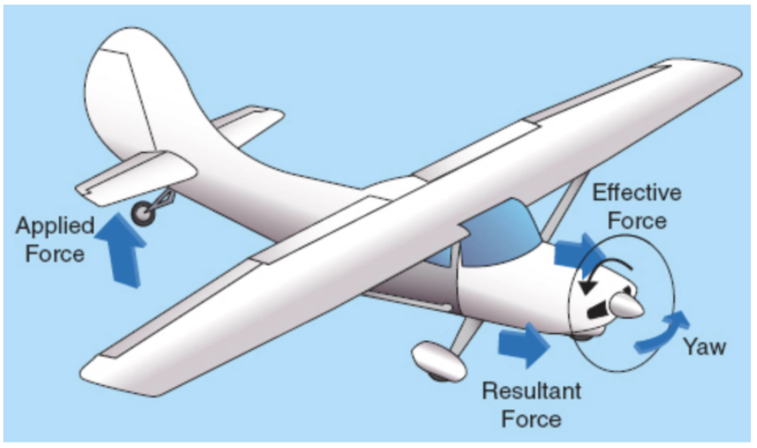

- [I. Basic Principles of Flight](#i-basic-principles-of-flight)
    - [The Forces of Flight](#the-forces-of-flight)
      - [Bernoulli's Principle](#bernoullis-principle)
    - [When Airflow is Disrupted](#when-airflow-is-disrupted)
    - [The Three Axes of Rotation](#the-three-axes-of-rotation)
      - [Vertical axis](#vertical-axis)
      - [Lateral axis](#lateral-axis)
      - [Longitudinal axis](#longitudinal-axis)
      - [Turns](#turns)
    - [Using the Rudder](#using-the-rudder)
      - [Too much rudder or too soon](#too-much-rudder-or-too-soon)
      - [Too little or too late](#too-little-or-too-late)
      - [Just right](#just-right)
- [II. Controlling the Airplane in Flight](#ii-controlling-the-airplane-in-flight)
    - [Making Turns](#making-turns)
      - [Banks](#banks)
    - [Understanding Load Factor](#understanding-load-factor)
    - [Load Factor](#load-factor)
    - [Understanding Maneurvering Speed](#understanding-maneurvering-speed)
      - [Maneuvering speed](#maneuvering-speed)
      - [Weight](#weight)
    - [Climbs and Descents](#climbs-and-descents)
      - [Climbs](#climbs)
      - [Transitioning to straight-and-level](#transitioning-to-straight-and-level)
      - [Transitioning to descent](#transitioning-to-descent)
      - [Transitioning back to straight-and-level](#transitioning-back-to-straight-and-level)
    - [Power-Off Descents](#power-off-descents)
      - [Drag](#drag)
      - [Best Glide Speed](#best-glide-speed)
      - [Glide Ratio](#glide-ratio)
    - [The Airplane's Left-Turning Tendencies](#the-airplanes-left-turning-tendencies)
      - [Torque](#torque)
      - [P-Factor](#p-factor)
      - [Slipstream effect](#slipstream-effect)
      - [Gyroscopic Precession](#gyroscopic-precession)
    - [How to Control Left-Turning Tendencies](#how-to-control-left-turning-tendencies)
    - [Flying in Ground Effect](#flying-in-ground-effect)
      - [Ground effect on takeoff](#ground-effect-on-takeoff)
      - [Ground effect on landing](#ground-effect-on-landing)
    - [Using Trim and Flaps](#using-trim-and-flaps)
      - [Primary flight controls](#primary-flight-controls)
      - [Secondary flight controls](#secondary-flight-controls)
      - [Trim tab](#trim-tab)
      - [Flaps](#flaps)
      - [Using flaps to take off](#using-flaps-to-take-off)
      - [Using flaps to land](#using-flaps-to-land)

# I. Basic Principles of Flight

### The Forces of Flight
Four main forces:
1. Lift
2. Weight
3. Thrust
4. Drag

* These forces are in equilibrium in steady, unaccelerated flight conditions only

#### Bernoulli's Principle
* As air is forced over the top of the wing, it speeds up and pressure decreases
* Air under the wing has same or greater pressure than pressure over the wing; pressure differential creates lift

### When Airflow is Disrupted
* *Chord line* is the imaginary line connecting the leading edge to the trailing edge of the wing
* Curve of airfoil is the *camber*
* **Angle of Attack** is the angle between the relative wind and the chord line

* Critical angle attack is angle at which wing stalls; sharp reduction of lift, sharp increase in drag
* Most GA aircraft stall at an AOA between 15 and 20 degrees (16 degrees for C172)

### The Three Axes of Rotation
* Vertical axis
* Lateral axis
* Longitudinal axis
* All intersect at the center of gravity

#### Vertical axis
* Yaw
* Rotates to left and right
* Imaginary vertical line through the airplane
* Controlled via rudder

#### Lateral axis
* Pitch
* Nose pitches up and down
* Imaginary horizontal line through the wing tips
* Controlled via elevator

#### Longitudinal axis
* Roll
* Wings bank left or right
* Imaginary horizontal line through the nose and tail
* Controlled via ailerons

#### Turns
* Left turn: smooth left stick pressure, left rudder to compensate for yaw, pull back on stick as bank increases to account for loss of vertical lift; at desired bank, reset stick and rudders to neutral, but keep back pressure applied

### Using the Rudder
* Rudder corrects for adverse yaw and left-turning tendency
* Amount of required rudder pressure varies from airplane to airplane and with speed and power settings
* Right rudder will be necessary to correct for left-turning tendency at high power and slow airspeeds
* Almost always need right rudder to keep airplane stright during takeoff and climbing
* Apply rudder pressure at same time as yoke pressure when starting a turn

#### Too much rudder or too soon
* Airplane will yaw towards direction of turn
* Will feel pushed toward the high wing/outside of turn
* This is called a skid

#### Too little or too late
* Airplane will yaw in opposite direction
* Will feel like you're falling toward the inside of the turn
* This is called a skip

#### Just right
* You will feel pressed down in your seat without any sideways/leaning sensation
* Airplane rolls around longitudinal axis, does not yaw, and rate of turn increases as bank angle increases
* Ball coordinator instrument
* "Step on the ball" - apply rudder pressure on side that the ball is violating out towards
* *Glance* at this instrument after you have established the turn; use horizon and pressure in eat as visual and physical indicators of a coordinated turn

# II. Controlling the Airplane in Flight

### Making Turns
* Some vertical lift will be converted into horizontal lift

#### Banks
* Shallow: 20° or less
  * Keep the aileron and rudder pressure must be held into the turn to keep airplane from rolling out
* Medium: 20° to 45°
  * Airplane will maintain constant bank will little aileron or rudder pressure
* Steep: 45° or more
  * Opposite aileron and rudder pressure needed to keep airplane from rolling into a steeper bank

* 30° is a typical bank for a turn
* May need to increase power during a turn to maintain airspeed

* Start rolling out of a turn when about 1/2 the bank angle away from the desired heading; so, in a 30 degree turn, start rolling out about 15 degrees before the desired heading
* To roll out, apply coordinated opposite aileron and rudder pressure, and **release bank pressure as bank angle decreases**

### Understanding Load Factor
* Horizontal component of lift is **centripetal force**
* It opposes centrifugal force, which is the **inertia** that drives an airplane to the outside of the turn
* Increased load that wings must support during a turn is called **load factor**
  * *Total lift* increases in a turn because wings must now support horizontal **plus** vertical components of lift

### Load Factor
* The total weight the wings must support divided by the gross weight of the airplane
  * For example, a load factor of 3 means that the total load on an aircraft's structure is three times its total weight
* Expressed in G's (unit of gravity)
* Increasing bank angle, flying in turbulence, or pulling out of a dive increases bank angle
* Increases exponentially
* **An increase in load factor increases an aircraft's stall speed**, but does NOT change the critical AOA
  * Wings now reach critical AOA at a higher airspeed

Steep bank angle turns beyond 30° should generally be avoided for this reason (exponential increase in stall speed)

### Understanding Maneurvering Speed
* VA: maneuvering speed
* *Normal category*: stressed for +3.8 Gs and -1.52 Gs without structual damage
* *Utility category*: stressed for +4.4 Gs and -1.76 Gs without structual damage
* C172 is certified in both normal and utility categories, but the given category for a flight depends on model and operating weight
* High speed and load factor can damage an aircraft
* Reduce airspeed to VA when flying in turbulence; will avoid structural damage

#### Maneuvering speed
* Maximum speed you can apply full deflection of any one contrrol and not cause structural damage to the airplane (SINGLE deflection of a SINGLE control)
* Full control deflections at VA will cause a stall before load factor limits are hit
* Structural damage can still occur at VA through deflection of more than one control or repeated control deflections
* VA can be found in the POH

#### Weight
* Maneuvering speed is directly proportional to weight
* Heavier weight &#8594; higher VA
* Lower weight &#8594; lower VA

### Climbs and Descents
* Each of the four aerodynamic forces are in equilibrium for straight and level flight PLUS climbs and descents at constant airspeed and path

#### Climbs
* Mixture rich, landing light optionally on
* For climbing more than 200 feet, icnrease power and add right rudder pressure
* Generally pitch to a climb altitude approximately 10° above the horizon indicator
* Pitch down if airspeed too low
* Pitch up if airspeed too high
* Adjust trim

#### Transitioning to straight-and-level
* Start leveloff at approximately 10% of vertical climb rate
  * i.e. climbing at 400 feet per minute, start level off approximately 40 feet prior to desired altitude
* Ease nose down to level attitude
* Leave power setting at climb power and let airspeed build; hold nose of airplane at level flight attitude
* Reduce throttle to cruise RPM
* Trim
* Reset mixture
  * Lean for cruise or above 3,000 MSL
  * Rich for maneuvers or below 3,000 MSL

#### Transitioning to descent
for more than a 200 feet descent...
* Reduce power to 1500-1800 RPM
* Descent rate of 400-500 feet per minute
* Higher RPM for slower descent rates
* Lower RPM (idle - 1500) for faster descent rates
  * Avoid prolonged idling to avoid rapidly cooling the engine or build-up of carb ice
* May need to use some left rudder pressure

#### Transitioning back to straight-and-level
* Start level off at approximately 10% of vertical clime rate, similar to climbing
* Apply back pressure on the yoke to raise the nose to level attitude
* Increase RPM to cruise
* Trim
* Reset mixture as noted above

* Anything climb or descent of more than 200 feet necessitates throttle adjustment
* Otherwise, just use the yoke

### Power-Off Descents

#### Drag
Two types of drag:
* Induced drag: results from production of lift
* Parasite drag: results from airplane moving through the air

* Induced drag is *inversely* proportional to airspeed
* Parasite drag is *directly* proportional to airspeed

**Dinduced + Dparasite = Dtotal

#### Best Glide Speed
* At power off, an airplane will glide the greatest distance at the **best glide speed**
* Usually given for the airplane's maximum gross weight and can be found in the POH
* Best glide speed:
  * Airspeed where total drag is the least
  * Point with highest ratio of lift to drag
  * May be shown in a PFD (primary flight display) with a "G" indicator
  * Varies with weight; lower weight &#8594; slower best glide speed; heavier weight &#8594; faster best glid speed
  * Reduce glide speed by 5% for every 10% below max gross weight
  * Include best glide speed in takeoff briefing

#### Glide Ratio
* C172 can glide about nine foot of every foot of altitude lost (glide ratio of 9:1)
  * Every 1,000 feet above the ground, can glide roughly 9,000 feet over the ground
  * 6,076 feet per nautical mile
* Flaps will decrease glide distance because they increase drag
* Glide distance will be less if you fly faster or slower than your best glide speed
* Glide *speed* changes with weight, but not glide *distance*
  * Lift-over-drag ratio is based on the shape of the airplane, so airplane will glide the same descent path regardless of weight
  * Lighter aircraft means it can fly slower to get the best glide speed
* Time it takes you to glide to the ground will be less for a heavier airplane because it is flying the descent path faster
* Time it takes you to glide to the ground will be more for a lighter airplane because it is flying the descent path slower
* Lower the weight means more time in the descent if you have a problem during takeoff or flight

### The Airplane's Left-Turning Tendencies
* Airplane tends to turn left when flying slow or with high power setting
* Caused by:
  1. Torque from engine
  2. Propeller factor (P-factor, asymmetrical thrust)
  3. Slipstream effect

#### Torque
* Propeller turns clockwise, so airplane tends to turn counter-clockwise, because for every action there is an equal and opposite reaction
* This will also cause the airplane to *yaw* to the left during takeoff, since there is more weight/friction on the left main landing gear, creating a left yaw tendency during takeoff and the need to hold right rudder

#### P-Factor
* Also known as asymmetrical thrust
* Occurs when one side of the propeller produces more thrust than the other and yaws the plane in the opposite direction
* Results when an airplane is flying at a high angle of attack (climb or slow flight)
* Downward-moving/descending blade on the ride side takes a bigger bite out of the air and creates more thrust
* Upward-moving/ascending blade on the left takes a smaller bite out of the air
* Difference in thrust creates a tendency to yaw to the left

#### Slipstream effect
* Also known as spiraling slipstreaem
* Occurs when the air pulled in by the propeller is rotated and sent backward
* Moves in a clockwise corkscrew pattern around the fuselage
* Strikes vertical stablizer on the left side (would also strike the vertical stabilizer if it extended down below the empennage) and pushes the tail to the right, causing left yaw
* Also causes a slight rolling moment to the right about the longitudinal axis (hits the wings and horizontal stablizer)

* Airplanes are designed with aerodynamic compensations to correct for left-turning tendency at cruise speed
  * Engine is often offset slightly to the right
  * Trailing adge of vertical stabilizer may be canted a little to the right
  * Left wing may have a slightly greater angle of attack
* Only compensate at cruise speed
  * Right rudder for higher power settings/lower speed
  * Left rudder for lower power settings/higher speed

#### Gyroscopic Precession
* Another less noticeable factor that may cause the aircraft to yaw
* More prominent in tailwheel airplanes when tail is raised on takeoff roll
* Gyroscopic precession is the resultant action/deflection of a spitting rotor when a force is applied to change the axis of rotation
* Deflection will occur 90° in the direction of rotation to where the force was originally applied
* Imagine holding a spinning bike wheel in between your hands and deflcecting the wheel to either side - a force will be exerted at a 90° angle around in the direction of rotation

* A spinning propeller acts as a gyroscope; when you change the pitch attitude of the airplane, a force is applied to the axis on which it is spinning
* Pitching the nose down/tilting the propeller forward
  * Applies a forward force at the top of the propeller
  * Resulting force acts at 90° of rotation (clockwise) to the right
  * Forward force on the right side
  * Pushes the nose of the airplane to the left
  * Causes left yaw when tailwheel aircraft are taking off
* Pitching the nose up/tilting the propeller back
  * Applies a forward force on the bottom of the propeller
  * Resulting forward force on the left side
  * Pushes the nose of the aircraft to the right

  

  In review:

  * Torque rolls and yaws to the left
  * Slipstream yaws to the left
  * P-factor yaws to the left
  * Gyroscopic precession yaws to the left when pitching down and to the right when pitching up
  * Left turning tendency is most pronounced when flying at a low airspeed with a high power

### How to Control Left-Turning Tendencies
* Right rudder is needed at high power and low airspeed
* Left rudder is needed at low power and high airspeed
* You want to feel your body's weight straight down into the seat
* Slip/skid indicator tells you whether you are applying proper rudder pressure to correct for left-turning tendency and your coordination of rudder and airleron input is correct
* Feel yourself being pushed to the right &#8594; use right rudder
* Feel yourself being pushed to the left &#8594; use left rudder
* Right rudder is needed on takeoff and climb
* When raising a steerable nose wheel off the runway, you must increase right rudder pressure to compensate for the loss of steering control from the nose wheel
* Apply right rudder throughout the climb

### Flying in Ground Effect
* Occurs when aircraft is within one wingspan of the ground
* Airplane begins to fly better because:
  * **Less drag**
  * More lift
  * Can fly at a slower speed
* Ground alters the three-dimensional airflow pattern around the airplane
* Surface restricts vertical component of airflow around the wing; alters wing's upwash, downwash, and wingtip vortices

"When an aircraft flies at or below approximately half the length of the aircraft's wingspan above the ground or water there occurs an often-noticeable ground effect. The result is lower induced drag on the aircraft. This is caused primarily by the ground or water obstructing the creation of wingtip vortices and interrupting downwash behind the wing."

* Low winged aircraft are more affected by ground effect than high wing aircraft
* May cause errors in airspeed system or other instruments due to changes in local pressure at the static port

* Vortices flow outward and around wing tips, hit the top of the wing, and reduce left
* These vortices are reduced over a surface because they are physically blocked from reaching teh wing
* This increases lift and reduces drag; can flow at a slower speed and with less power

#### Ground effect on takeoff
* Ground effect can cause your airplane to lift off at an airspeed too slow for flying out of ground effect
* Once you exit ground effect, lift decreases and drag increases, requiring more thrust and higher AOA; this also increases the stall speed
* Lifting off prematurely creates possibility of setting back on runway and increases available distance to clear an obstacle
* **Do not allow airplane to lift off until recommended airspeed is reached**

#### Ground effect on landing
* Excess speed on landing can result in extra floating distance
* Reduce power as airplane descends into ground effect to avoid overshooting
* If you experience floating...
  * Do not let airplane drif off centerline
  * Control lateral movement with ailerons and rudder
  * Do not force touchdown at faster-than-normal airspeed (you could land on the nose wheel)
  * Go around if there is insufficient runway remaining

### Using Trim and Flaps

#### Primary flight controls
* Ailerons
* Elevator
* Rudder

These are essential for control.

#### Secondary flight controls
* Trim tab
* Flaps

#### Trim tab
* Small control service hinged at trailing edge of primary flight control
* Applies force on a primary flight control in opposite direction; neutralizes or reduces pressure required on the primary flight control
* Airspeed and power will change the constant pressure needed on the flight controls, and trimming off the control prevents maintaining continuous pressure, pilot fatigue, and sloppy control
* Trim tabs can be *fixed* or moveable
* Fixed trim tabs are set at the factory (C172 rudder)
* Moveable trim tabs can be moved electrically or manually from the cockpit
* Moving the trim tab moves opposite the direction of desired control surface movement

* The trim tab **moves the actual control surface to a position equivalent to what the previously necessary control pressure established**
* Nose-down trim: moves trim tab up, forcing elevator down, driving tail up, driving nose down
* Nose-up trim: moves trim tab down, forcing elevator up, driving tail down, driving nose up
* Nose up &#8594; trim tab will be down
* Nose down &#8594; trim tab will be up

#### Flaps
* Attached to trailing edges of the wings between fuselage and ailerons
* Change shape of the wing to **increase lift, increase drag, and decrease stall speed**
* Flaps allow takeoff and landing at a slower speed in shorter distance
* Descend at steeper rate and angle of descent without increase in airspeed
* Use fleps when you want to **get down or slow down**

* Flaps change the camber of the wing and sometimes increase its surface area
* This changes stall speed
* Cessna 172SP stalls
  * without flaps at 48 knots
  * with full flaps at 40 knots

#### Using flaps to take off
* 172SP calls for 0°-10° of flaps for takeoff
* This reduces takeoff ground roll and total distance to clear and obstacle by 10%
* Maintain flap setting until airplane is a safe distance from the ground and maintaining a positive rate of climb
* Control back pressure may be necessary to offset slight sinking when retracting flaps
* Climb checklist will remind you to retract flaps; leaving flaps extended will slow climb and risk exceeding maximum flap speed and can cause structural damage

#### Using flaps to land
* Usually want to land with full flaps
* Reduced flaps in gusty/turbulent conditions to increase control
* For a go-around:
  * Apply full power
  * Pitch to climb attitude
  * Reduce flaps to partial setting (20°)
    * Note: reducing flaps fully puts you closer to stall speed and allows sinking, delaying the climb
  * Accelerate to a safe climb airspeed (60 knots)
  * Retract to 10° until obstacles are cleared
  * At safe altitude, retract to 0°
