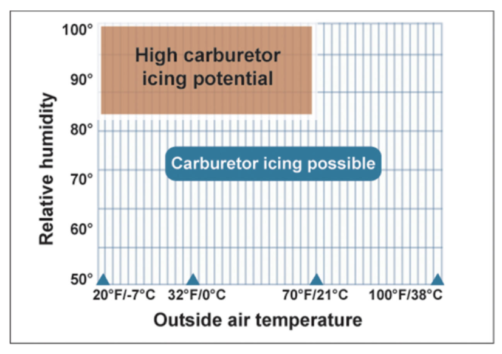
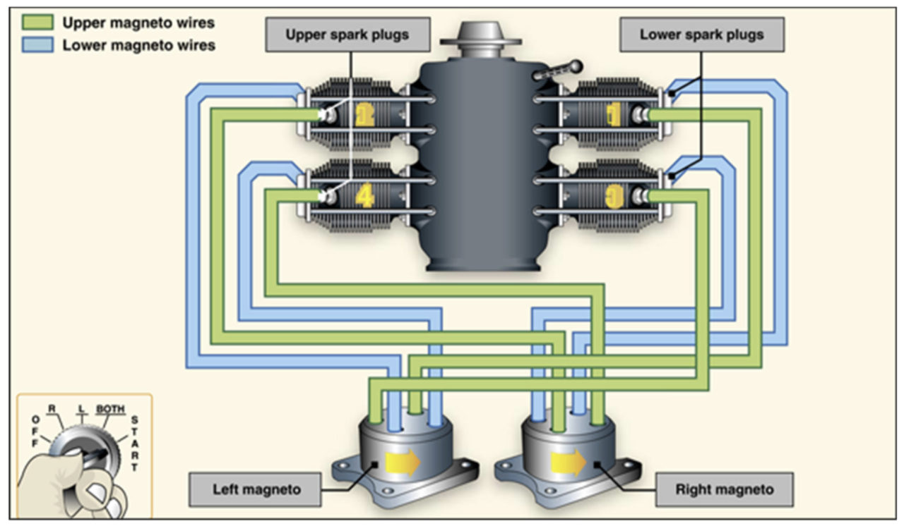
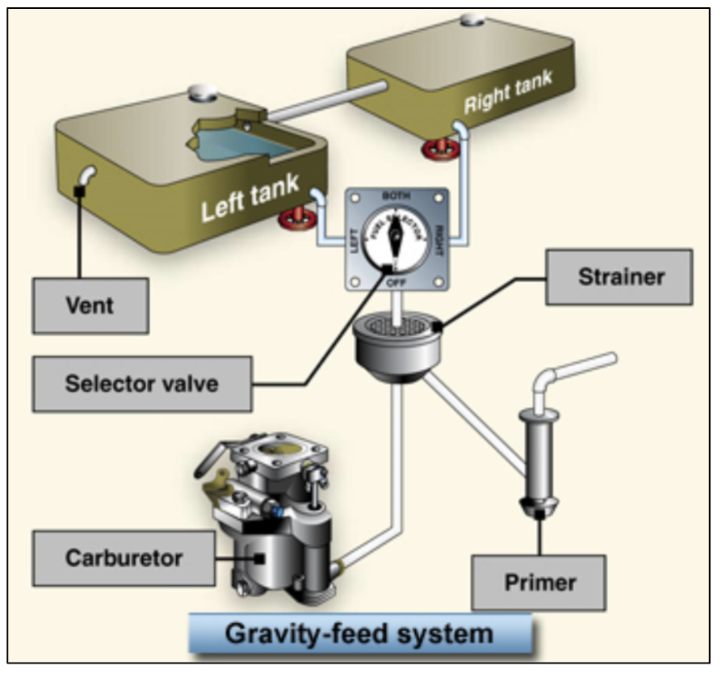
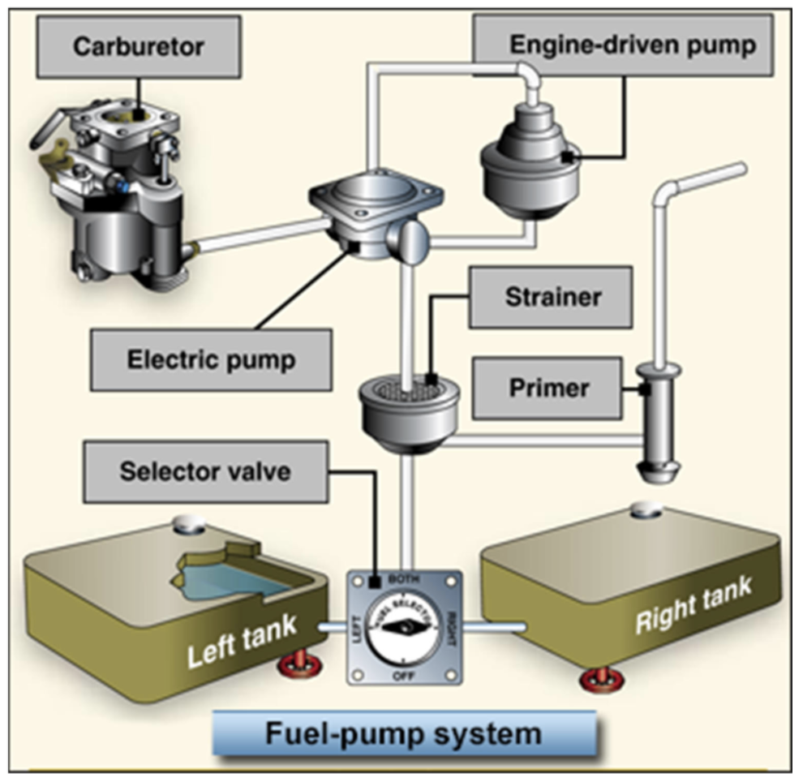

# Airplane Engines and Systems

## I. Engine and Propeller

### How the Engine Works
* Airplane engine and propeller are the powerplant
* Reciprocating engines--back-and-forth movement of the pistons
  * Radial, in-line, v-type, or opposed cylinders
  * Liquid or air cooled
  * Cessna 172 has horizontally opposed cylinders and is air cooled

#### Main parts of the engine
* Cylinder
  * Contains intake/exhaust valves, spark plugs, and pistons
* Crankcase
  * Contains crankshaft and connecting rods
  * Crankshaft is connected to the piston through the connecting rod
* Accessory housing
  * Contains the magnetos

* Engine and propeller are direct drive

#### Four-stroke
* Intake
  * Piston moves down, sucking fuel/air mixture into cylinder
* Compression
  * Piston rises to the top of the cylinder, compressing fuel/air mixture
* Power
  * Spark plugs ignite fuel/air mixture and drive piston down
* Exhaust
  * Piston driven up and pushes out remnant gases from combustion

* Desired fuel-to-air ratio by weight is 15 parts air to 1 part avgas (15:1)
* Engine will not burn fuel properly and run smoothly if mixture is too lean or rich
* As you gain altitude, air is less dense--less molecules per unit volume of air
  * Therefore less weight
  * Engine draws air based on volume but needs the mixture to be correct by weight
  * Amount of fuel must be reduced to compensate for thinner air to get the same 15:1 mixture
* Lean mixture gives
  * Smoother engine operation
  * More power
  * Greater fuel efficiency
  * Less carbon build-up on spark plugs
* Mixture can and should be leaned when using less than 75% power above 3000 ft MSL even when full throttle or climbing
* With an EGT gauge, lean the mixture until the EGT temperature peaks, then go lean or rich of peak depending on your political opinions (/s)
  * According to ground school, go with rich of peak to 50 degrees under peak
* If no EGT, lean to maximum RPM
* Full rich should be used at high power below 3000 ft (takeoffs and climbs) and before landing for a go-around

#### Engine temperature
* Mixture directly affects engine temperature
* Richer &#8594; lower the engine temperature (excess fuel carries heat away)
* Leaner &#8594; higher the temperature (to a point)
* Airflow, however, is primary way the engine is cooled in a C172
  * Cooling fins on cylinders are heat sinks
  * Baffles in engine compartment direct airflow over the fins
  * Air enters through nose inlets, is directed around cylinders by the baffles, and leaves through bottom of cowling
  * Run ups &#8594; point nose into wind if possible
* In the air, engine cooling is primarily controlled via airspeed, power, and mixture
* Climb at higher airspeeds (lower pitch) to keep engine cool
* Cruise at low power settings

### How the Engine Gets Air and Fuel
* Carbuertor mixes fuel and air
* Fuel-injection system injects fuel into air just before entry into each cylinder
* Air enters via inlet and filter to carburetor, passes through venturi, speeds up/causing lo pressure, which pulls fuel out of opening from float chamber into the venturi
* Fuel mixes with air, controlled via butterfly throttle valve, and is then ducted to teh cylinders through manifold tubing

#### Carburetor Icing
* Carb icing is a concern due to lower temperature caused by fuel vaporization and decreased pressure in the venturi
  * Pressure decrease causes temperature decrease
  * Low pressure pulling fuel into the venturi cools air around it (like water on your skin evaporates and cools you)
  * Temperature can drop as much as 60 to 70 °F
* **Favorable conditions for carb icing include high humidity and temps beteen 20 to 70 °F (-7 to 21 °C)**

* Indications of carb icing
  * Loss of RPM as ice blocks airflow
  * Loss of manifold pressure (constant speed prop) since propeller governer keeps engine RPM constant
* Carb heat should be used at reduce power settings (follow POH)
* Exhaust system will cool quickly in event of ice-caused shutdown, might not be able to melt ice
* Carb heat ducts air around exhaust muffler and into carburetor
  * Melting ice causes loss of RPM and engine roughness for about 30 sec-several minutes
  * RPM will gradually increase
* Carb heat in normal conditions cause RPM since warmer air is less dense (less power output, unfavorable fuel-air mixture ratio)
* Never use carb heat when full power is required

#### Fuel-Injected engines
* Cessna 172SP
* Auxiliary fuel pump provides pressurized fuel to fuel/air control for starting and emergency use
* Engine driven fuel pump takes over after starting
* Fuel/air control unit replaces carburetor and meters fuel based on mixture, sending it to fuel distributor at rate controlled by throttle
* Fuel distributor distributes fuel to individual fuel discharge nozzles located at entrance of each cylinder (spider valve)
* Fuel discharge nozzles inject fuel directly into each cylinder
* Fuel pressure/flow indicator indicates flow of fuel to engine
* Benefits
  * Better fuel economy (more precise control and distribution)
  * Faster throttle response
  * Easier cold-weather starts
  * No carb ice!
* It is possible for air intake to ice (induction icing)
  * In this case, spring-loaded alternate air door opens automatically (or can be opened manually) to provide an alternate air intake route
* Drawbacks
  * May be more difficult to start when engine is hot (fuel vaprozies in distribution lines)
  * Blocks normal fuel flow, causing *vapor lock*
  * Total fuel starvation makes it hard to re-start due to air in system

### How Magnetos Work
* Two magnetos, one left and one right
* Two sets of ignition wires, upper and lower
* Two spark plugs per cylinder, upper an dlower
* Ignition switch
* Duplication allows for redundancy and engine performance from firing two spark plugs per cylinder

#### Magneto
* Uses permanent magnets that generate an electrical current independent of the aircraft's electrical system
  * Connected directly to the engine, so its mechanism moves whenever the propeller moves
* Provides electricity for the spark plugs to ignite fuel/air mixture

* Magneto is made up of bundle of wires coiled around a metal bar
* Magnet spins around and next to the bundle whenever the engine is turning
* Spinning magnet (soft iron) induces an electrical current in the wires
* Current goes to spark plugs, which fire and burn gas, which turn engine, which turns magnetos
* Ignition switch sends power to starter motor and turns magnetos on and off
* OFF grounds both magnetos, so no electricity can flow to spark plugs, but flows through the primary leah to the ground (grounding)
* L position shorts right magneto and vice versa
* Checking the magnetos
  * Increase power to setting in checklist (usually 1700-1800 RPM)
  * Go from BOTH to R, then BOTH, then L, then BOTH
  * Notice drop in RPM on each magneto
  * Acceptable RPM decrease is in POH
  * If it exceeds, do not fly (could be caused by fouled spark plugs, broken wires, improper firing of spark plugs)
  * If there is no RPM drop, do not fly, p-leads may be broken/disconnected
  * Good idea to check R first then L to avoid going from R to L assuming you are going from L to BOTH
* Optionally check magnetos after flying
  * Throttle at idle
  * Briefly to go OFF then back to BOTH
  * If enegine does not quit momentarily, p-lead may be broken (meaning engine could start even at OFF)
    * Hot mag/hot prop
    * Report immediately--this is a big danger
* Never leave keys in aircraft ignition
* Place them on the dash

### Detonation and Preignition
* C172 is cooled via airflow over cylinders, oil flowing inside the engine, and rich fuel/air mixture
* High engine temps come from lack of air flow, high power settings for long period of time, too lean a mixture, or poor oil quality
* This can lead to loss of power, excessive oil burn, or detonation and preignition (often simultaneously)

* Detonation
  * Fuel/air mixture explodes in cylinder instead of burning smoothly
  * Causes excessive temperature and pressure leading to overheating, rougness, or loss of power, in addition to cylinder/piston damage
  * Can be caused by lower fuel grades (not 100 or 100LL for C172)
  * Can be caused by running at high power with too lean a mixture
  * Can be caused by extended ground operations where cylinder cooling is reduced

* Preignition
  * Fuel/air mixture in the cylinder ignites too soon
  * Caused by hot spots on the piston, cylinder, and valve that ignotes fuel/air mixture before spark plug fires
  * Causes loss of power

* Cooling the engine
  * Reduce AOA to increase airspeed and airflow into cowling
  * Reduce power to decrease engine heat
  * Enrich mixture to allow excess fuel to cool the cylinders
* Don't forget to monitor engine temperature gauges!

### How the Propeller Works
* Propeller is directly connected to the crankshaft
* Turns at same RPM as engine
* Thrust is determined by RPM
* Propeller has greatest pitch angle at hub and smallest pitch angle at tip
  * Helps produce uniform thrust from hub to tip
  * Tip travels greater distance than hub in same amount of time
  * Propeller would be inefficient if blade was same angle all across
* Propeller either has a fixed or adjustable pitch propeller

#### Fixed-Pitch Propellers
* Pitch is set at factory and cannot change
* Blade angle determines how much "bite" out of air the propeller takes
* Big blade angles optimize thrust for cruise flight; small blade angles optimize thrust for climb
* C172 compromises between both

#### Adjustable-Pitch Propellers
* Most common is constant-speed propeller (blue knob)
* You set desired RPM with propeller control knob
  * Governor adjusts propeller blade angle to keep RPM constant (i.e., constant-speed propeller)

* Pushing the nose over...
  * ...in an aircraft with a fixed-pitch propeller will increase RPM
  * ...in an aircraft with a constant-speed propeller, governor will detect increase in RPM and adjust propeller blade angle to maintain RPM (in this case, will increase blade angle and slow prop back to set RPM)

* Throttle controls engine manifold pressure as indicated in manifold pressure gauge by controrlling amount of fuel/air mixture entering engine
* Acceptable manifold pressure (throttle) settings and RPM (prop) combinations are shown in POH
* Rules of thumb
  * Increasing power, move the prop forward first and then the throttle forward
  * Decrease power, move the throttle back first and then the prop back

## II. Airplane Systems

### The Fuel, Oil, and Hydraulic Systems
* Fuel systems are either gravity-feed or fuel-pump
* Gravity-feed use gravity to transfer fuel to tanks
  * Common in high-wing airplanes (C172)
* Fuel-pump systems use electric and engine-driven fuel pumps to transfer fuel
  * Common in low-wing airplanes

* C172 has a fuel tank in each wint with a vent either in the fuel cap or in the leading edge of the wing
  * Allows air to flow into tank as fuel flows into engine, because otherwise reduced pressure in the tank will eventually prevent fuel flow to the engine
* Bottom of left wing has another fuel vent (L-shaped tube)
  * Air enters tube during flight and helps keep positive pressure in the tanks
  * Two tanks connected via vent line to keep pressure equal
* If it's hot, fuel expands and may drip from L-shaped vent, but that should be OK

#### Fuel strainers, sumps, and drains
* Each wing has drain valves (sump drains) under the wing at the lowest point in each tank
* Engine has fuel strainer underneath that removes moisture and other sediments from the system
  * Should be drained prior to any flight
* Water and sediment sink, good to sump each valve to ensure there are none
* When sumping a tank, check:
  * Proper smell (avgas, not jet fuel)
  * Color (blue)
  * No water
  * No dirt or grit
* Consider replacing a good sample back into the tank
* Fill tanks after last flight of day to prevent water from condensing in tank

#### Fuel selector
* Ensure that no tank runs completely out of fuel
* Do not let fuel tanks become unbalanced

#### Fuel pumps
* Engine or electrically driven
* Engine driven failure is rare but is indicated by sudden reduction in fuel flow just prior to loss of power
  * Use auxiliary electric electric fuel pump
* Auxiliary electric fuel pump is used for starting engine, purging vapor from fuel-injection lines, and emergencies (when engine-driven pump fails)
  * Controlled via combined on/off switch and circuit breaker
  * Can hear auxiliary electric fuel pump running

* Fuel shutoff valve
  * Cuts fuel flow to engine in emergencies
  * Labeled red knob in cockpit
  * Used to prevent fire from starting or continuing
  * **Ensure it is pushed in fully before takeoff**

* Fuel gauges
  * Only required to read accurately at zero (when tanks are empty)
  * Always visually verify fuel by checking fuel level inside tank using bottom of filler tab or dipstick
* Standard fuel gauge (non-glass) is electric, meaning fuel gauges will read zero even though there is still fuel during an electrical failure
  * Skycatcher has fuel sight gauges that will still work

#### Oil and hydraulic systems
* Oil protects engine's internal parts and helps to cool the engine by carrying heat to oil cooler
* Ensure there is adequate oil pressure
* Need 5 quarts of oil in C172 for short flights (8 for extended flights)

* Single-disc, hydraulically-actuated brake on each main landing gear is connected via hydraulic line to each rudder pedal
* Hydraulic fluid is red
  * When there is a hydraulic leak, brakes feel soft or spongy, and pedal travel increases

### The Electrical System
* Either a 14-volt or 28-volt direct-current (DC) electrical system
* Section 7 of POH
* Components
  * Alternator
  * Battery
  * Master switch
  * Circuit breakers

* Alternator
  * Provides electrical power to airplane and charges battery off of engine
* Battery
  * Starts engine, provides electrical power when engine is off, reserve power in case of alternator failure
* Master switch
  * Split between alternator (left) and battery (right)
* Circuit breakers
  * Protect electrical system from damage (overload on circuit)
  * Labeled with the circuit they protect
  * Numbers tell maximum current that the equipment may draw from electrical system before breaking circuit (causing breaker to pop out)
  * Momentary surge in power may pop a breaker, which can be reset **once** if no smoke or smell present
  * Leave it if it pops out again

### The Environmental System
* Cooling
  * Open window on ground and in some flight conditions
  * Adjustable cabin air vent
  * Cabin Air knob
* Heat
  * Cabin heat activated by Cabin Heat knob
  * Heated air comes from shroud wrapped around exhaust manifold (doesn't let in exhaust air when working properly)
  * Turn off heat if you suspect a leak in exhaust manifold; get fresh air in cabin and land
* Exhaust leak
  * Carbon monoxide poisoning is possible
  * May not be detectable
  * CO detector
