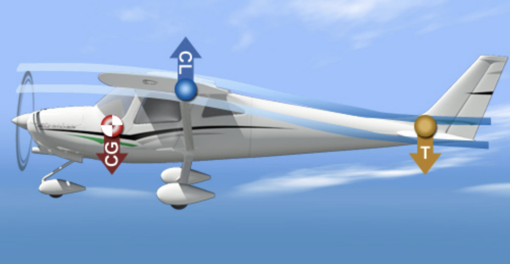
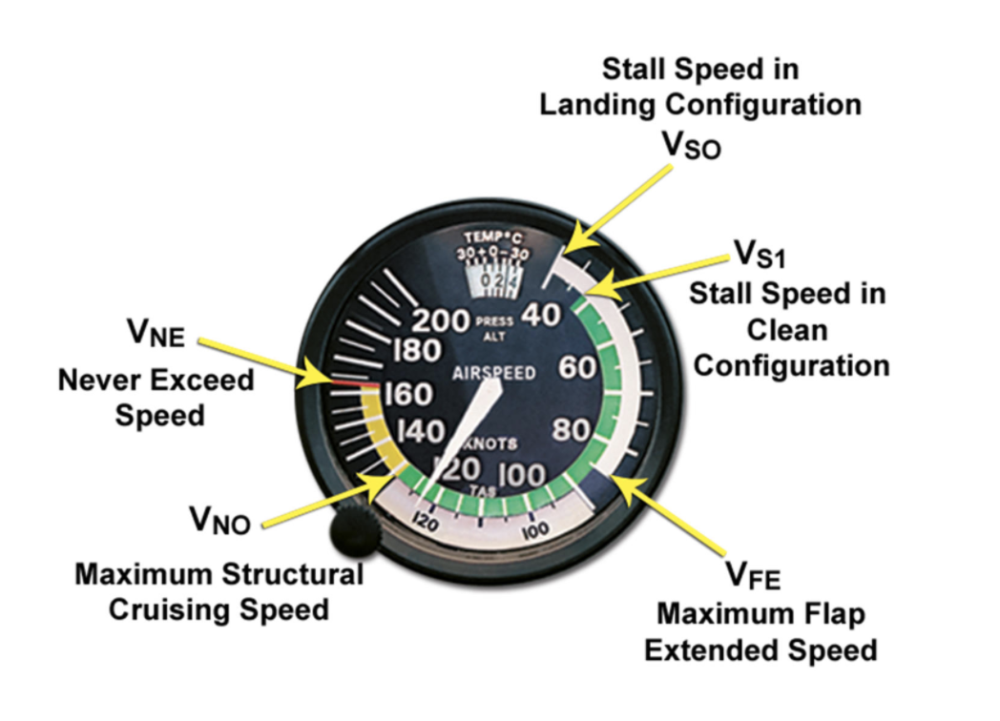
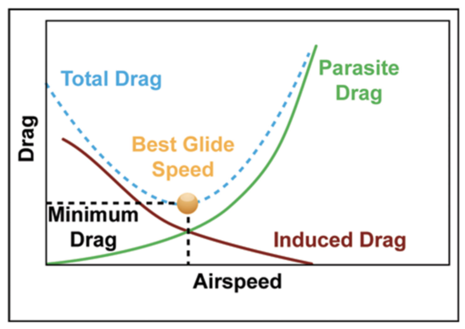

# More About Your Airplane

- [More About Your Airplane](#more-about-your-airplane)
  - [I. Learning About Your Airplane](#i-learning-about-your-airplane)
    - [Why an Airplane Flies Straight-and-Level](#why-an-airplane-flies-straight-and-level)
      - [Center of Gravity Range](#center-of-gravity-range)
    - [Comparing the Instruments to the View Outside](#comparing-the-instruments-to-the-view-outside)
    - [Learning About Heading](#learning-about-heading)
    - [Learning About Airspeed and Altitude](#learning-about-airspeed-and-altitude)
      - [V-speeds](#v-speeds)
      - [Altimeter](#altimeter)
      - [Vertical speed indicator (VSI)](#vertical-speed-indicator-vsi)
    - [Learning About Slow Flight](#learning-about-slow-flight)
      - [Slow Flight](#slow-flight)
      - [Procedure](#procedure)
      - [Turns](#turns)
      - [Climbs](#climbs)
      - [Descents](#descents)
      - [Recovery](#recovery)
  - [II. Airworthiness of the Airplane](#ii-airworthiness-of-the-airplane)
    - [Certificates and Documents](#certificates-and-documents)
    - [Equipment Required for Flight](#equipment-required-for-flight)
      - [Requirements for flying visually during the day](#requirements-for-flying-visually-during-the-day)
      - [Requirements for flying visually during the night](#requirements-for-flying-visually-during-the-night)
      - [Equipment on your airplane](#equipment-on-your-airplane)
      - [Inoperative instruments](#inoperative-instruments)
    - [Required Inspections](#required-inspections)
      - [Equipment inspections](#equipment-inspections)
      - [Airworthiness Directive](#airworthiness-directive)
    - [Special Flight Permits](#special-flight-permits)
    - [Basic Airplane Maintenance](#basic-airplane-maintenance)

## I. Learning About Your Airplane

### Why an Airplane Flies Straight-and-Level
* An airplane is inherently stable about the lateral axis, known as longitudinal stability (or pitch stability)
* When airplane nose is disturbed by turbulence or accidental bump in controls, airplane will oscillate a couple times and then return to original airspeed and altitude as air flow over horizontal stabilizer forces aircraft to correct
* Positive static stability: initial tendency of nose to come back up
* Positive dynamic stability: initial tendency over time for oscillations to correct
* Positive static stability is required for positive dynamic stability
* Neutral static stability: airplane tends to stay where it is displaced to
* Negative static stability: airplane tends to continue in the direction it is being displaced
* Cessnas have positive static and dynamic stability
* Longitudinal (pitch) stability is determined by center of gravity (CG) compared to the location of center of lift (CL)
* Cessnas have CG forward of CL, making them stable

* Aircraft is more stable the more forward the CG is compared to the CL
* More forward CG is compared to CL, more downward force required on tail, and more stable the aircraft
* If CG is too rearward, nose will not return to original attitude when disturbed
  * Difficult or impossible to recover from stall
* Aerodynamic downward force on tail means nose will pitch up when power is increased and vice versa
* Airflow over the horizontal stabilizer and elevator creates a form of lift, but in the opposite direction, pushing the tail down to balance the aircraft (increased airflow from increasing power thus pushes tail down and nose up, causing a climb)
  * Think of tail and upside-down wing
  * Opposite applies when removing power
* More airflow &#8594; more tail downforce &#8594; more forward pressure needed on control stick to keep nose level and counteract tail downforce
* Less airflow &#8594; less tail downforce &#8594; more back pressure needed on control stick to keep nose level and add tail downforce

#### Center of Gravity Range
* Manufacturer sets a forward and aft limit on the location of CG
* Found in POH Section 6
* CG moves when any weight distribution within the aircraft changes (fuel, passengers, baggage)
* Further aft the CG &#8594; more tail heavy &#8594; more forward pressure necessary
  * Aircraft becomes negatively stable
  * Lower nose &#8594; keeps going down
  * Raise nose &#8594; keeps going up
* Further forward the CG &#8594; more nose heavy &#8594; more back pressure necessary
  * Aircraft will become increasingly difficult to maneuver
  * Forward-of-limits CG will make takeoff rotation nearly impossible

### Comparing the Instruments to the View Outside
* Look outside as much as possible
  * See position relative to horizon and avoid traffic
  * Instrument panel should be looked at briefly to confirm what is seen outside
* Attitude indicator
  * Marked in 5° increments on mechanical indicators
  * Marked in 2.5° increments on electronic indicators
  * Bank relative to horizon marked in 10° increments for first 30° of bank
  * In a G1000-equipped airplane, slip/skid indicator is in attitude indicator as bar under horizon marks
  * "Step on the ball"

### Learning About Heading
* Heading is the direction the airplane is pointed in relation to magnetic north
* *Magnetic* north (Earth's magnetic field), not *true* north
* Headings are expressed in degrees clockwise from magnetic north
  * North is 0° but more commonly 360°
  * East is 90°
  * South is 180°
  * West is 270°
* When expressing heading, pronounce all three digits
  * 10° &#8594; zero one zero degrees
  * 120° &#8594; one two zero degrees
* A **heading indicator** is gyroscopically stabilized to avoid the errors in the magnetic compass that occur when you are turning or accelerating/decelerating
* Match heading indicator to compass when not turning, accelerating, or decelerating
* **Must reset heading indicator about every 15 minutes**
* Electronic flight display gets heading information from remote magnetometer that is stabilized to avoid compass errors
* Heading indicators have a heading bug to set desired heading
  * Good idea for setting to runway heading to ensure on proper runway
  * Good idea for settings to direction the local winds are from during taxi
* Magnetic compass
  * Inspected annually during an aircraft's annual
  * Should be checked for proper fluid levels before each flight

### Learning About Airspeed and Altitude
* Airspeed indicator; color-coded
* White
  * Flap-operating range
* Green
  * Normal operating range
* Yellow
  * Caution range
* Red and white "barber pole"
  * Never-exceed speed
* Red
  * Low speed awareness

#### V-speeds
* VSO
  * Stall speed in landing configuration
  * Full flaps and gear down
* VS1
  * Stall speed in clean configuration
  * No flaps
* VR (shown to the right of airspeed tape in G1000)
  * Rotation speed
* VG (shown to the right of airspeed tape in G1000)
  * Best glide speed
  * Most lift with least drag
* VX (shown to the right of airspeed tape in G1000)
  * Best angle of climb
  * Most altitude for given distance (get to desired altitude in minimum distance)
* VY (shown to the right of airspeed tape in G1000)
  * Best rate of climb
  * Most altitude for a given time (get to desired altitude in minimum time)
* VFE
  * Maximum flap extended speed for full flaps
  * Exceeding this speed with flaps extended may damage flaps or wing
* VNO
  * Maximum structural cruising speed
  * Do not exceed this speed except in smooth air and with caution
* VNE
  * Never exceed speed
  * Exceeding this speed may compromise structural integrity of the airplane

* Arcs in analog speed indicator indicate certain V speeds

#### Altimeter
* In G1000, tape on right side in 20 foot increments
* Adjusted with barometric pressure knob to set local altimeter settings in barometric pressure window or airport elevation
* Mentally calculate height above ground level (AGL) by subtracting elevation of terrain from indicated altitude on altimeter
* Reading an analog altimeter
  * If a hand is between numbers, round it down to the lower number like a watch
  * Read tens-of-thousands, then thousands, then hundreds (each tick mark is 20 feet)

#### Vertical speed indicator (VSI)
  * Located to right of altitude tape in electronic flight display with 500 feet increments
  * Uses needle and 100 foot increments in analog instrument

### Learning About Slow Flight
* Slower an airplane flies &#8594; greater angle of attack and more induced drag
* Faster an airplane flies &#8594; more parasite drag

* Total drag = induced drag + parasite drag
* Induced drag
  * Comes from production of lift
  * Decreases as airspeed increases
  * Increases with AOA
* Parasite drag
  * Increases as airspeed increases
  * Combination of
    * Form drag
      * Results from body of aircraft plowing through air, affected by size and shape of airplane
    * Interference drag
      * Results from vortices that form where two surfaces of airplane join at sharp edge (i.e. where wings meet fuselage)
    * Skin friction drag
      * Friction between aircraft skin and air
* Bottom of total drag requires least power and gives maximum endurance
* Area to left of bottom of curve is *region of reverse command/back side of the power required curve*
  * More power needed to fly slower and slower
  * Speed is unstable (negative static stability)
  * Slow flight

#### Slow Flight
* Less air over control surfaces
* Combination of pitch and power to control
* **Pitch controls airspeed in slow flight**
* **Power controls altitude in slow flight**
* Both are directly correlated (i.e. higher pitch to slow down, more power to climb, etc)
* Rudder and trim are very necessary in slow flight

#### Procedure
* Reduce power to 1900 RPM
* Add back pressure to maintain altitude
* Nose up trim to relieve control pressure
* Add power when slightly above target airspeed of 50-55 knots
* Increase power to maintain altitude, use right rudder
* Straight and level
  * Pitch to control airspeed, power to control altitude

#### Turns
* 90° to left or right
  * No more than 15° bank
  * Note landmark and initial heading; set heading bug
* Add power, more right rudder and back pressure

#### Climbs
* Note heading reference
* Apply full power and right rudder
* Pitch to maintain 55 knots, climb 200 feet, reduce power to level off

#### Descents
* Reduce power to 1500 RPM or idle
* Reduce right rudder
* Pitch to maintain 55 knots, above goal altitude by 200 feet, add power and right rudder back to original setting

#### Recovery
* Apply full power
* Increase right rudder
* Maintain altitude
* Gain airspeed
* Reduce flap settings
* Once at normal speed, reduce power back to normal cruise power setting, reduce right rudder
* Minimum controllable airspeed is speed at which stall will result if:
  * Any further increase in AOA
  * Reduction in power
* Stall warning horn may sound during slow flight, which occurs about 5-10 knots above the stall in all conditions
* Power and back pressure necessary to prevent stall when in a bank in slow flight
* Increase in bank increases stall speed
* Use shallow banks; only around 15°, no more than 30° when under 1000 feet AGL or in the traffic pattern

## II. Airworthiness of the Airplane

### Certificates and Documents
* Pilot is responsible for determining that airplane is in condition for safe flight (airworthy)
* Airplane is airworthy when:
  * Passes preflight
  * Documents on board (AROW)
  * Inspections are up-to-date
  * Airworthiness Directives (ADs) are in compliance

* Airworthiness Certificate must be displayed in aircraft in sight
  * Does not expire
  * Issued when aircraft is built
  * Must match aircraft N-number
  * Serial must match serial on data plate on exterior of aircraft (like a VIN)
* Registration Certificate
  * Owner's name and address, carried in aircraft at all times, match N-number of AC, good for 3 years
* Operating Limitations found in the POH
* Weight and Balance information determins CG limitations and max gross weight
  * First, must know empty airplane's weight and empty CG location, found in Aircraft Weight Record in POH
    * Changes any time equipment is added or removed
  * Second, must know how to determine total weight and CG, considering weight of pilot, passengers, baggage, fuel
    * Form for making calculations found in POH or Pilot's Information Manual (PIM) for make and model (but only use actual empty weight from POH)
* Other documents--i.e. must have G1000 reference guide for G1000-equipeed Skyhawk
* **If flying international**
  * Must have Radio Station License (AROW &#8594; ARROW)
  * Must have original Aircraft Registration Certificate, not duplicate/pink copy

### Equipment Required for Flight
* Airplane may still be airworthy even if some equipment is removed or inop
* PIC must determine airworthiness based on
  * Manufacturer's Equipment List in Weight and Balance section of AFM (Airplane Flight Manual)/POH
    * Items required by FAA-approved type certificate
  * Minimum instruments/equipment required by FAR 91.205 for various weather/flight rule conditions

#### Requirements for flying visually during the day
* Altimeter
* Airspeed indicator
* Magnetic direction indicator (simple wet/wiskey magnetic compass)
* Tachometer
* Oil pressure and temperature gauges
* Fuel gauge(s)
* Safety belt, shoulder harness if aircraft newer than July 1978
* Emergency locator transmitter (ELT)
* Anticollision light system (red/white) if aircraft newer than March 1996

#### Requirements for flying visually during the night
* Everything for day flying
* Position lights (red on left wingtip, green on right, white on tail)
* Anticollision light system no matter when aircraft made
* Adequate electrical source for all electrical and radio equipment
* Spare fuses (C172 uses circuit breakers)

Note: airplanes configured differently from C172/C152 may require
* Landing gear position indicator (retractable gear)
* Coolant temperature gauage (liquid cooled engines)
* Manifold pressure gauge (constant speed props)
* Oxygen equipment (high altitude flying)

#### Equipment on your airplane
* Equipment list is in Weight and Balance section of AFM
* R: required equipment, must be installed and operable
* S: standard equipment, normally is installed but not required
* O: optional equipment, neither required nor standard
* A: additional equipment, added after installation
* Also look in Limitations sections of FAA approved AFM or POH for the Kinds of Operation Equipment List (KOEL)
  * Instruments needed for given flight conditions

#### Inoperative instruments
* Rules defined by FAR 91.213
* Minimum Equipment List (MEL)
  * Inoperative equipment but still legal to fly
  * Obtained through FAA, usually for large aircraft or fleet
  * Probably not in a C172
* Kinds of Operations Equipment List (KOEL) in the Limitations section of AFM/POH
  * If listed as required, no flight
  * If not, consult list of equipment in regulations for the type of flight (FAR 91.205)
  * If not listed here, not required for flight
  * But first, must deactivate equipment and placard the equipment INOP

### Required Inspections
* Owner or operator responsible for ensuring that aircraft is maintained and noted in maintenance records
* Pilot is responsible for ensuring aircraft is safe for flight at moment of flight
* Most aircraft must pass *annual inspection*
  * Some manufacturers can conduct *phase inspections* instead
* **Annual inspection**
  * Every 12 calendar months (expires on last day of the month 12 months later)
  * Documented in aircraft's maintenance records (airframe logbook, engine logbook, prop logbook)
  * Must have maintenance release to return to service with Inspection Authorization (IA) from the FAA
* **100-Hour inspection**
  * Required for aiplanes used for hire (charter, flight instruction, etc)
  * Performed every 100 engine hours/tach time
    * Can be exceeded by 10 hours ONLY to get airplane to where inspection must be done, and cuts into the next 100 hour due date
  * Requires maintenance release from A&P (not an IA)
  * Physically the same as the annual, but required since aircraft for hire fly more hours

#### Equipment inspections
* Transponder
  * Must be tested and inspected within last 24 calendar months, **no matter what**
  * Certified avionics technician
  * Documented in maintenance records
* Altimeter and Pitot-Static system
  * Must be tested and inspected within last 24 calendar months
  * Completed with transponder check
  * Required to fly in controlled airspace under IFR
* ELT
  * Must be inspected within the last 12 calendar months
  * ELT battery replaced/recharged when transmitter has beeen in use for more than one cumulative hour, or 50% of battery's life has expired (about every two years)

#### Airworthiness Directive
* Must follow all ADs
* FAA document issued due to problem in the field that adds inspection or maintenance action not covered under annual/100-hour inspections
* "One-time" or repetitive/periodic inspection/service/compliance
* Recorded in maintenance records to comply with AD

### Special Flight Permits
* Issued for specific flight, also known as ferry permit
* Used for aircraft that does not currently meet applicable airworthiness requirements
  * But can fly somewhere for repairs/storage, delivery, flight tests, evacuate from impending danger, customer demonstration, or for excess weight operations (oceanic crossings for example)
* Must submit requiest to FAA Flight Standards District Office (FSDO) with Form 8130-6

### Basic Airplane Maintenance
* You can only perform preventative maintenance if:
  * You own the aircraft
  * You have a pilot certificate (PPL for C172, SPL for C152/Special Light Sport Aircraft (SLSA))
  * Detailed in FAR Part 43
* Includes:
  * Simple operations
    * Changing oil
    * Replenishing hydraulic fluid
    * Servicing landing gear bearings
    * Changing tire
  * Replacement of small parts not involved in complex assemblies
    * Landing lights
    * Seat covers
  * Items listed in 14 CFR Part 43, Appendix A for PPL; 14 CFR Part 65 for SPL
* Does not include things that must be performed by a maintenance technician
  * Main seat support brackets
  * Engine adjustments to allow use of mogas
  * Reparing landing gear struts
  * Repairing skin
* Preventative maintenance must be logged in maintenance records for aircraft
  * Description, date, grade of pilot certificate, pilot certificate number, signed
* Airplane must be noted in logbook as acceptable to return to service
* FAA Form 337 for major repairs
  * Requires test flight for operational check of repair/alteration
  * Requires private pilot or above, no passengers, and entry made in maintenance logbook
