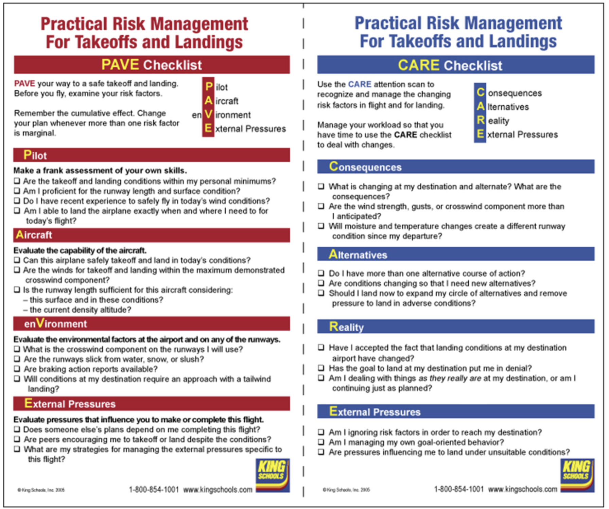

# Single-Pilot Resource Management (SRM)

- [Single-Pilot Resource Management (SRM)](#single-pilot-resource-management-srm)
  - [I. Single-Pilot Resource Management (SRM)](#i-single-pilot-resource-management-srm)
    - [Task Management (TM)](#task-management-tm)
    - [Automation Management (AM)](#automation-management-am)
    - [Risk Management (RM) and Aeronautical Decision Making (ADM)](#risk-management-rm-and-aeronautical-decision-making-adm)
      - [DECIDE model](#decide-model)
      - [PAVE](#pave)
    - [Situational Awareness (SA)](#situational-awareness-sa)
      - [CARE](#care)
    - [Controlled Flight Into Terrain (CFIT) awareness](#controlled-flight-into-terrain-cfit-awareness)
  - [II. Practice Applications of SRM](#ii-practice-applications-of-srm)
    - [The 5 Ps](#the-5-ps)
    - [PAVE and CARE Checklists](#pave-and-care-checklists)
    - [Personal Minimums](#personal-minimums)
    - [Cockpit Management (CRM)](#cockpit-management-crm)
  - [III. Basic Aviation Physiology](#iii-basic-aviation-physiology)
    - [Understanding Hypoxia, Dehydration, and Other Phsyical Factors](#understanding-hypoxia-dehydration-and-other-phsyical-factors)
      - [Hypoxia](#hypoxia)
      - [Dehydration](#dehydration)
      - [Middle Ear and Sinus Problemns](#middle-ear-and-sinus-problemns)
      - [Carbon Monoxide](#carbon-monoxide)
      - [Hyperventilation](#hyperventilation)
      - [Stress and Fatigue](#stress-and-fatigue)
      - [SCUBA](#scuba)
    - [How Alcohol and Drugs Affect Flying](#how-alcohol-and-drugs-affect-flying)

## I. Single-Pilot Resource Management (SRM)

### Task Management (TM)
* SRM - manage all resources before, during, and after flight
* Task, automation, risk management; aeronautical decision making (ADM); situational awareness; controlled flight into terrain (CFIT) awareness
* Prioritize tasks (most important: fly the airplane)
* Avoid getting distracted, remain calm
* Positive aircraft control is highest priority
* Pitch + Power = Performance; always control pitch and power
* Task saturation occurs during critical phases of flight, malfunctions, and emergencies
* Memory items (verify with checklist); scenario-based training

### Automation Management (AM)
* Ability to control/navigate airplane by automated systems (GPS, autopilot)
* Learn GPS before you fly; learning GPS in the cockpit will distract you
* Same for autopilot; do not operate it unless you have received ground instruction on how to use it
* Know where Autopilot Disconnect button is
* Moving electric trim switch or pulling appropriate circuit breaker will also disconnect autopilot

### Risk Management (RM) and Aeronautical Decision Making (ADM)
* ADM is systematic approach to the mental process used by pilots to take best course of action given the current circumstances
* Recognition of situation, controlling risks, making decisions
* Consequences include operating aircraft in non-ideal conditions, beyond limits, or a unairworthy aircraft
* FAA AC 60-22

#### DECIDE model
* **D**etect the change
* **E**stimate the need to react to the change
* **C**hoose a desirable outcome
* **I**dentify actions to control the change
* **D**o take the necessary actions
* **E**valuate the effect of the actions
* Many factors affect decision making

* Risk management starts before you arrive; take conditions, experience, physical/mental condition into account
* Get preflight weather before arriving
* Check airspace, active runways, NOTAMs

#### PAVE
* **P**ilot
  * How are you feeling
  * IMSAFE is within this acronym
* **A**ircraft
  * Aircraft condition, range/altitude capabilities
* En**V**ironment
  * Phsyical environment you will be operating in/over, are you comfortable with it
* **E**xternal pressures
  * Suitable outs to cancel trip
  * Won't feel in a hurry or pressure to continue at any point
* Many pilots have goal-oriented behavior--hate to give up on a goal, pushing to press on and ignore mounting risks
  * Manage this in advance
  * Always take overnight bag
  * Don't schedule appointments for right when you arrive
  * Alternative plans available
* Anti-authority
* Impulsivity
* Invulnerability
* Macho
* Resignation

### Situational Awareness (SA)
* Accurate perception of operational/environmental factors that affect airplane, pilot, passengers
* PAVE check throughout the flight

#### CARE
* **C**onsequences
  * How have risk factors changed
* **A**lternatives
* **R**eality
  * Deal with things as they really are, not as you planned them to be
* **E**xternal pressures
  * Are pressures influencing you to continue when you shouldn't
* GPS as backup instead of primary navigation (in case you lose GPS)
* Always have sectional or terminal area chart, keep it open
* If you get lost: aviate, navigate, communicate

### Controlled Flight Into Terrain (CFIT) awareness
* Occurs when airworthy aircraft is flown by a qualified pilot into terrain, water, or obstacles
* Common during day in low visibility, at night, in mountainous areas, or in unfamiliar areas
* Gather complete weather and terrain info
* Do not continue flight if visibility is rapidly deteriorating
  * Inadvertent descents are common
* If experiencing low visibility, perform 180° and get out of there; land ASAP
* FAA AC 61-134

## II. Practice Applications of SRM

### The 5 Ps
* Practical applications of SRM
* **P**LAN
* **P**LANE
* **P**ILOT
* **P**ASSENGER(S)
* **P**ROGRAMMING

* Monitor 5 Ps and assess situation and manage risk if any one changes
* Easiest during pre-flight and planning

* PLAN
  * Weather, planning, route, fuel, currency of publications
  * Reviewed and updated several times during flight
* PLANE
  * Airworthiness, avionics, GPS database currency, autopilot
  * Decide if flight should continue if any of these change
* PILOT
  * IMSAFE checklist
  * Physiological situation
  * How you feel throughout the flight and during landing
  * Evaluate physical and mental condition
* PASSENGER(S)
  * Inform and involve passengers
  * Pilot has final say
  * Give tasks and duties to the passengers
  * Clearly define relationship between passenger(s) and pilot
    * Clarify your expectations
    * Don't let them push you to do something you shouldn't
    * Passengers should understand risk of stopping early for example
* PROGRAMMING
  * Plan in advance where programming route changes/airport info should be done along the flight
  * Familiar with equipment
  * Maintain positive control of aircraft at all times

### PAVE and CARE Checklists

### Personal Minimums
* Limits that you set for yourself as a pilot
* Based on experience, familiarity with airplane/route, current weather/personal conditions
* FAA sets minimums for flying, but they are the absolute minimum conditions and are not necessarily safe for everyone
* Personal minimums based on YOUR skills and experience
* For example:
  * Generally need 3 miles' visibility to fly VFR
  * If you have always flown with 15 miles' visibility, should you fly in 4 miles' visibility? No, unless you have the skill level
  * 7 miles is good start
  * 10 knots max wind
  * What about crosswind? POH says 15-knots, but you'll want less as a beginner
  * Consider recency and how sharp you are
* Consider stress
  * 24 hours from last significant argument/bad occurrence
* Marginal minimums: consider no-go when at least two marginal risk factor categories
* Evaluate personal minimums honestly before each flight
* Minimums can always be increased, but only reduced when a positive event has occurred

### Cockpit Management (CRM)
* Also crew resource management
  * Optimizing use of human resources internal and external to aircraft
  * Aircraft hardware
  * Printed resources
* Keep cockpit organized at all times
* Anticipate communication frequency changes, point where you begin descent to airport, heading to fly, asking yourself what the next thing to do is
* Store charts properly, fold properly
* Position flight gear so it is accessible and secure
* Set GPS destination ahead of time to calculate groundspeed and time
* Scan instruments

## III. Basic Aviation Physiology

### Understanding Hypoxia, Dehydration, and Other Phsyical Factors

#### Hypoxia
* Oxygen defficiency in the body
* Results from flying at high altitudes without supplemental oxygen
  * Low air pressure means less oxygen reaches lungs
* Less oxygen in blood
* Affects brain first, then eyes
* Effects are subtle, vary from one individual to another
* Symptoms include blue-colored fingernails, lips, and ears
* Decreased skill capabilities
* Overcome by using supplemented oxygen: above 10,000 feet MSL during day and 5,000 feet MSL at night

#### Dehydration
* Body does not have enough water
* Occurs when about 2% of water volume has been lost
* Symptoms
  * Headaches
  * Decreased blood pressure
  * Dizziness or fainting
* Best treated by drinking water and avoiding dehydrating food (coffee)

#### Middle Ear and Sinus Problemns
* Gas in various cavities in head expands as you climb
* If it cannot escape, will build pressure and cause pain
* As you descend, you will need to equalize similar to SCUBA
* Swallow or blow through nostrils
* Ear block
  * Occurs when you have respiratory infection (cold, ear infection, sore throat) because congestion around Eustachian tubes makes equalization difficult
  * Causes loss of hearing or ruptered ear drum
  * Do not fly with upper respiratory infection/nasal allergies
  * Do not take oral decongestants--can impair piloting skills
* Sinus block can occur in frontal (eyebrow) or maxillary sinuses (upper cheek)
  * Do not fly with sinus block

#### Carbon Monoxide
* Tasteless, colorless, odorless
* Byproduct of burning fuel
* CO molecules attach to hemoglobin in blood, displacing oxygen molecules, causing hypoxia
* May enter cabin when using cabin heat, may be evidenced by exhaust smell in cockpit
* Symptoms
  * Difficulty concentrating
  * Headache
  * Blurred vision
  * Dizziness
  * Diminished muscle power and coordination
* If suspected...
  * Shut off heater
  * Open all air vents
  * Close openings between engine and cabin
  * Land ASAP

#### Hyperventilation
* Too little carbon dioxide in body, disturbing chemical balance of blood
* Caused by excessive breathing induced by emotions
* Symptoms
  * Lightheadedness
  * Feeling of suffocation
  * Drowsiness
  * Tinging sensation in fingers/toes
* Slow breathing rate, breathe into bag, talk aloud, singing

#### Stress and Fatigue
* Not enough rest/sleep, food, drink, physical/mental strain at home
* Poor coordination, poor memory
* Avoid high-stress situations, get rest, eat, hydrate

#### SCUBA
* Residual nitrogen in bloodstream can cause decompression sickness
* Wait **24 hours** until flying

### How Alcohol and Drugs Affect Flying
* FAA no-fly rules
  * FAA requires minimum 8 hours from bottle to throttle
  * No flying under a hangover
  * BAC limit is 0.04% or greater
  * No drugs
* Effects of alcohol can last up to 72 hours
* Brain effects
  * Decreased ability to make use of oxygen
  * Impaired judgement, reaction, reasoning, memory
  * Magnified when flying at altitude when there is less air
  * 2 drinks can have the effect of 4 at altitude
* Eyes
  * Eye muscle imbalance
  * Double vision, difficulty focusing
* Ear
  * Dizziness, decreased hearing
* Effects of alcohol worsen with sleep deprivation, fatigue, medication, etc.
* FAA does not publish "approved" medication list

