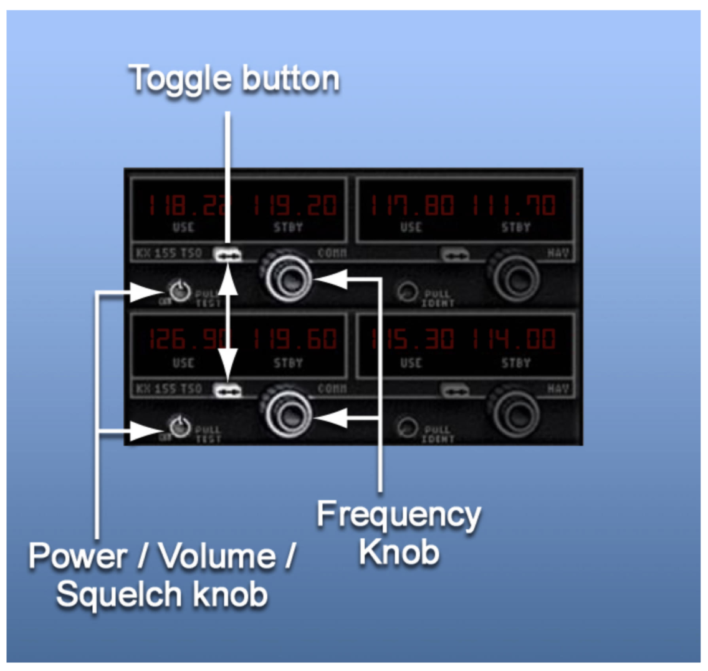
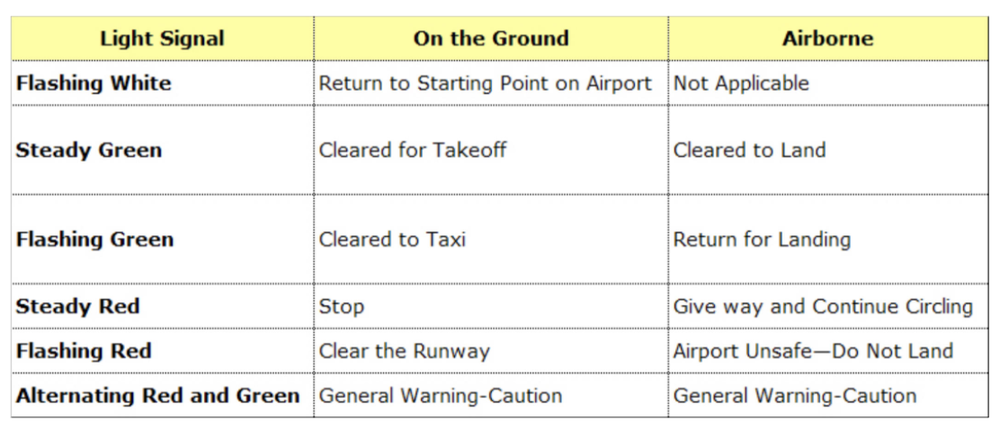

# Using Your Airport and Radio Communications

- [Using Your Airport and Radio Communications](#using-your-airport-and-radio-communications)
  - [I. Using Your Airport](#i-using-your-airport)
    - [Coordinated Universal Time](#coordinated-universal-time)
    - [Runway and Taxiway Markings](#runway-and-taxiway-markings)
      - [Runway Markings](#runway-markings)
      - [Airport Signs](#airport-signs)
    - [Progressive Taxi Directions](#progressive-taxi-directions)
    - [Ramp Hand Signals](#ramp-hand-signals)
  - [II. Radio Communications](#ii-radio-communications)
    - [Radios](#radios)
    - [Safety Equipment](#safety-equipment)
      - [Transponder](#transponder)
      - [Emergency Locator Transmitter (ELT)](#emergency-locator-transmitter-elt)
    - [Communicating by Radio](#communicating-by-radio)
    - [Composing what to say](#composing-what-to-say)
    - [Lost Communications](#lost-communications)
    - [Landing With a Radio Failure](#landing-with-a-radio-failure)

## I. Using Your Airport

### Coordinated Universal Time
* Time at Royal Observatory, Greenwich, England (0100, 1300, etc.)
* Does not adjust for DST
* Referred to as Zulu time
* Necessary to frequently convert to and from Zulu
* Eastern: +5 standard, +4 during daylight savings
* Add 1 for Central, 2 for Mountain, and 3 for Pacific against Eastern conversion
* To convert from Zulu back to Eastern, -5 standard, -4 during daylight savings

### Runway and Taxiway Markings
* Markings are white for runways
* Yellow for taxiways and other non-runway surfaces

#### Runway Markings
* Three types of markings for runways
  1. Runways with no instrument approach (visual runways)
  2. Runways with nonprecision instrument approach
  3. Runways with precision instrument approach

* Runway designation markings are determined by approach direction
* Runway number is magnetic bearing of the runway rounded to nearest 10 degrees
  * i.e. runway 19 = magnetic heading of 190 degrees within +/- 5 degrees
  * Parallel numbers with have L/R/C
* Runway has threshold/approach end where landing starts and departure end where taking off happens
* Some thresholds are displaced, which means you can use it to take off but cannot land before it

* Emergency overrun is indicated with yellow chevrons pointed to threhold
* No operations allowed on overrun
* Cannot taxi, take off, or land

* Centerline is marked with uniformly spaced white stripes (dashed line)
* Side stripes are solid white
* Runway hold position markings indicate where to stop and wait for clearance; four yellow lines, two solid and two dashed
* Solid lines on side where aircraft is to hold

* Center of taxiway is solid yellow but may have dashed line on each side when approaching runway

* Taxiway shoulders may be unmarked or with a dashed or continuous yellow line

#### Airport Signs

* Signs with red background and white lettering are mandatory instructions and indicate areas where taxiing requires ATC clearance, special caution, or is prohibited

* Signs with black background and yellow lettering tell you where you are located (black square, you're there)

* Signs with yellow background and black letter provide direction/destination, commonly used at intersections

* Signs with black background and white numerals are found along side of runway and indicate runway length remaining in thousands of feet

* Closed runways have large yellow "X" at each end
* Aeronautical Information Manual Chapter 2 has additional information about airport markings and signs

### Progressive Taxi Directions
* Some avionics can display airport layout (SafeTaxi in Garmin avionics)
* Airport diagrams contain runway and taxiway information
* [FAA Airport Diagrams](https://www.faa.gov/airports/runway_safety/diagrams/)
* At airports with control towers, you can request progressive taxi from ground control
  * Useful if unfamiliar with airport, unsure of position on field, or operating in low visibility
* Ground control will give you step by step directions to safely taxi to destination
* Helps prevent runway incursions (aircraft entering runway without clearance or with improper clearance)

### Ramp Hand Signals
* Line service person assists in taxiing onto the ramp
* Raise arms over head to signal "line up on me"
* Can nod at lineperson to acknowledge or flashing landing light

* Proceed straight ahead
  * Both arms raised with palms aft making fore and aft motion

* Left Turn
  * Left arm raised, palm aft, for and aft motion, right arm in 45-degree angle downward

* Right Turn
  * Right arm raised, palm aft, for and aft motion, left arm in 45-degree angle downward

* Slow down
  * Both arms extended horizontally, palms down, both arms making vertical motion

* Stop
  * Both arms raised then hands crossed overhead

* Cut engine
  * Left arm at side, right arm making cutting motion across throat

## II. Radio Communications

### Radios
* Radio both transmits and receives
* Operates in VHF (very high frequency) range
  * 118 to 136.975 MHz
* Limited by line of sight; greater range at higher altitude, can be blocked by things (i.e. mountains)
* Will display active and standby frequency
  * Standby frequency is previously used frequency or next frequency to use
  * Toggles by button

* Power/Volume/Squelch knob
  * Turn unit on and off
  * Increase or decrease volume
  * Disable automatic squelch (background noise control) by pulling knob out and rotating it
    * Lets you set minimum signal to send to speakers/headsets
    * Could help you receive weak signal
* See CTA for notes on G1000

### Safety Equipment
* Transponder and ADS-B out always transmitting location
* Emergency locator transmitter (ELT)

#### Transponder
* Enhances radar return on ATC screen
* Required for many airspace classes
* Receives an interrogation signal from ground radar unit and replies back with squawk
* Provides position and altitude; ground radar unit can determine track
* Has unique assigned transponder code if assigned with registration number
* ADS-B Out
  * Based on onboard GNSS (GPS) to determine and broadcast aircraft info, position, altitude, and track
  * Relayed to ATC
  * Updates more frequently and accurately than ATC radar
  * Required whenever transponder is required
* Transponder should always be on and operated as requested by ATC
  * *IDENT* button brightens display on controller's radar screen for 18 seconds; should only be used when requested
  * Can enter 4096 four-digit codes
  * Transmits altitude
* Specific transponder codes
  * 0000: military intercept, do not use
  * 1200: VFR, use by default
  * 7500: hijack, ATC will immediately ask you if you meant to do this
  * 7600: lost communications, ATC may ask you to squawk ident to see if you can receive
  * 7700: emergency, displays alarm on radar screen
* Operational modes
  * Off
  * STBY: warming up
  * ON: unit responds to radar but does not transmit altitude
  * ALT: unit responds to radar and transmits altitude
* VFR button changes to 1200

#### Emergency Locator Transmitter (ELT)
* Transmits location in emergency
* Automatically when gravity switch senses a hard collision
* Manually when activated by pilot
* Old-style
  * Transmit homing signal
  * Limited by line of sight
  * Transmit on 121.5 VHF and 243.0 UHF
  * Capable of being received by ground stations and aircraft (most of which will monitor 121.5)
  * Testing
    * Test between top of hour and five minutes after the hour only
    * Tune to 121.5 and listen for signal
    * Move ELT rocker switch to ON to listen for ELT signal (no more than three transmissions)
    * Seeing red annunciator light
    * And moving ELT rocker back to RESET
* New-style
  * Transmit on 121.5 VHF, 243.0 UHF, and 206.028 UHF (which is monitored by satellites and includes lat/lon and aircraft info)
  * Testing
    * Only should be tested by authorized mechanics
    * Have visual/aural indications when activated
    * Testing new-style ELT will activate International Search and Rescue Satellite (SARSAT) system
    * Immediately notify nearest ATC agency if you accidentally activate new-style ELT
* Must replace ELT battery when 50% of useful life has expired or when transmitter has been in use for more than one hour
* Can tune to 121.5 and verify ELT is not transmitting or by checking indicator

### Communicating by Radio
* Many different services
  * Automatic Terminal Information Service (ATIS)
  * Clearance delivery
  * Ground control
  * Tower
  * Approach and departure control
  * Air Route Traffic Control Centers
  * Their frequencies can be found in the chart supplements
* ATIS
  * Used at high-activity airports
  * Continue broadcast of non-control info like weather, runways, airport notices
  * Updated typically every hour around 50 minutes past the hour
  * Updates identified by sequential alphabetical codes starting each day at Alpha
  * Reduce frequency congestion, alert controllers what information you have
* Clearance delivery
  * Relieves congestion on Ground Control
  * Provides pilot with basic instructions necessary to depart area after takeoff and avoid collisions/noise-sensitive areas
* Ground control
  * Directs traffic on ground at busy airports (including ground vehicles)
  * Avoids traffic jams/collisions
  * Control in some ramp areas and taxiways
  * Must read back ground control instructions that include runway and any hold-short instruction
  * Usually can only clear you across one runway at a time; must get separate clearance for each runway
* Tower
  * Controls traffic within about 5 miles (sometimes more) of airport
  * Separates traffic landing and taking off on runway
* Important clearances
  * **Hold short**: do not proceed onto runway
  * **Line up and wait**: taxi onto departure runway lined up and stop without taking off
  * **Cleared for takeoff**: authorization to depart
  * **Cleared to land**: authorization to land
  * **Cleared for touch-and-go**: authorization to land followed by immediate takeoff
  * **Cleared for stop-and-go**: authorization to land, come to a complete stop, and make an immediate takeoff on the remaining runway
  * C**leared for the option**: authorization to make, at pilot discretion, a missed approach, touch-and-go, stop-and-go, or full stop landing
  * **Go around**: abandon the landing approach, more instructions to follow
  * **Continue**: continue taxi, continue approach, continue descent, etc.
* Approach and Departure control
  * Sequence traffic to and from the airport
  * Usually use radar
  * Control traffic outside airspace limits of control tower up to 30 miles from airport
  * You should not comply with instruction or clearance if you are unable to safely do so
    * Say "unable" and maybe suggest alternative
* Air Route Traffic Control Center (ARTCC), called "Center"
  * Provide separation and radar service on airways between major airports (more than 30 miles from airport)
  * For aircraft on instrumne flight plans (optionally by VFR aircraft)
* VFR may request flight following by center/approach
  * Monitor flight at your request
  * Traffic advisories when controller's workload permits (they will not always have time to point out traffic to you)

### Composing what to say
* Listen before talking on the radio
* Think before you transmit; mentally rehearse what you want to say
* Use standard formats, normal conversational term
* FAA Pilot/Controller Glossary is useful
* Five items:
  * Who you are calling: "Reagan Tower"
  * Who you are: "Skyhawk One Six Two Charlie Charlie"
  * Where you are: "Two zero miles southwest at eight thousand, five hundred"
  * What you want: "Inbound for landing"
  * What you know: "Information Bravo"
* ATC functions: address clearance delivery, ground control, tower, departure control, etc.
* Flight Service Stations (FSS): addressed as *Radio*
* ATC may abbreviate call sign to last three characters; do not abbreviate your callsign until ATC does
* [Memorize phonetic alphabet](https://quizlet.com/9566872/coast-guard-phonetic-alphabet-flash-cards/)
* Frequencies as single digits: 124.6 &#8594; "One-Two-Four-Point-Six"
* Altitudes as thousands and hundreds of feet: 4,500 &#8594; "Four-Thousand-Five-Hundred"

### Lost Communications
* Inability to receive/transmit, audio panel failure
* Indicated by not hearing transmissions or not getting response (do not make repeated calls to ATC)
* Check volume, headset connections, volume on headset; activate Power/Volume/Squelch knob (listen for hissing on high volume)
* Inability to transmit
  * No TX annunciator on display
  * No responses
  * No side tone (transmissions in headset)
  * Check Power/Volume/Squelch switch in VOL position
* ATC may say "carrier only, no voice"
  * Radio is transmitting signal, but not voice
  * Try disconnecting and reconnecting microphone
* Stuck microphone
  * Push to talk key is stuck after last transmission and you are still transmitting on that frequency
  * Try to unstick push-to-talk key
  * If unable, switch to unused or less important frequency, since you will be blocking other communications
  * G1000 alerts to stuck mic
  * G1000 fail-safe connects pilot's headset and microphone directly to COM1 transceiver (no audio for cockpit speaker or passengers)
* If you cannot transmit and need to talk to ATC or need them to be aware, squawk 7600 (XPDR, CODE, then 7600)

### Landing With a Radio Failure
* May be best to land at an airport without a control tower
  * Overfly runway 500 feet above pattern altitude
  * Observe direction and flow of traffic
  * Join traffic pattern and land
  * Transmit intentions just in case
  * Watch for other aircraft and follow good collision avoidance practices
  * Non-radio-equipped aircraft land at nontowered airports all the time
* Landing at a towered airport
  * Squawk 7600
  * Remain above or outside the airport's Class D airspace
  * Observe directions and flow of traffic
  * Join traffic pattern using 45-degree entry to downwind
  * Transmit intentions just in case
  * Look for light gun signals from tower indicating whether and when you can land
    * Acknowledge signals by rocking wings in day or flashing landing light at night
    * Light gun signals are white, red, or green, and visible in daylight
    * Directed at a specific aircraft that tower believes has had a radio failure
    * If on short final and no light signal, prepare to go around

