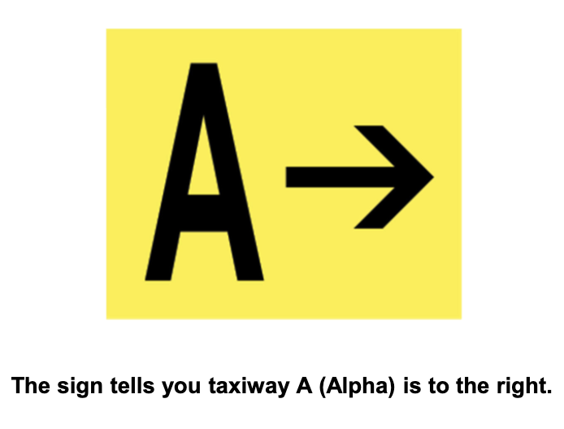

# Using Your Airport and Radio Communications

## I. Using Your Airport

### Coordinated Universal Time
* Time at Royal Observatory, Greenwich, England
* 0100, 1300, etc.
* Does not adjust for DST
* Referred to as Zulu time
* Necessary to frequently convert to and from Zulu
* Eastern: +5 standard, +4 during daylight savings
* Add 1 for Central, 2 for Mountain, and 3 for Pacific against Eastern conversion
* To convert from Zulu back to Eastern, -5 standard, -4 during daylight savings

### Runway and Taxiway Markings
* Markings are white for runways
* Yellow for taxiways and other non-runway surfaces

#### Runway Markings
* Three types of markings for runways
  1. Runways with no instrument approach (visual runways)
  2. Runways with nonprecision instrument approach
  3. Runways with precision instrument approach

* Runway designation markings are determined by approach direction
* Runway number is magnetic bearing of the runway rounded to nearest 10 degrees
  * i.e. runway 19 = magnetic heading of 190 degrees within +/- 5 degrees
  * Parallel numbers with have L/R/C
* Runway has threshold/approach end where landing starts and departure end where taking off happens
* Some thresholds are displaced, which means you can use it to take off but cannot land before it

* Emergency overrun is indicated with yellow chevrons pointed to threhold
* No operations allowed on overrun
* Cannot taxi, take off, or land

* Centerline is marked with uniformly spaced white stripes (dashed line)
* Side stripes are solid white
* Runway hold position markings indicat where to stop and wait for clearance; four yellow lines, two solid and two dashed
* Solid lines on side where aircraft is to hold

* Center of taxiway is solid yellow but may have dashed line on each side when approaching runway

* Taxiway shoulders may be unmarked or with a dashed or continuous yellow line

#### Airport Signs

* Signs with red background and white lettering are mandatory instructions and indicate areas where taxiing requires ATC clearance, special caution, or is prohibited

* Signs with black background and yellow lettering tell you where you are located (black square, you're there)

* Signs with yellow background and black letter provide direction/destination, commonly used at intersections

* Signs with black background and white numerals are found along side of runway and indicate runway length remaining in thousands of feet

* Closed runways have large yellow "X" at each end
* Aeronautical Information Manual Chapter 2 has additional information about airport markings and signs

### Progressive Taxi Directions
* Some avionics can display airport layout (SafeTaxi in Garmin avionics)
* Airport diagrams contain runway and taxiway information
* [FAA Airport Diagrams](https://www.faa.gov/airports/runway_safety/diagrams/)
* At airports with control towers, you can request progressive taxi from ground control
  * Useful if unfamiliar with airport, unsure of position on field, or operating in low visibility
* Ground control will give you step by step directions to safely taxi to destination
* Helps prevent runway incursions (aircraft entering runway without clearance or with improper clearance)

### Ramp Hand Signals
* Line service person assists in taxiing onto the ramp
* Raise arms over head to signal "line up on me"
* Can nod at lineperson to acknowledge or flashing landing light

* Proceed straight ahead
  * Both arms raised with palms aft making fore and aft motion

* Left Turn
  * Left arm raised, palm aft, for and aft motion, right arm in 45-degree angle downward

* Right Turn
  * Right arm raised, palm aft, for and aft motion, left arm in 45-degree angle downward

* Slow down
  * Both arms extended horizontally, palms down, both arms making vertical motion

* Stop
  * Both arms raised then hands crossed overhead

* Cut engine
  * Left arm at side, right arm making cutting motion across throat

## II. Radio Communications
