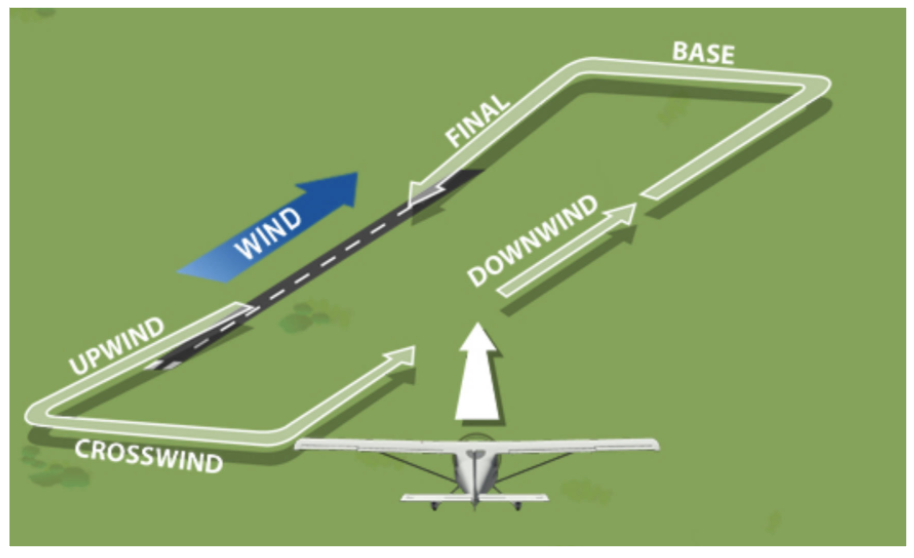

# The Airport Environment and Correcting for Wind

- [The Airport Environment and Correcting for Wind](#the-airport-environment-and-correcting-for-wind)
  - [I. Learning About Ground Operations](#i-learning-about-ground-operations)
    - [Wind Direction and Runway to Use](#wind-direction-and-runway-to-use)
    - [Using Flight Controls While Taxiing](#using-flight-controls-while-taxiing)
  - [II. Flying Around Airports](#ii-flying-around-airports)
    - [The Traffic Pattern Around the Airport](#the-traffic-pattern-around-the-airport)
    - [Entering and Departing the Traffic Pattern](#entering-and-departing-the-traffic-pattern)
    - [Communicating Your Intentions and Requests](#communicating-your-intentions-and-requests)
    - [Flying Safely in the Traffic Pattern](#flying-safely-in-the-traffic-pattern)
  - [III. Correcting for Wind](#iii-correcting-for-wind)
    - [Ground Reference Manuevers](#ground-reference-manuevers)
      - [Rectangular course](#rectangular-course)
      - [Turns Around a Point](#turns-around-a-point)
      - [S-Turns](#s-turns)

## I. Learning About Ground Operations

### Wind Direction and Runway to Use
* Landing and takeoffs usually made on runway most aligned with wind
* Reduces groundspeed
* Less runway required
* Less wear on tires/breaks
* Greater angle of climb on takeoff, steeper angle of descent on landing
* Airplane easier to handle at slow ground speeds
* Conforms with other traffic in the pattern
* Windsock
  * Large end points to direction wind is blowing from
  * Stronger wind, straighter the windsock will extend
  * Straight out windsock usually indicates wind stronger than 15 knots
  * Used to determine runway to land at nontowered airports
  * Tetrahedron or wind tee also used to show which runway is in use; should only be used to determine runway in use because sometimes are positioned manually
    * Supersedes wind sock in determining the runway (but not the wind)
* How to determine where wind is coming from without windsock?
  * ASOS or AWOS broadcast
  * Ask on radio what runway other pilots are using
  * Feel wind on face before you taxi
  * Look for flags, tree movement, smoke, ripples on water
  * ATIS
* Chart Supplement
  * Has ATIS and other frequencies
  * Navigational facilities
  * Special notices/procedures/noise abatement
* Sectional chart
  * Shows airports and frequencies, airspace, terrain elevations, ground features/landmarks
* Nontowered airport communication
  * Many have a UNICOM used by airport operator or fuel seller
  * Frequently provide airport advisories, wind direction/strength, runway in use
* AWOS
  * Automated weather observing system
* ASOS
  * Automated surface observing system
* Both accessed by radio frequency in Chart Supplement or sectional, sometimes a phone number from Chart Supplement
* Reported wind direction is direction wind is blowing *from* rounded to nearest 10 degrees refrenced to magnetic north
  * Smart idea to set heading bug to wind direction
* Runway numbered on each end, representing magnetic direction rounded to nearest 10 degrees in which runway is oriented, omitting last zero
  * Tells you heading you will be on when landing

### Using Flight Controls While Taxiing
* Expose top of control surfaces to wind while taxiing in wind
  * Want wind pushing down on top of control surfaces to minimize risk that wind flips airplane

* Set heading bug to wind!
* When wind is coming from in front of you
  * Neutral elevator
  * If wind coming from right, turn wheel right into the wind
    * Exposes aileron top to wind to push airplane down
  * If wind coming from left, turn wheel left into wind
  * So, confront wind "head-on" with neutral elevator
* When wind is coming from behind you
  * Full forward elevator - exposes top of elevator to wind, pushing tail down
  * Control stick away from wind
    * Wind from left - full control right - exposes top of left aileron to wind
    * Wind from the right - full control left - exposes top of right aileron to wind
    * Dive away from the wind

* Beware of buildings - they can funnel winds (especially between buildings) and make wind turbulent and harder to correct for
* *Mechanical turbulence*: turbulence caused when operating downwind of hangars and other buildings that create a physical disturbance of the wind
* Also watch out for large airplanes/helicopters and wash/wake turbulence

## II. Flying Around Airports

### The Traffic Pattern Around the Airport
* Traffic pattern helps avoid collisions
* Every pilot knows where to look for traffic and what to expect from other aircraft
* Legs of traffic pattern are flown in the following order:
  * Upwind
    * Departure leg
    * Up into the wind
    * Turn into crosswind leg when 300 feet below traffic pattern altitude
  * Crosswind
    * Across the wind
    * Before turning onto downwind leg, be sure to check for traffic
  * Downwind
    * Parallel to runway, going with the wind
    * Visual reference is handy to help with proper spacing from runway (halfway up wing strut, for example)
    * Flown at traffic pattern altitude (TPA, usually 1000 feet AGL unless otherwise noted in Chart Supplement)
    * Also known as left downwind or right downwind depending on what side runway is on
    * Begin descent abeam the runway numbers
    * Turn onto base leg when 45-degree angle to runway numbers
    * Altitude should be approximately 700 to 800 feet AGL on base
  * Base
    * Left base if turning left, right base if turning right
  * Final
    * Slow to approach speed on final, should be at least 0.25 mile out
  * Announce left/right base, left/right downwind, left/right crosswind

* Turns in traffic pattern should not exceed 30 degrees of bank
* Turns in traffic pattern should be left unless otherwise noted on sectional/Chart Supplement
  * Left traffic pattern is standard; right is nonstandard
  * Pilot is usually in left seat, so turning to the left provides most visibility
  * Airport may have right traffic if there is mountain, houses, other obstruction
  * Parallel runways
    * Left has standard traffic, right has nonstandard
  * Chart Supplement will have traffic pattern and TPA (traffic pattern altitude)
    * Runway number will have RP in front of it (RP 14 or RWY 15 Rgt tfc.)
    * Or, call UNICOM operator, and they will advise if runway in use has right traffic
    * Traffic pattern indicators near runway
* Traffic pattern indicators / segmented circles
  * Legs show direction of turn from base to final

* If no control tower, no AWOS/ASOS, and no answer on UNICOM, overfly airport 500 feet above TPA to check wind sock, indicator, and determine best runway to use

### Entering and Departing the Traffic Pattern
* When departing, either continue straight out or make 45-degree turn in direction of crosswind leg after leaving the runway and have reached pattern altitude
* Look for special departure procedures at airport (may be because of noise abatement, obstructions, etc.) on signs around airport or on Chart Supplement
* Enter traffic pattern on 45 angle to downwind at about the midfield point at traffic pattern altitude (1000 feet AGL unless otherwise noted)

### Communicating Your Intentions and Requests
* Towered airports
  * Control Tower (CT) frequencies
    * Must establish communications with tower before entering airspace around towered airport
    * Airport airspace is shown on sectional
    * CT frequences can be found in sectional or Chart Supplement (i.e. `CT - 118.2`)
  * On initial conact, let them know you have ATIS information by providing phonetic identifier
  * Control tower will tell you which runway/traffic pattern to use (if different from standard)
* Common Traffic Advisory Frequency (CTAF)
  * Some towers close at night
  * When closed, announce intentions and position in traffic pattern to other pilots
  * Use the CTAF (CTAF at towered airport is followed by small blue circle with a white `C` in it)
  * Use CTAF at all times at nontowered airports
  * Suggested to make initial contact 10 miles out
* UNICOM
  * At a nontowered airport, CTAF is usually UNICOM frequency
  * UNICOM is assigned frequency or that airport, usually operated by an FBO
* Nontowered airport
  * CTAF at nontowered airport is fol.owed by a small magenta circle with a white `C` in it
* Several airports in area may be using same CTAF/UNICOM
  * Say airport name at both beginning and end of transmission
  * Potomac Traffic, blah blah blah, Potomac Traffic
* UNICOM operator should tell you current wind, runway in use, other pertinent information
* If no control tower or UNICOM, airport will use generic CTAF, which is 122.9 and also known as MULTICOM and will be on sectional

### Flying Safely in the Traffic Pattern
* Use landing light in addition to required beacon/strobes (anti-collision lights) when within 10 miles of an airport
* If airplane is ahead of you when you are on downwind, wait until that airplane is abeam you on final before you turn base
* If you have an airplane ahead of you on upwind, wait until that airplane is abeam you on downwind before you turn crosswind
* The best places to establish spacing in the pattern is on the upwind/departure leg; just extend the upwind leg
* Overlfying the airport
  * Observe traffic flow, see windsock, pass over without intention of landing
  * Fly at least 500 feet above TPA
* Right-of-way
  * Aircraft on final to land have right of way
  * Out of aircraft on final, aircraft at lowest altitude has right-of-way
  * Do not cut in front of someone
  * Landing airplanes have priority over airplanes in flight or waiting to take off
* See and avoid
  * Continually look out for other traffic; constantly be looking for traffic
  * Be aware of blind spot in high-wing aircraft; raise wing and check for traffic before turning
  * When turning final, always visually ensure there are no aircraft on straight-in final who may not be talking on frequency
  * Verbalize "*Clear Final*" after visually checking final approach
  * On climb-out from runway, make shallow S-turns for better view of traffic that may be ahead
    * Lower nose every 500 feet to ensure path in front is clear

## III. Correcting for Wind
* Wind affects path over ground
* Wind can be determined from preflight briefer, weather resources at airport, and visually
* Point airplane into wind to track along straight path to destination
* *Crab* and make coordinated turn to set appropriate crab angle
  * Fly in coordinated straight flight on that new heading
* Wind also affects groundspeed
  * Wind does not affect indicated airspeed!
* Wind affects path over ground when making turns
  * Faster groundspeed &#8594; more rate of turn needed &#8594; more bank
  * Slower groundspeed &#8594; less rate of turn needed &#8594; less bank

### Ground Reference Manuevers
* Always entered on the downwind
* Steepest bank angle where groundspeed will be greatest; establishes maximum necessary bank angle
* Performed at 600 to 1000 feet AGL
* Always do pre-manuever checklist, clearing turns, and backup landing site

#### Rectangular course
* Practice correcting for wind in the traffic pattern
* Enter at 45-degree angle to downwind at constant power setting with less than VA speed
* Steepest bank necessary on downwind; will need to turn more than 90 degrees to crab into wind for second leg

* Second turn from base to upwind
  * Start with medium bank and shallow it as you turn into wind
  * Groundspeed is at slowest, so will need shallow bank
  * Turn will be less than 90 degrees since going from crab into wind

* Third turn from upwind to crosswind
  * Entering turn at slowest groundspeed
  * Start with shallow bank; increase to medium bank as groundspeed starts to increase
  * Turn will be less than 90 degrees since on crosswind you will be crabbing into the wind

* Last turn from crosswind to downwind
  * Start with medium bank and steepen as groundspeed starts to increase
  * Turn will be more than 90 degrees since going from crab to parallel/downwind
  * Exit maneuver at end of downwind leg

* Always monitor airspeed, altitude, and traffic

#### Turns Around a Point
* Maintain constant radius circle by adjusting bank angle
  * Faster groundspeed &#8594; more bank
  * Lower groundspeed &#8594; less bank
* Enter on the downwind at 600 to 1,000 feet AGL
  * Airspeed will be fastest and bank steepest
  * No more than 45 degrees bank
  * Medium bank as wind changes to a crosswind and groundspeed decreases
  * Shallow bank, becoming shallowest when turning upwind

#### S-Turns
* Fly ground track with equal-radius semi-circles on alternating sides of reference line
* Reference line should be perpendicular to the wind and long
* Bank angle is positively correlated with groundspeed
* Roll rate is positively correlated with groundspeed
1. Enter maneuver downwind
2. Start first turn as soon as you cross reference line
3. Downwind, use steepest bank and fastest roll rate
4. Shallow out bank as you take upwind, use shallowest bank and roll rate on upwind
5. Start next turn as soon as you cross reference line
6. Shallow into steep bank as you take downwind from upwind

* Wings should be level and parallel to road when crossing it
* However, it will be necessary to crab when crossing road if wind is not perpendicular to the road

