# Stalls, Takeoffs, and Landings Explained

## I. Normal and Crosswind Takeoffs and Landings

### Takeoffs
* CHORRD checklist
* **C**onditions
  * i.e. crosswind
* **H**azards
  * i.e. wind causing issues with directional control
* **O**perational changes
  * i.e. taking off with aileron full right, gradually decreasing; i.e. delay lift-off to have better control
* **R**unway required vs. available
  * i.e. required today is 850 feet ground roll, 1250 feet takeoff distance, with 3400 feet runway available
* **R**eturn Procedure
  * i.e. if we have problems after takeoff I will enter downwind and return to this airport
* **D**eparture plans
  * i.e. runway heading until above pattern altitude and then climb to 3000 feet MSL on heading of 030
* Before taking the runway
  * Lights: landing light on
  * Camera: transponder set ALT
  * Action: mixture full rich, clear final
* When ready
  * Taxi onto runway, set crosswind correction, select reference for tracking centerline, start roll
  * Smoothly apply full power (three seconds)
  * Apply right rudder pressure to counteract left-turning tendency
  * Glance at engine indicators to ensure normal operation
  * Establish aircraft in climb attitude
  * Let airplane fly itself off the runway (around VR)
  * Pitch for VY
    * Verify climb attitude of just below the 10-degree mark on attitude indicator
  * Keep right rudder in, after establishing safe climb, verify coordinated
  * Retract flaps once at safe altitude (at least 200 AGL and 60 knots)
  * Look out back window to verify no drift from runway
* Crosswind takeoffs
  * Use aileron control into the wind
    * Wind from right &#8594; yoke to right
    * Wind from left &#8594; yoke to left
    * Should be fully deflected at takeoff roll
      * Raised aileron will keep wing from being lifted by wind; lowered aileron will increase drag and prevent airplane from weathervaning into the wind
      * Not enough aileron will let upwind wing rise and cause airplane to "skip", imposing side-stresses on the landing gear
  * Gradually reduce aileron control as you gain speed
  * Use rudder to keep nose straight
* Significant crosswind
  * Keep main wheels on ground slightly longer than normal takeoff
  * Both main wheels should lift off at same time, but it's okay to lift downwind wheel to prevent side-skipping
* Compensate for additional left-turning tendency with more right rudder
* Hints
  * Keep toes off brakes by keeping heels on floor and balls of feet on bottom of rudder pedals
  * Maintain full power to enhance performance by providing more fuel (and thus cooling) to engine until clear of obstacles/high enough to level-off
* After takeoff
  * Correcting for wind, looking for traffic, retracting flaps, lowering nose every 500 feet to get better look for traffic ahead
  * Climb checklist at 1000 feet AGL, transition to cruise climb airspeed/shallower climb

### Landings
6 phases:
* Downwind, abeam the point of intended landing
* Base leg
* Final approach
* Roundout (flare)
* Touchdown
* After-landing roll

#### Downwind / abeam the point of landing
* Reduce power
* Apply carb heat
* Start descent (80-85 knots)
* Lower flaps

#### Base Leg
* Start turn at 45° angle from point of intended landing
* Set flaps to next increment setting (20°)
* Reduce airspeed
* Point where you turn depends on wind
  * Strong wind &#8594; base leg closer to runway
  * Light wind &#8594; base leg further from runway
* Typically will have crosswind, should establish crab to correct for drift
* Flap setting and rate of descent will depend on wind/distance from runway threshold
* Airspeed on base should be approximately 1.4 VSO (75 knots in C172)
* Check final for traffic

#### Final approach
* Normal bank angle to turn from base leg to final approach
* Line up with centerline
* Tailwind on base &#8594; turn slightly early
* Headwind on base &#8594; turn slightly late
* Add more flaps as needed
* Airpseed should be about 1.3 VSO (65 knots in C172)
* Touch down in first third of runway
* Maintain proper angle of descent/airspeed by coordinating power and pitch
* Stablized final approach is established when, about a half-mile out, you have proper angle of descent, altitude, airspeed, and power setting
* Keep touchdown aiming point at same position on windscreen
  * Moves down on windscreen &#8594; pitch down and reduce power
  * Moves up on windscreen &#8594; pitch up and increase power
* Descent rate of 300 feet per nautical mile is normal

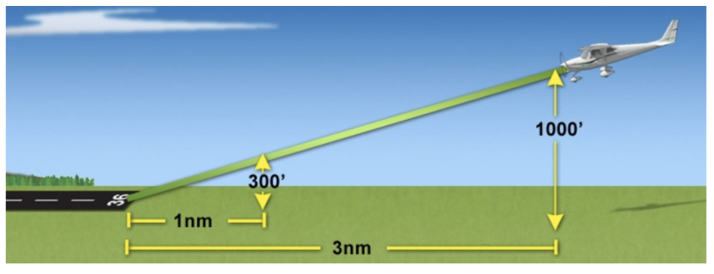

* 3 miles &#8594; 1000 feet
* 1 mile &#8594; 300 feet
* .5 mile &#8594; 150 feet
* .25 model &#8594; 75 feet

#### Roundout (flare)
* Start 10 to 20 feet from ground by easing in back pressure
* Gradual increase in pitch, AOA, and decrease in airspeed
* Keep lined up with centerline; use aileron to move towards centerline and rudder to keep aircraft body parallel with runway
* Visual focus same distance as car
* Touchdown should occur beyond the aim point (because of roundout) but within first third of runway

#### Touchdown

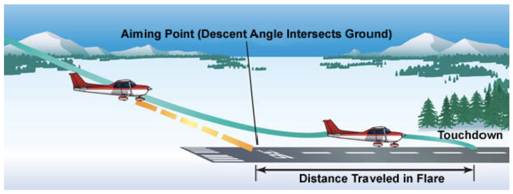

* Nose-high/tail-low attitude
* On both main wheels, except crosswind where upwind main wheel will touch first
* At or near VSO
* On the centerline with longitudinal axis parallel to runway
* With no sideways drift (keep aileron correction after touchdown and increase during landing roll)

#### After-landing roll
* Ends when aircraft reaches taxi speed or stops
* Confirm throddle at idle
* Back pressure on elevator to minimize stress on nose gear (after nose gear has settled)
* Gradual increase of aileron input into wind (if crosswind)
* Rudder pressure to keep nose straight
* Apply brake pressure evenly as necessary
* Exit runway when slow enough to safely make turn onto taxiway
* Tell controller "unable" if unable to safely make taxiway
* Runway slope may create illusions of being too high or low
* Runway width may also create same illusions

### Crosswind Landing
* Determining the crosswind component
  * Wind is not usually aligned exactly with runway on which you will be landing
  * When not perfectly aligned, there will be a headwind component and a crosswind component
  * Crosswind component is value of effective wind at 90° to the runway and is always less than the absolute value of the wind
  * Must correct for crosswind component so that you don't land while moving sideways (could damage landing gear) and wind does not pick up a wing (could flip airplane over)

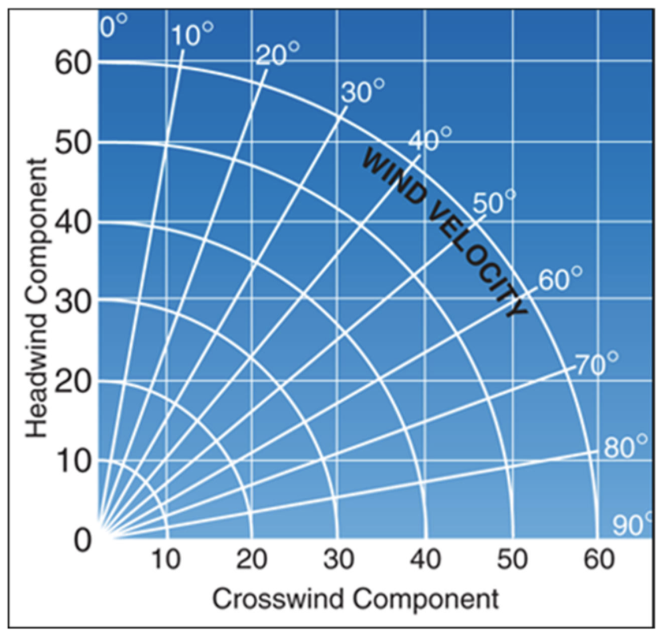

* How to use the crosswind component chart
  * Determine by observation or via ATIS the wind direction and velocity along with the runway in use
  * Determine the angle between wind direction and the runway
    * Example: wind is 240 degrees at 10 knots, runway 27 is in use
      * Difference between wind (240) and runway direction (around 270) is 30 degrees
    * Locate angle on the appropriately labeled line
    * Follow line down to the appropriate arc representing the wind velocity
    * Mark that spot; draw line across to left for headwind component and down for crosswind component
* POH has maximum demonstrated crosswind capability (maximum crosswind an experienced company test pilot could safely demonstrate; does not necessarily indicate your skills)
* Crosswind landings are more difficult than crosswind takeoffs
  * Difficult to maintain accurate control of airplane while speed is decreasing (rather than increasing on takeoff)
* Two methods: crab and wing low; combination of both is most common
* Crab method
  * Set heading on final to correct for wind drift
  * Physically easier for pilot to maintain during final approach
  * More comfortable for passengers because it is coordinated
  * Crab must be removed before touchdown to keep airplane from landing sideways and from damaging landing gear
* Wing-low method
  * Also known as a *sideslip*
  * Is uncoordinated, and therefore uncomfortable for passengers
  * Apply aileron into the wind to match the horizontal component of lift with the crosswind component of the wind
  * Opposite rudder to hold longitudinal axis straight down centerline of runway
  * Applied late on final and held until after touchdown
* You have reached crosswind capability of airplane when full rudder is required to hold longitudinal axis of airplane straight down the centerline of the runway, even if still able to steepen the bank angle with the ailerons
  * Additional bank would just cause airplane to turn, even though full opposite rudder is being applied

#### Crosswind touchdown
* Maintain bank angle into the wind and rudder to align longitudinal axis with runway
* During gusty or high wind conditions, prompt adjustments to bank angle must be made to ensure airplane does not drift sideways
* Maintain directional control during after-landing roll - do not let airplane weathervane into the wind - use rudder
* Keep upwind wing from rising by increasing use of aileron as airplane slows done (full deflection by the time airplane comes to a complete stop)
* Common errors
  * Attempting to land in crosswinds that exceed airplane's maximum crosswind component or pilot abilities/skill level
  * Inadequate compensation on final for wind drift
    * and increased drag during wing-low method, resulting in excessive sink rate and/or too low an airspeed
    * results in excessive sink rate and/or too low an airspeed
  * Touching down while drifting
  * Failure during rollout to apply appropriate flight control inputs, maintain directional control, and increase aileron deflection into the wind as airplane slows down

### Visual Glide Path Indicators
* Visual Approach Slope Indicator (VASI)
* Uses 2 or 3 light bars: near, middle (if used), and far
  * Usually a 3° angle but may be as high as 4.5°
* Projects white light in upper part of beam and red light in lower
* Daytime from 3 to 5 miles and at night up to 20 miles
* Provides safe obstruction clearance for 10 degrees either side of the extended runway centerline out to 4 miles from the runway threshold
* Red over white: you're all right
* Red over red: you're dead (below glide)
* White over white: you'll fly all night (above glide)

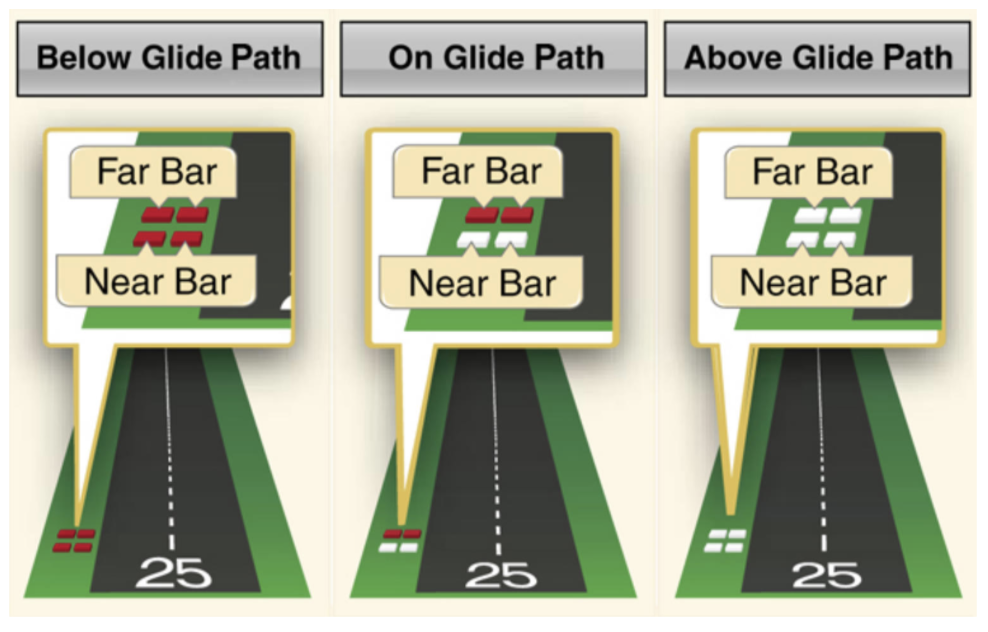

* Precision Approach Path Indicator (PAPI)
* Single row of either two or four lights
* Daytime range up to 5 miles, nighttime up to 20 miles

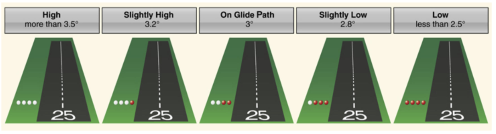

* Pulsating VASI - PVASI
* Single light unit projecting two-color visual approach plan
* **Above glide path**: pulsating white light
  * Higher above glide path, faster the pulsations
* **On glide path**: steady white light
* **Slightly below glide path**: steady red light
* **Below glide path**: pulsating red light
  * Lower below the glide path, lower the pulsations
* Do not confuse without other light sources
* Daytime range up to 4 miles, nighttime up to 10 miles
* Tri-color VASI: rarest
* Single light that projects three colors
* Amber: too high
* Green: on glide path
* Red: too low
* Daytime range of 1/2 to 1 mile, nighttime up to 5 miles
* May briefly appear amber when transitioning from green to red

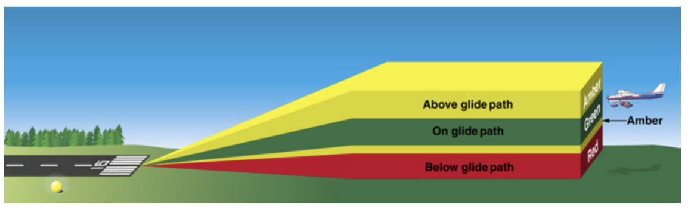

### Corrections while landing
* Including adjusting throttle, pitch, or control yoke
* Use ailerons to control wind drift
* Use rudder to keep longitudinal axis of airplane lined up with extended runway centerline
* Must correct for wind gusts, too high, too low, too fast, too slow
* Good landing starts with good approach
* Constant, small pressures over jerky movements
* Be mindful of overcorrecting; apply correction and *wait long enough to see effect*
* Do, observe, adjust

### Going Around
* Reject a landing when:
  * Approach is not stabilized
  * Speed, pitch attitude, and/or glide path are varying unacceptably
  * Approach is unsafe
    * Not lined up with runway centerline
    * Won't touch down in first third of runway
    * Speed is not in proper range
  * Hazard on runway
  * Wind shear or wake turbulence
* Normal maneuver; not an emergency maneuver
* The earlier you recognize a rejected landing, the safer it will be

#### Go-Around Procedures
* Power, Altitude, Configuration
* **Power**: apply full power smoothly and without hesitation when you decide to go around
  * Right rudder to keep nose straight
  * Attitude is critical when close to ground
  * After adding power, will need to keep nose from pitching up prematurely
  * May require forward pressure on yoke; fight the urge to pull nose up
  * Build up sufficient airspeed before trying to gain altitude or turn
* **Configuration**: flaps should be retracted in increments to takeoff setting (avoid sudden loss in lift)
* Positive rate of climb at VY

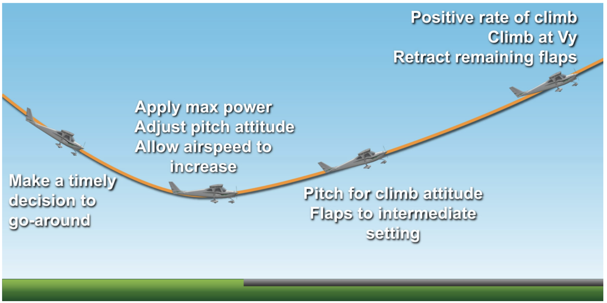

* It's ok if airplane touches runway during go around, don't change mind and commit to go-around
* Once airplane is under control (flaps up, established in climb)
  * Advise tower that you are going around
  * Or, advise CTAF of go-around

## II. Learning About Stalls

### Stall Theory
* Lift is affected by changes in airspeed
* Increasing airspeed increases lift and vice versa
* Stall occurs when airflow is disrupted over airplane's wing, resulting in a loss of lift
* Occurs when airplane exceeds critical angle of attack (angle between chord line and relative wind)
  * Air can no longer conform to top of wing when exceeding critical angle of attack
  * Backfills, burbles, and eddies, destroys lift, and stalls the wing
  * An airfoil always stalls at the same critical AOA regardless of airspeed, weight, load factor, or density altitude
* Most small airplanes have critical AOA of between 16 and 20 degrees (16° for C172)
* Easy to exceed critical AOA while flying slow, fast, or while turning
  * Can stall at any airspeed or attitude; not necessarily flying slow or in nose-high condition

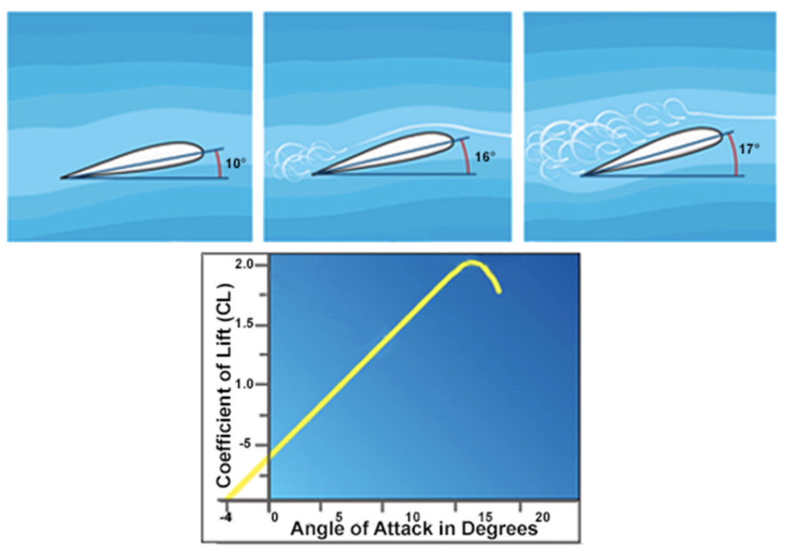

* Stall speed is **not** a fixed value for all flight situations
  * VS (stall speed with no flaps) is 48 KIAS
  * VSO (stall speed with full laps) is 40 KIAS
* Rises in turns with steep banks
  * Centrifugal force is added to airplane's weight
  * Thus more back pressure necessary
  * Thus increases wing AOA
* Steep bank angles at slow airspeeds should be avoided
  * 30° of bank or less in traffic pattern

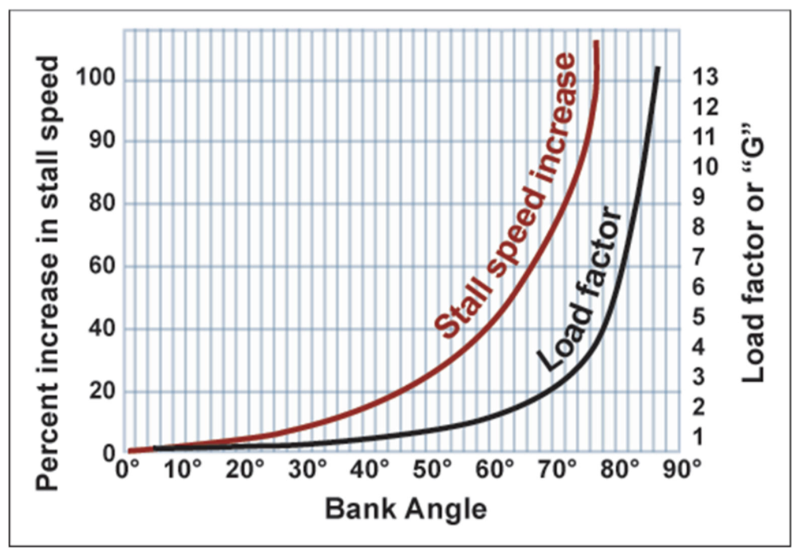

### Mastering the Stall
* Airplane is designed to stall at wing root first and progress outward towards wingtips
* Allows ailerons to remain effective during a stall which provides more controllability
* When stall is about to occur
  * Will notice decrease in wind noise
  * Mushy flight controls
  * Stall warning horn (5-10 knots before stall)
  * Airplane will buffet/shake as airflow becomes turbulent
* Stall is *imminent* when buffeting is occurring with stall warning horn sounding
* Stall is *full* when nose drops as a result of loss of lift
* Stall recovery: three actions
  * Decrease pitch attitude and AOA
  * Apply maximum allowable power
  * Regain straight-and-level flight with coordinated use of all flight controls
* On recovery, if flaps extended, wait until reaching VY to retract last flap setting
* Then climb, return to straight-and-level, and set throttle to cruise power setting
* Goal is to lose as little altitude as possible
  * Pitch down should be timely and appropriate, not dramatic
  * Pitch up when airspeed allows
* In a coordinated stall, nose will drop straight ahead (no wing drop)
  * Proper use of rudder prevents wing drop
* If a wing drops, release back pressure on yoke, use coordinated aileron and rudder to level the wings

### Stall Situations
* Power-on stalls
  * Can be performed using no or 10° flaps
    * Stall with flaps will occur at a lower speed
  * Using full or partial power
  * Wait until at takeoff speed or lower to initiate application of power and pitch
  * Slowly, smoothly, and constantly increase power and back pressure and apply right rudder
  * Increase pitch to an attitude that the airplane cannot sustain
  * Increase right rudder as pitch attitude increases
  * If in bank, maintain bank with coordinated aileron and rudder
  * More right rudder as you approach stall and left-turning tendencies increase
  * Common errors
    * Failure to use enough right rudder to stay coordinated
    * Failure to keep increasing back-pressure as pitch attitude increases
  * Hints
    * Slower the entry speed when initiating stall, less pitch up when power is applied
    * Anticipate all power with rudder to keep airplane coordinated
    * Be prepared for nose to break more quickly than with the power-off stall
* Situations that may cause a stall
  * Tightening a turn from base to final
  * Maneuvering around something on the ground
  * Leveling off after a descent and forgetting to bring power in

### Spin Awareness
* Stall in which one wing is more fully stalled than the other
* Result of an uncoordinated stall (slipping or skidding stall)
* Less-stalled wing continues to produce some lift, rises, reduces angle of attack to below critical AOA, increasing lift
* More-stalled wing produces even less lift
* Wing drops, further increasing AOA and stalling more deeply, and decreasing lift

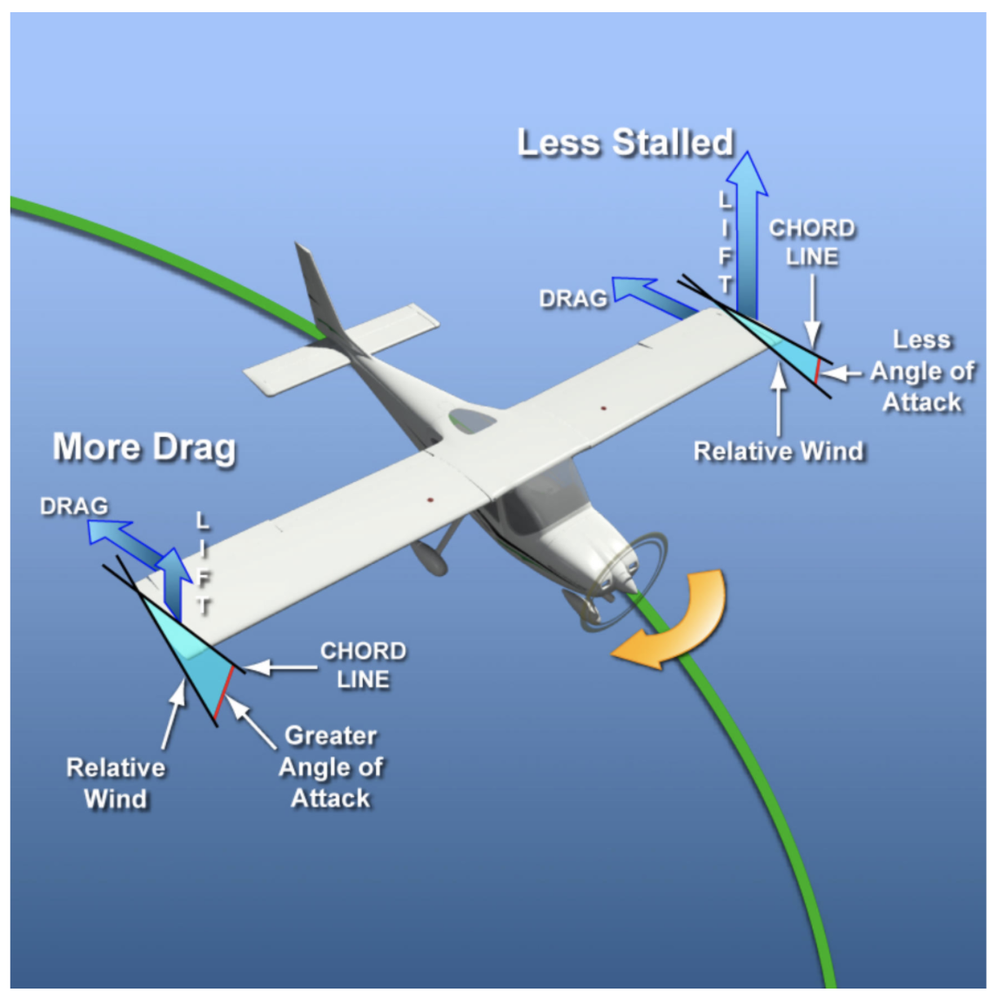

* A spin is a stable condition
* Airplane autorotates in a nose-down attitude on its own without pilot input
* Airplane will continue in this condition unless pilot takes action to recover
* TARE
  * **T**hrottle to idle
  * **A**ilerons neutralized
  * **R**udder full to stop in opposite direction of the spin
  * **E**levator briskly to forward of neutral
* After rotation stops, neutralize rudder, and cautiously use elevator to bring nose up to level attitude

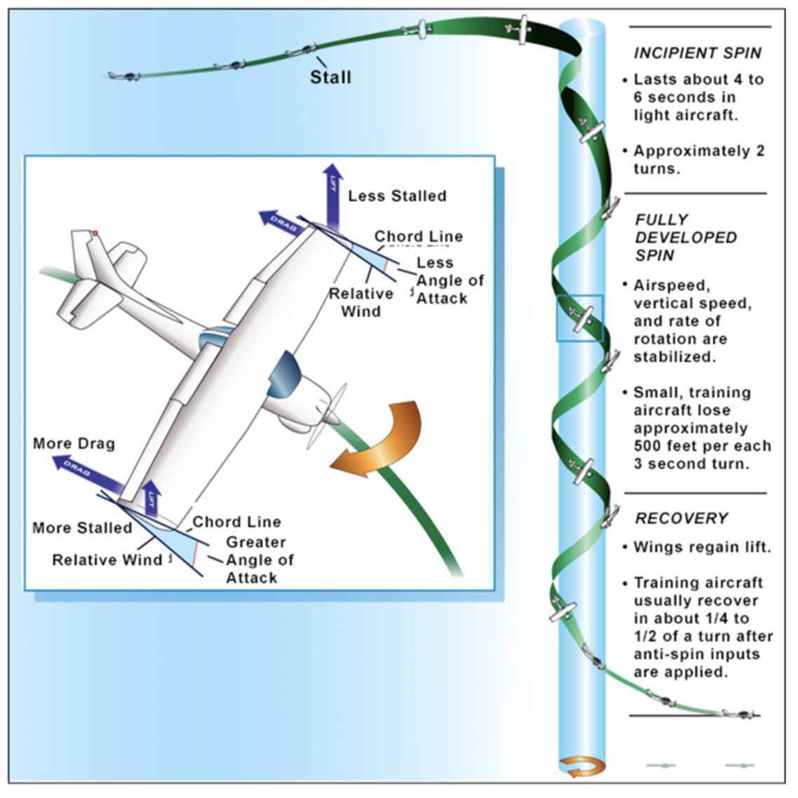

* Airplane must be both stalled and uncoordinated (slipping or skidding) to spin
* Accidental spins are most likely during skidding turn from base to final or an uncoordinated power-on stall

#### Accidental Spin Entry
* Turning from base leg to final approach
  * When overshooting final approach course...
  * ...avoid steep banks near ground
  * Pilots may use rudder only to realign with runway, resulting in skidding turn
  * Or add back pressure to compensate for loss of vertical lift, entering a stall that leads to a spin
* Departure climb
  * At high power and low airspeed, airplane wants to turn left
  * Pilot uses insufficient right rudder
  * Airspeed decreases and airplane enters stall that leads to spin
* When demonstrating stall, use rudder to keep wings level (avoid accidental wing-drop that may lead to a spin)
