# Weather and Weather Briefing

- [Weather and Weather Briefing](#weather-and-weather-briefing)
  - [I. Basic Weather THeory](#i-basic-weather-theory)
    - [What Makes Weather](#what-makes-weather)
    - [The Atmosphere](#the-atmosphere)
    - [Wind](#wind)
      - [Winds Aloft](#winds-aloft)
      - [Upslode/downslope winds](#upslodedownslope-winds)
    - [Moisture](#moisture)
      - [Cloud Heights](#cloud-heights)
      - [Clouds](#clouds)
      - [Four families of clouds](#four-families-of-clouds)
  - [II. Weather Patterns](#ii-weather-patterns)
    - [Stable and Unstable Air](#stable-and-unstable-air)
      - [Lapse rates](#lapse-rates)
      - [Thunderstorms](#thunderstorms)
    - [Air Masses and Fronts](#air-masses-and-fronts)
      - [Fronts](#fronts)
      - [Characteristics of fronts](#characteristics-of-fronts)
      - [Frontal speed](#frontal-speed)
  - [III. Weather Hazards](#iii-weather-hazards)
    - [Fog](#fog)
      - [Types of Fog](#types-of-fog)
    - [Thunderstorms](#thunderstorms-1)
      - [Thunderstorm types](#thunderstorm-types)
      - [Wind shear](#wind-shear)
      - [Avoiding thunderstorms](#avoiding-thunderstorms)
    - [Wind Shear and Microburst](#wind-shear-and-microburst)
      - [Microburst development](#microburst-development)
    - [Turbulence](#turbulence)
      - [Reporting metrics](#reporting-metrics)
      - [Convective turbulence](#convective-turbulence)
      - [Turbulence in mountains](#turbulence-in-mountains)
      - [Mountain wave](#mountain-wave)
      - [Clear air turbulence](#clear-air-turbulence)
      - [Encountering turbulence](#encountering-turbulence)
    - [Frost and Ice](#frost-and-ice)
  - [IV. Basic Sources of Weather Information](#iv-basic-sources-of-weather-information)
    - [Telephone Weather Briefings](#telephone-weather-briefings)
    - [Online Weather Resources](#online-weather-resources)

## I. Basic Weather THeory

### What Makes Weather
* Heat exchange is behind every physical process of weather
* Uneven heating of the earth's surface drive weather; causes air circulation
* Movement of pressure patterns and fronts create weather
* Also occurs when a parcel of air becomes warmer than surrounding air
  * Warmer air is less dense and rises
    * Expands and cools as it rises
    * If it cools below dew point, liquid moisture forms
    * When changing from gas to liquid, water releases heat of condensation (opposite of evaporation, which carries away heat and caused it to evaporate) which heats the air
    * This warm air is even less dense than surrounding air and rises faster
  * This repeats until air runs out of moisture or is no longer warmer than surrounding air
  * This cycle causes thunderstorrms
* Air circulation (wind) observed as breezes
  * On-shore breeze occurs when land mass heats more quickly than water, air over land rises, and is drawn from water to the land by resulting vacuum
  * Off-shore breeze occurs when land mass cools more quickly than water, and the air over the land sinks and pushes air from land into water

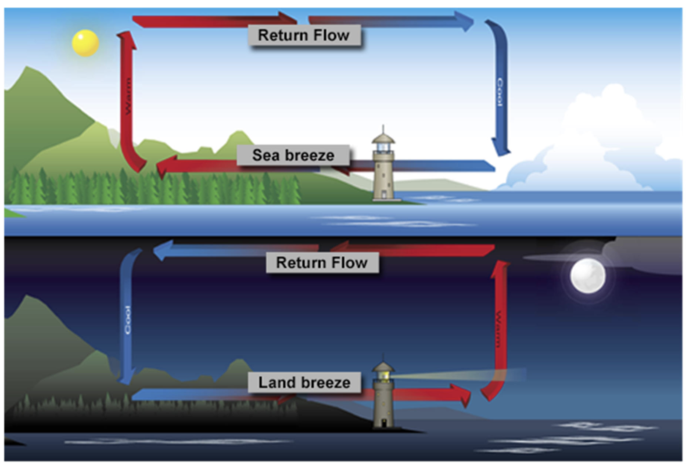

* General circulation of air/wind results in air:
  * Rising because of heat at the equator
  * Descending because of coldness of polar regions
  * Influcned by topography/rotational forces of Earth/vapor content

### The Atmosphere
* Gaseous envelope covering the Earth
* Makeup:
  * 78% nitrogen
  * 21% oxygen
  * 1% other gases
* Carries suspended water vapor (0 to 5% of air's volume)
* Exerts pressure averaging 29.92 inches of mercury at sea level
* Atmosphere can be divided into two layers:
  * Troposphere
    * Surface to 30,000 feet
    * Higher near equator (50 to 60,000 feet)
    * Lower near poles (20 to 30,000 feet)
    * Where temperature cools as altitude increases
    * Most affectede by uneven heating of Earth's surface
    * Contains most of atmosphere's water vapor
    * Most flight occurs here
  * Stratosphere
    * Above troposphere
    * Small temperature changes but slightly warm near top
    * Contains little weather, mostly stable air
  * Tropopause
    * Boundary between the two layers
    * Jet stream cores commonly occur here
      * Jet stream winds vary from 50 to 150 knots
    * Acts as lid to keep most weather in troposphere

### Wind
* Areas of high and low pressure exist in atmosphere and are caused by differential heating of Earth's surface
* There is a natural tendency to equalize pressure between these areas, creating lines of pressure
  * These lines of pressure are where pressure is equal (isobars)
* Isobars show local pressure gradient, ranging from steep toshallow
  * Steep have isobars close together with strong winds
  * Shallow have farther apart isobars with light winds

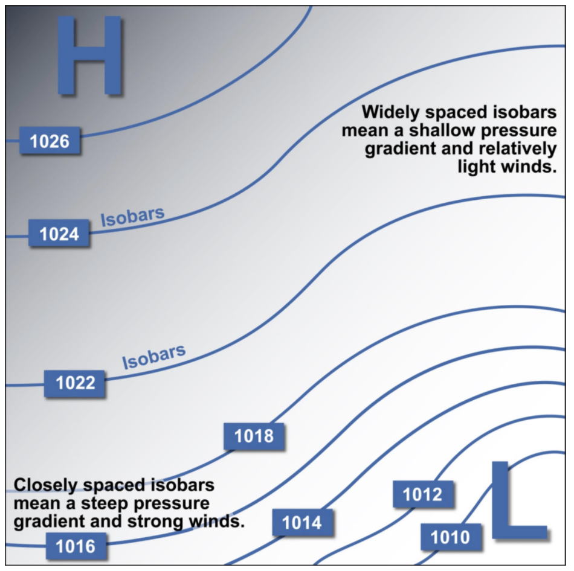

#### Winds Aloft
* Winds aloft attempt to move from high to low pressure
  * Do not travel directly from high to low pressure, but parallel to isobars because of the coriolis effect
* Coriolis effect is caused by the rotation of the earth
* Causes deflection of air currrents to the right in Northern Hemisphere
  * Rotates air clockwise around high pressure areas
  * Counterclockwise around low pressure areas
* Causes deflection of air currents to the let in the Southern Hemisphere
  * Rotates air counterclockwise around high pressure areas
  * Rotates air clockwise around low pressure areas
* Absent at the equator (no hurricanes)
* Winds near surface are modified by surface friction, causing wind to flow directly between high and low pressure at the surface, and shift to the right with increasing altitude

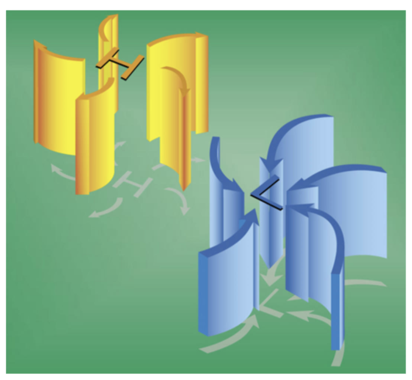

#### Upslode/downslope winds
* Mountain slopes heat more rapidly than valleys during the day
  * Heated air rises
  * Draws valley air into replace it
  * Creates upslope wind
* Mountain slopes cool more rapidly than valleys during the night
  * Cool, densire air sinks downslope
  * Lifts and replaces less-dense warmer air in the valley
  * Creates downslope wind

### Moisture

* Moisture is added to atmosphere via
  * Evaporation: liquid to vapor
  * Sublimation: frozen to vapor
* Moisture can also change state via
  * Condensation: gas to liquid
  * Deposition/desublimation: vapor to solid (frost/snow/ice)
* When water changes state from liquid to gas, it cools the surrounding air and absorbs energy
* When water changes from liquid to solid, it warms the surrounding air and gives off stored energy when it changes state
* Amount of moisture the air can hold depends on temperature
  * Warmer air &#8594; more moisture
  * Cooler air &#8594; less moisture
* Relative humidity is ratio between amount of moisture the air can hold at that temperature to the amount of moisture actually in the air at that temperature
* Dew point: temperature at which air can hold no more moisture; air cools to this temperature
* When dew point and temperature are the same, the air is totally saturated, and condensation will occur
* If differernce between temperature and dew point is small and getting smaller, relative humidity must be rising; fog/low clouds are likely to develop
* When temperature and dew point are equal and temp is
  * Above freezing: condensation occurs with clouds/fog/dew
  * Below freezing: deposition (desublimation) occurs with frost, snow, or ice developing

#### Cloud Heights
* For each 1,000 feet of altitude increase in the troposphere, the temperature decreases:
  * 2°C for standard/average atmosphere
  * 3°C for unsaturated air
  * .5°C decrease in dew point
* Temperature of unsatured air and dew point temperature converge by about 2.5°C for each 1,000 feet of altitude increase
* Spread between temperature and dew point provide:
  * Expectation of height of clouds (large diference &#8594; high-based clouds, small difference &#8594; low-based clouds)
  * Expectation of visibility (large difference &#8594; good visibility; small difference &#8594; poor visibility)
* Spread allows calculation of where bases of clouds will form
* Calculate base (in thousands of feet) where clouds will form AGL:
  * `(ST - DP) / 2.5°C`
  * ST: surface temperature
  * DP: dew point
* Example: ST of 35, DP of 30, elevation of 500
  * `((35 - 30) / 2.5) + 500) = 2,500 MSL`

#### Clouds
* Cloud formation depends on air stability
* Unstable: air that is cooler above than below, since warmer air beneath is less dense and lighter, and continues to rise
* Stable: little or no temperature decrease with altitude; rising air will cool to below temperature of the surrounding air, be more dense, and stop rising
* Cumulus
  * Form in unstable air
  * Fluffy/bumpy
* Stratus
  * Stable air
  * Look stratified/layered
* Nimbus
  * Rain cloud

#### Four families of clouds
1. High clouds
   * 16,500 to 45,000 feet in middle latitudes
   * Known as cirriform clouds
   * Include cirrus, cirrocumulus, and cirrostratus clouds
2. Middle clouds
   * 6,500 to 23,000 feet in middle latitudes
   * Usually prefixed with alto
   * Include altostratus and altocumulus
3. Low clouds
   * Surface to 6,500 feet
   * Stratus, stratocumulus, and fair weather cumulus
4. Clouds with extensive vertical development
   * Extend in height from 1,000 feet above surface to as high as 60,000 feet
   * Towering cumulus
   * Cumulomimbus (thunderstorms) if they contain rain

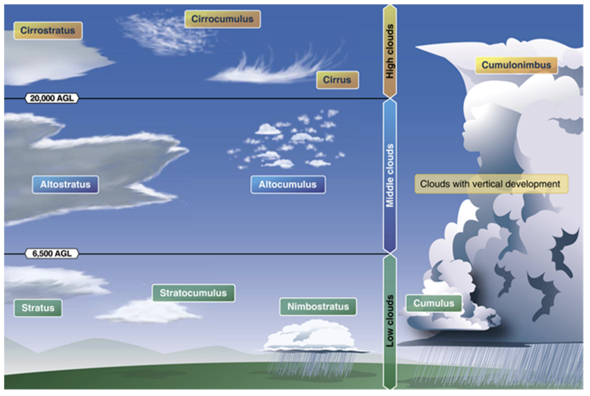

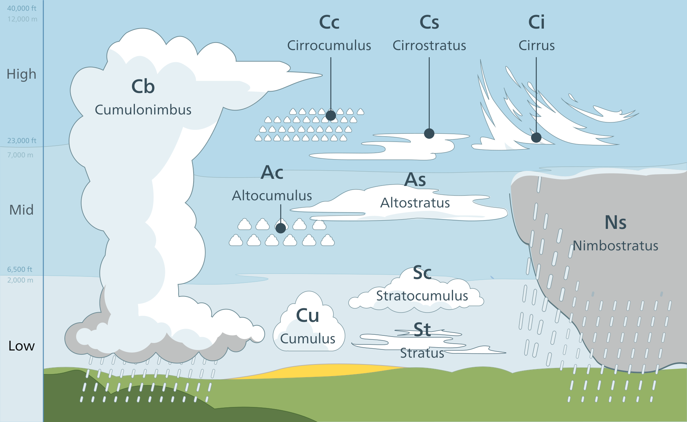

## II. Weather Patterns

### Stable and Unstable Air
* Characteristics of stable air
  * Stratus clouds with smooth tops since air unable to rise
  * Steady precipitation, since entire air mass produces similar conditions
  * Smooth air with little turbulence since there are no rising or descending columns of air
  * Reduced visibilities; when stable air is combined with cooler surface temperatures, produces some condensation/possible fog
* Characteristics of unstable air
  * Cumuliform clouds with variable tops since air is able to rise
  * Showery precipitations with condensation and precipitation as columns of air rise
  * Turbulence (rising air columns)
  * Goood air visibility, except in showers, since haze/pollution are carried away from the surface

#### Lapse rates
* Lapse rate determines stability of air
* Refers to decrease of air temperature with altitude
* Determines resistancee to vertical displacement of an air mass
* Measures rate of cooling associated with a climb in altitude
* Standard lapse rate is average decrease in temperature with increasing altitude of 2°C per 1,000 feet
* Temperature of vertically displaced air warmer than surrounding air &#8594; lighter than the cooler air &#8594; will rise
* Temperature of vertically displaced air cooler than surrounding air &#8594; heavier than warmer air &#8594; will descend in the surrounding warm air
* If existing lapse rate is greater than standard lapse rate:
  * Air is cooling at more than 2°C per 1,000 feet
  * Air mass is unstable
  * Lifted air is warmer than surrounding air and will rise in that air mass
* If existing lapse rate is less than standard lapse rate:
  * Air is cooling at less than 2°C per 1,000 feet
  * Air mass is stable
  * Lifted air is colder than surrounding air and will descend in that air mass when the lifting action stops

#### Thunderstorms
* Created when air is forced to rise in unstable air where it can continue to rise AND contains sufficient water vapor
* Air can be forced to rise when flowing over rising terrain, pushed upward by an approaching frontal surface, or is heated from below
* Air is unstable when lapse rate is greater than standard lapse rate; sufficient water vapor provides a source of further lifting of an air mass
* Heat produced by condensation causes air to rise even more until it is no longer warmer than surrounding air, runs out of moisture, and reaches the tropopause
* Sufficient water vapor is more readily available in warm air than cold air since warm air can hold more water vapor

### Air Masses and Fronts
* Air mass is a huge body of air with similar temperature and moisturer content
* Forms over *source regions*
  * Cold northern oceans
  * Polar ice/snow fields
  * Tropical oceans
  * Large land masses
* Classified by origin and water content:
  * *Continental*: dry
  * *Maritime*: moist
  * *Polar*: cold
  * *Tropical*: warm
  * i.e., contintental polar, maritime tropical, etc.
* Affected by the area over which it moves, like temperature difference between air mass and area, speed at which it moves, and thickness of the mass

#### Fronts
* The boundary between two air masses with different temperatures
* *Cold front*: advancing cold air is displacing warm air

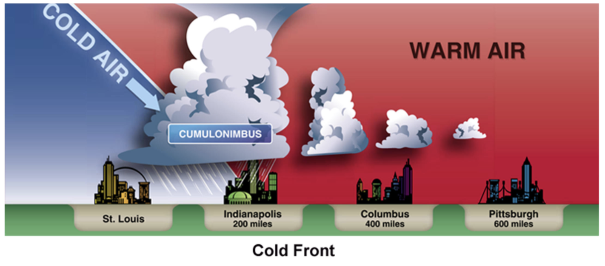

* *Warm front*: advancing warm air is displacing cold air

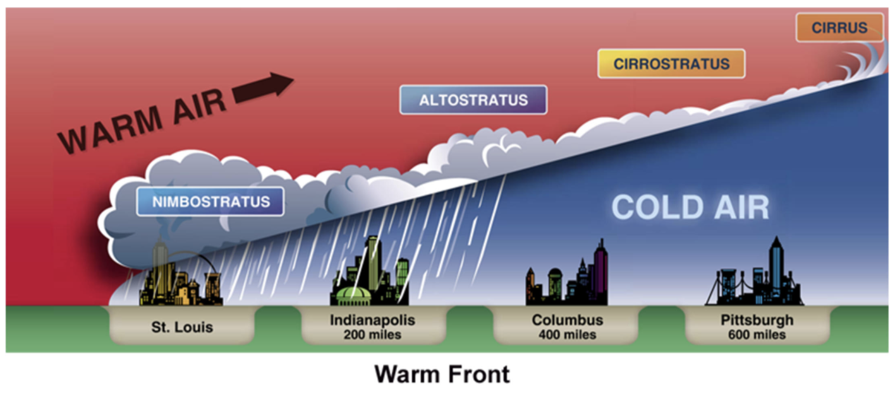

* *Stationary front*: when frontal movement is less than 5 knots
* *Cold occluded front*/*cold front occlusion*: fast moving cold front lifts warm air mass completely off the ground and overtakes cool air in front of the warm air mass

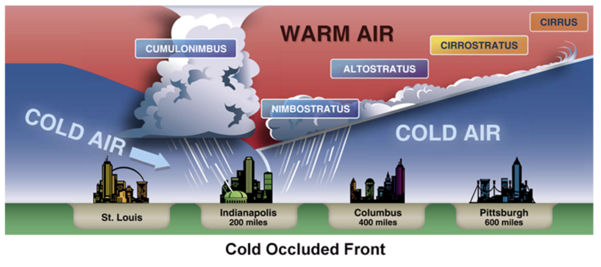

* *Warm occluded front*/*warm front occlusion*: fast-moving cold front lifts warm air mass completely off the ground, and cold air mass ahead is the coldest of the three air masses

#### Characteristics of fronts
* Fronts are characterized by discontinuities in temperature and wind direction
* Weather chart depictions:
  * Cold fronts have triangular points (icicles) pointing in direction of movement
  * Warm fronts have semi-circles (half-suns) pointing in direction of movement
  * Stationary fronts use opposing triangular points and semi-circles
  * Occluded fronts use same-side triangular points and semi-circles

#### Frontal speed
* Cold front
  * Equal to speed of the wind component perpendicular to the front just above the friction layer (approximately 2,000 feet AGL)
* Warm front
  * Half the speed of the wind component perpendicular to the front just above the friction layer
* Stationary front
  * Less than 5 knots
* Determining severity of cold frontal weather
  * Fast-moving cold fronts with deep vertical development produce most hazardous weather
  * Slow-moving cold fronts with less vertical development are not as violent
* Squall lines
  * Created by pressure wave in advance of a fast-moving cold front that creates a line of significant thunderstorms
  * Develop as far as 200 miles in advance of fast-moving cold fronts
  * Frequently contain weather more severe than that found along the front

## III. Weather Hazards

### Fog
* Composed of water droplets or ice crystals
* Types
  * Radiation
  * Advection
  * Upslope
  * Precipitation-induced
  * Steam

#### Types of Fog
* Radiation
  * Shallow fog
  * Clear skies above
  * Develops when air near ground cools with clear evening, high humidity, and light or no wind
  * Inversion forms
    * Temperature increases rather than decreases with altitude
    * Air aloft is warmer than air near the ground
    * Inversion forms a cap that prevents air from rising and traps pollutants below the inversion
    * Winds above inversion can be much stronger with possible wind shead turbulence when climbing out of the inversion
  * Occurs when clouds are not present
    * Heat given off by the ground is not reflected back to the ground (it is radiated into space instead)
    * Ground cools rapidly, lowering temperature of air near ground to the dew point
  * Requires high humidity for condensation to occur
  * Light or no wind so that vertical mixing does not occur between warmer air aloft and cooler surface air
  * May be created as ice crystals in cold/polar regions (ice fog)
* Advection fog
  * Requires wind for development
  * Develops rapidly, may be persistent
  * Forms a deeper fog than radiation fog
  * Occurs when
    * Wind conditions up to 15 knots (stronger than 15 knots usually produces low stratus clouds instead)
    * Warm air flows over cold surface and is cooled by cold surface to the dew point
  * Typically forms in winter when a warm sea breeze lows over cooler coastal land, or inland when a warm southerly wind flows over snow covered ground
* Upslope fog
  * Requires wind for development
  * Develops as a result of air rising, expanding, cooling to dew point, and forming fog
  * Occurs when stable air is forced to rise up a mountain slope, moves to an area of lower pressure and expands, and cools to dew point
  * Continues to form until air is no longer forced up the slope or it runs out of moisture
* Precipitation-induced fog
  * Occurs when relatively warm rain or drizzle falls through cool air
  * Evaporation from the precipitation saturates the cool air and produces fog
  * Commonly found where rain falls into cool air below approaching warm front
* Steam fog
  * Forms over bodies of water
  * Requires wind to form, but only in a light wind
  * Occurs when cold air from land flows over warmer water; water adds moisture to air, air becomes saturated, and fog forms
  * May contain icing conditions and low-level turbulence

### Thunderstorms
* Cumulus cloud producing rain is a cumulonimbus cloud
* Thunderstorm is a cumulonimbus cloud with lightning and thunder
* Formation
  * Requires lifting force (front, upslope wind, or thermals from ground heating)
  * Requires unstable air, allowing the air to continue to rise and cool
  * Requires moist air or high humidity, providing heat energy for the storm to grow and moisture to condense
* Three stages
  * Cumulus stage
    * Vertical cloud build-up
    * Growth rate may exceed 3,000 feet per minute
    * Continus strong updrafts
  * Mature stage
    * Downdrafts, some reaching 2,500 fpm, with:
      * Precipitation beginning to fall from cloud base
      * Strong, gusty surface winds
      * Sharp temperature drop
      * Rapid rise in pressure
    * Updrafts of as much as 6,000 fpm, causing vertical wind shears as you transition from updrafts to downdrafts and back
    * Most severe hazards to aircraft
    * May form Cumulonimbus Mamma clouds, which have irregular, rounded, lumpy-looking bases and are associated with most violent thunderstorms and tornados
  * Dissipating stage
    * Downdrafts
    * Still dangerous, with hail and severe turbulence
    * Ends when rain ends and downdrafts abate

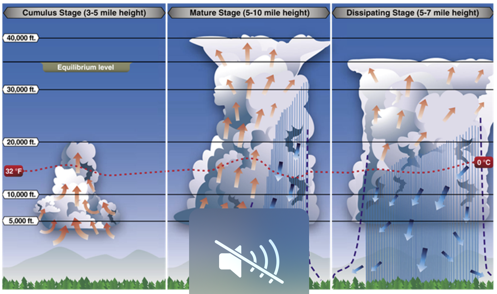

#### Thunderstorm types
* Air mass thunderstorms
  * Isolated
  * Associated with convective lifting caused by surface heating
  * Typically last between 20 minutes and 1.5 hours
    * Cool surface below them in mature stage
    * Inhibits updrafts
    * Cuts off supply of water vapor and becomes self-destructing
* Frontal thunderstorms and associated squall lines
  * These are steady state thunderstorms
  * Associated with fronts, converging winds, and troughs aloft
  * Typically last many hours
    * Precipitation falls outside updraft area (storm leans as it moves)
    * Updrafts continue to supply water vapor
    * Cell strengthens with energy of water vapor
* Squall line thunderstorms
  * May contain tornadoes, large hail, heavy rain, strong winds
  * Most hazardous because long life cycles, move rapidly, and have much energy
  * Reach maximum intensity during late afternoon or first few hours after dark

#### Wind shear
* Occurs when wind changes rapidly in direction or velocity (either vertical or horizontal)
* Happens frequently in thunderstorms
* Gust front
  * Thunderstorm downdraft that hits ground, fans out, and produces rapid changes in wind direction and velocity

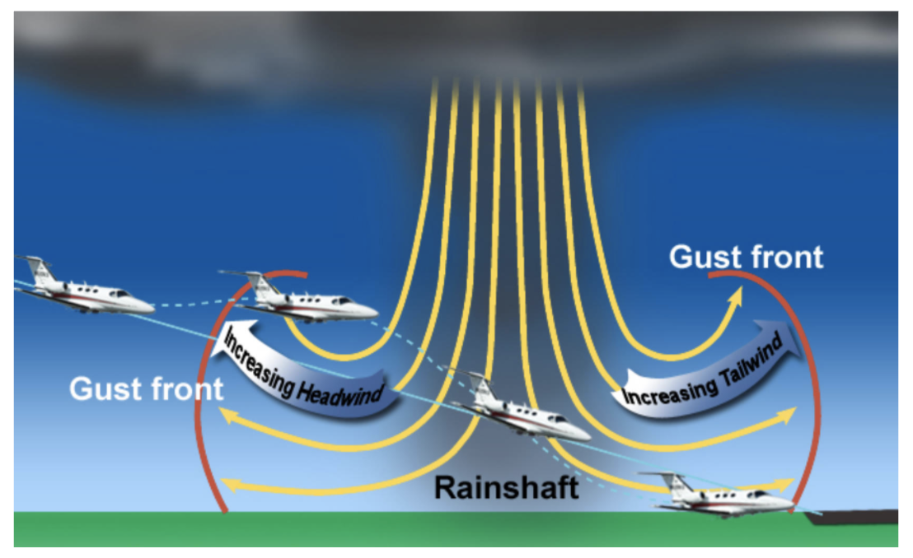

* Embedded thunderstorms are hiddene in other clouds and dangerous to IFR pilots without on-board radar (cannot be spotted visually)

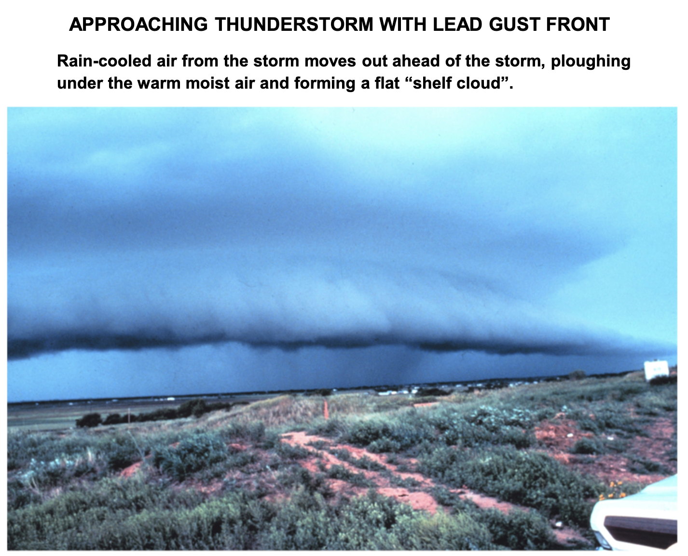

#### Avoiding thunderstorms
* Do not take off or land in the face of an approaching thunderstorm
  * May contain gust front
  * Low-level turbulence
  * Horizontal wind shear
* Never fly under a thunderstorm; risk of severe downdrafts, wind shear, or hail
* Avoid enroute thunderstorms by flying at least 20 miles from individual cells and 20 miles from each cell when flying between two cells
* Never fly under the anvil top of a thunderstorm
  * Indicates direction of upper-level winds
  * Hail is commonly carried by upper-level winds
* Use all resources to identify areas of thunderstorm activity
  * Advisories, radar
  * Look for cumulonimbus clouds with frequent lightning
  * XM weather (NEXRAD)
  * Onboard weather radar if equipped

### Wind Shear and Microburst
* Wind shear is suddent change over short distance or period of time in wind direction (horisontally and vertically) and speed
* Microbursts
  * Small-scale intense downdraft
  * Produced by some thunderstorms
  * Spreads strong surface winds in all directions
  * Produces horizontal and vertical wind shears
  * Particularly hazardous at low altitudes during takeoff/landing
* Can be found anywhere there is convective activity (heavy/light rain, dry areas near thunderstorm, or harmless-appearing virga)
* Virga
  * Rain that does not reach the ground
  * Occurs when air is dry at lower layers
  * Rain evaporates before it reaches the ground
  * Air cools rapidly due to evaporation
  * Cooling of air accelerates descent, creates downdraft that can exceed any aircraft's climb capacity

#### Microburst development
* Development of microburst frequently associated with thunderstorm downdraft
  * Thunderstorm downdraft drags precipitation down, warming it, causing it to evaporate, and cooling the air due to evaporation
  * Results in cold air sinking more rapidly, producing intense downdraft exceeding 6,000 fpm
* Usually less than 1 mile in diameter
* Horizontal winds spread out as much as 2.5 miles in diameter
  * As strong as 45 knots (resulting in 90-knot shear headwind to tailwind change)
  * Can occur within few hundred feet of the ground
* Duration of increasing intensity for 5 minutes, peak intensity for 2 to 4 minutes, and lasts generally less than 15 minutes
* Signs
  * Blowing dust
  * Virgia
  * Wind diverging from single point
* Be on alert for microburst activity any time convective activity is present
* Look for PIREPs, special airport equipment (low-level wind shear alert system LLWAS), Terminal Doppler weather radar
* Takeoff
  * Most hazardous situation being a shift from increasing headwind to tailwind, causing decrease in airspeed and climb rate
* In the air
  * First sign of microburst can be updraft
  * As air hits ground, it curls back up forming ring vortext around microburst
  * At first sign of microburst, add full power and pitch to go-around attitude
* On landing
  * Most hazardous situation being a shift from increasing headwind to tailwind, causing a brief increase in airspeed and an updraft, followed by decrease in airspeed and rapid descent
  * At first sign, increase power and go around

### Turbulence
* Caused by windshear
* Light turbulence
  * Momentarily causes slight, erratic changes in altitude and/or attitude
  * Causes slight strain against seat belts
* Light chop
  * Continuous slight, rapid, and rhythmic bumpiness
  * No appreciable changes in altitude or attitude
* Moderate turbulence
  * Similar to light turbulence but greater intensity
  * Causes changes in altitude and/or attitude
  * Airplane still remains in positive control at all times
  * Definite strain against seat belts
* Moderate chop
  * Similar to light chop but greater intensity
  * Rapid bumps or jolts without appreciable changes in aircraft altitude or attitude
* Severe turbulence
  * Large, abrupt changes in altitude and/or attitude
  * Causes large variations in indicated airspeed with aircraft momentarily out of control
  * Occupants forced violently against seat belts
* Extreme turbulence
  * Aircraft violently tossed about
  * Aircraft practically impossible to control
    * Can cause structural damage
  * Found in thunderstorm

#### Reporting metrics
* Occasional: less than 1/3 of the time
* Intermitten: 1/3 to 2/3 of the time
* Continuous: more than 2/3 of the time
* Turbulence can be found in areas of thunderstorms/wind shead/microbursts, and hot air, mountainous terrain, or near the jet stream

#### Convective turbulence
* Hot air turbulence
* Started when ground is heated
* Caused by hot air rising
* Able to be identified visually by cloud development; base of clouds indicate top of turbulence, and clear air above clouds is smooth

#### Turbulence in mountains
* Can occur when wind is perpendicular to mountain ridges
  * Creates updraft on upwind/windward side of mountain
  * Downdraft on downwind/lee side of mountain
    * Air on downwind side is disturbed by the mountain and tends to be more turbulent
  * Wind velocity over mountain ridge is in excess of 25 knots (general producing turbulence and downdraft hazards) to 50 knots (making it unwise to fly at normal altitudes used by light aircraft)
  * Can be avoided by flying in smooth air on windward side of ridge, avoiding turbulence on the lee side
* When crossing mountain ridge in windy conditions, have at least 2 to 3,000 feet altitude above ridge line
* Cross at a 45° angle to allow you to change mind and turn back without doing a 180° turn

#### Mountain wave
* Occurs in specific mountain wave conditions when a strong wind in stable air is lifted over a range of mountains, descends on the other side, and creates a wave downwind of the mountains
  * Can undulate for several hundred miles downwind
  * Air in wave may be smooth updrafts/downdrafts
  * Underneath the crest of each wave may be severe turbulence

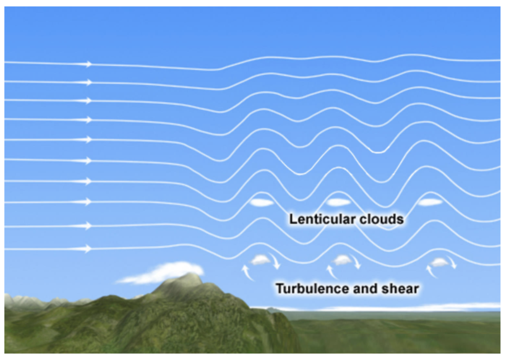

* Visual indications include lenticular clouds at top of mountain and at each wave crest downwind, or rotor clouds underneat each wave downwind

#### Clear air turbulence
* Turbulence above 15,000 feet in clear air not associated with convective activity
* Most often associated with jet stream
* Best determined from PIREPs (from FSS)

#### Encountering turbulence
* Slow to VA and depart turbulent area

### Frost and Ice
* Frost
  * Occurs when temperature cools to dew point and dew point of surrounding air AND surface temperature of the aircraft is colder than freezing
  * Thin layer of frost disrupts airflow, reduces lift, and significantly increases stall speed
  * May prevent aircraft from becoming airborne at VR
* Ice
  * Can form on aircraft when in visible moisture (clouds, rain, snow) and OAT is below freezing
* Freezing rain
  * Liquid precipitation that freezes on contact with a cooler surface (like an aircraft) when OAT is below freezing
  * Occurs when there is a temperature inversion; rain falls from warmer air aloft into colder air below
  * Most like to occur with a warm front; advancing warm air pushes over colder air
  * If the rain falls into air that is cold enough, rain freezes as it falls, forming ice pellets which reach the surface
  * Can build up on airplane and render unflyable in minutes

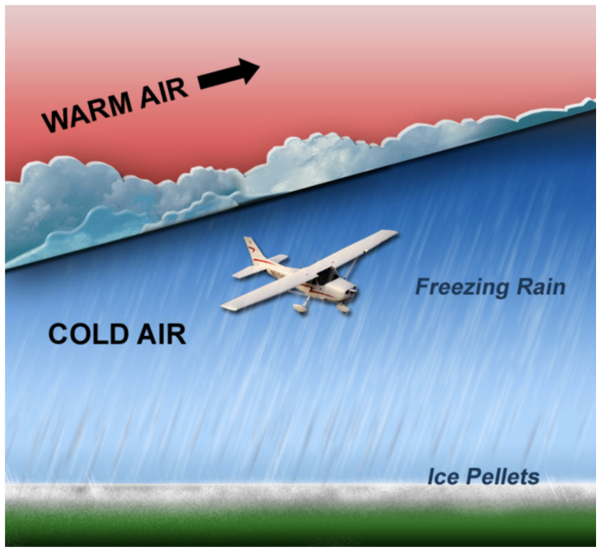

* Ice on aircraft decreases lift, increasing stall speed, and increases drag
* Do not fly into known icing conditionos
* Remove all frost and ice from an aircraft before flying
* Do not fly if unable to do so
* Icing requires immediate action; leave area with visible moisture and find warmer temperatures
* Climb or descend, or do a 180 to exit the area
* You must be in visible moisture for ice to form

## IV. Basic Sources of Weather Information

### Telephone Weather Briefings
* Call FSS or check [www.1800wxbrief.com](https://www.1800wxbrief.com)
* Can always call FSS via 800-992-7433 (800-WXBRIEF)
  * Ask for standard, abbreviated, or outlook briefing
  * VFR or IFR flight
  * N number or pilot's name
  * Departure airport, estimated time of departure (ETD)
  * Flight altitude
  * Route
  * Destination
  * Estimated time en route (ETE)
* Standard briefing
  * Complete weather picture, most detailed
  * Contains:
    1. Adverse conditions
       * i.e. thunderstorms/icing, turbulence, wind shear, visibility
    2. VFR flight not recommended
       * Weather below VFR minimums
    3. Synopsis
       * Overall weather
    4. Current conditions
       * Curren surface weather observations, PIREPs, satellite/radar data, ceiling/visibility, wind, temperature
    5. En route forecast
    6. Destination forecast
    7. Winds aloft
    8. NOTAMs
    9. ATC delays
    10. Other information
* Abbreviated briefing
  * Shortened version of standard briefing based on requested information
  * Should be requested when departure has been delayed and specific updates are needed
  * Tell weather specialist time/source of previous briefing
* Outlook briefing
  * Requested for planned departure more than 6 hours away
  * Can help determine route of flight, altitude, or go/no-go
  * Should be followed by standard briefing

### Online Weather Resources
* Meets all FAA requirements for preflight briefing
* [www.1800wxbrief.com](https://www.1800wxbrief.com)
* [fltplan.com](https://fltplan.com/) is a private resource that also meets FAA requirements
* [aviationweather.gov](https://aviationweather.gov/)
  * Does not meet FAA requirements for preflight briefing
