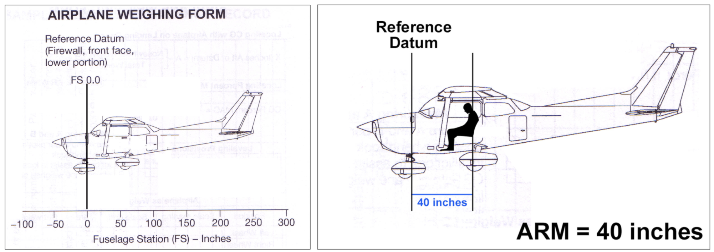

# Airplane Performance and Limitations

- [Airplane Performance and Limitations](#airplane-performance-and-limitations)
  - [I. Predicting Performance](#i-predicting-performance)
    - [Factors Affecting Performancee](#factors-affecting-performancee)
      - [Air Density](#air-density)
      - [Density Altitude Chart](#density-altitude-chart)
    - [More Factors Affecting Performance](#more-factors-affecting-performance)
      - [Formulas](#formulas)
      - [Performance](#performance)
    - [Performance Speeds and Runway Conditions](#performance-speeds-and-runway-conditions)
      - [Takeoff and Climb Performance Speeds](#takeoff-and-climb-performance-speeds)
    - [The POH](#the-poh)
    - [Using Performance Charts](#using-performance-charts)
      - [Short-Field Takeoff Computations](#short-field-takeoff-computations)
      - [Time, Fuel, and Distance to Climb](#time-fuel-and-distance-to-climb)
      - [Cruise Performance Computations](#cruise-performance-computations)
      - [Short-Field Landing Computations](#short-field-landing-computations)
      - [Remarks](#remarks)
  - [II. Airplane Loading](#ii-airplane-loading)
    - [Airplane Weight and Balance](#airplane-weight-and-balance)
      - [Balance](#balance)
    - [Methods of Weight and Balance Control](#methods-of-weight-and-balance-control)
      - [Loading Arrangements chart](#loading-arrangements-chart)
      - [Weight and Moment Tabulation table](#weight-and-moment-tabulation-table)
      - [Airplane CG Location graph (Center of Gravity limits)](#airplane-cg-location-graph-center-of-gravity-limits)
      - [A Load Moment/1000 graph (Loading Graph)](#a-load-moment1000-graph-loading-graph)
      - [A Loaded Airplane Moment/1000 graph (Center of Gravity Moment Envelope)](#a-loaded-airplane-moment1000-graph-center-of-gravity-moment-envelope)
      - [Ground school notes](#ground-school-notes)

## I. Predicting Performance

### Factors Affecting Performancee

#### Air Density
* Air density: number of molecules in a given volume of air
* Less dense air has fewer molecules
* Airplane performance is determined by air density
* Air is less dense at high altitudes
  * High density altitude: air is less dense and engine/wings have fewer air molecules to work with
* High density altitude
  * Engine produces less power (less fuel can be burned)
  * Propeller produces less thrust (less air to bite into)
  * Wing produces less lift (fewer air molecules)
* Calculating density altitude
  * Start with *indicated altitude*, read from altimeter
  * Correct for non-standard pressure to arrive at pressure altitude
    * Pressure altitude is what alimeter indicates when set to 29.92
    * When used as reference, altimeter tells altitude compared to standard altitude
  * Then, correct for non-standard temperature to arrive at density altitude
* Density altitude
  * Indicates how well airplane will perform
  * Flight computer/chart can determine DA based off PA and temperature
* If at 5,000 feet MSL, and DA is 8,000 feet, airplane will perform as if at 8,000 feet, called the performance altitude of the airplane

#### Density Altitude Chart
* determines density altitude
* Higher pressure altitude &#8594; higher density altitude
* Higher temperature &#8594; higher density altitude
* Using the chart:
  * Select sloping line for PA
  * Locate OAT at bottom
  * Follow temperature up vertically to where it intersects PA line
  * Read DA horizontally on left edge
  * Need OAT, airport elevation, and current altimeter setting
* Compute PA: find altimeter setting on right of chart, read correction, and apply it to airport elevation
* Use PA and OAT to find intersection on chart and draw line to left for density altitude
* High humidity increases density altitude and decreases aircraft performance
  * Water vapor molecules displace air molecules and are less dense
  * Effect is less than those of pressure and temperature
  * Complicated to compute effect of high humidity; sufficient to know that high humidity decreases performance
* In summation:
  * Density altitude increases and performance decreases with high altitude, temperature, and humidity
  * Beware High, Hot, and Humid
    * Increase density altitude, decrease performance

### More Factors Affecting Performance
* Takeoff performance calculations
  * Automatic Terminal Information Service (ATIS)
  * Automatic Surface Observing System (ASOS)
  * Automatic Weather Observing System (AWOS)
* Refer to Chapter 5 of POH/PIM
* ATIS gives runway in use, ASOS/AWOS give favored runway

#### Formulas
* Density altitude: `[(OAT - ISA) * 120] + PA = DA`
  * 120 is number of feet of correction for each degree Celsius difference
  * ISA: international standard atmosphere (15°C at sea level, -2°C every 1,000 feet increase in altitude)
  * To get ISA, multiple 2°C times PA and subtract from 15°C
* Pressure altitude: `(29.92 - current altimeter setting) * 1000 + field elevation`

#### Performance
* Taking off or landing in a tailwind should be avoided
  * Can cause 10% increase in groundspeed on final approach
  * 20% increase in landing distance
* Short/narrow runways require special planning and extra attention to risk management

### Performance Speeds and Runway Conditions
* Consider type of runway, gradient, proper speed
* Surfaces other than hard, smooth, and dry will require longer takeoff roll
* Add extra margin to be conservative
* Runway gradient increases takeoff distance uphill and landing distance downhill (and vice versa)
* Runway slope only listed in Chart Supplement when runway has instrument approach and greater than 0.3%
* Can determine gradient by taxiing from end to end, noting difference in altitude, and dividing difference by length of runway
* For each 1% of gradient, there is a 10% change in runway length
  * i.e. runway is 7,000 feet long with 1% upslode, meaning 10% decrease in effective length uphill &#8594; 6,300 feet effective runway
* Try to land uphill and takeoff downhill

#### Takeoff and Climb Performance Speeds
* Speeds depend on weight; lower speeds at lower weights, higher speeds at higher weights

### The POH
* Specific for one particular airplane by serial number
* PIM relates to all aircraft of same make and model
* Has FAA-approved Airplane Flight Manual
* Max 10 sections
* Sections
  * General
    * Generic info, conversion tables, dimensions
  * Limitations
    * Airspeed limitations/indicator markings
    * Powerplant limitations
    * Weight limits
    * Center of gravity limits
    * Maneuver limits
    * Flight load factor limits
    * Kinds of opoeration limits
    * Placards
  * Emergency Procedures
    * Airspeeds for emergency operation
    * Checklists, including boldface items which should be memorized
    * Extended emergency procedure information
  * Normal Procedures
    * Airspeeds for normal ooperation
    * Checklists (same as used in GT checklists)
  * Performance
    * Data from actual test flights
    * Sample performance problems
    * Performance charts for flight phases
  * Weight & Balance/Equipment List
    * Weight and balance charts/computations
    * Computing aircraft weight and center of gravity
    * Comprehensive Equipment List
      * All Cessna equipment
      * Weight and arm of each item of equipment
      * Operational need
        * R: Required for FAA certification
        * S: Standard equipment
        * O: Optional
        * A: Additional items
  * Airplane & Systems Description
    * Operation of airplane and systems produced by Cessna/Lycoming
  * Handling, Service, & Maintenance
    * Procedures for proepr ground handling, routine care/servicing
    * Airplane identification plate (serial, model, production, type certificate numbers)
    * Cessna Owner Advisories
    * Airplane File (miscellaneous data)
    * Pilot-conducted preventive maintenance, alterations/repairs
  * Supplements section
    * Expanded operations procedures for standard/optionall equipment
    * Log of supplements (used as checklist)
    * Information on removing supplements of equipment not present or maintaining updated supplements

### Using Performance Charts
* For FAA knowledge test: interpolate when conditions fall between the available conoditions
* In flying: nearest set of conditions that gives more conservative result

#### Short-Field Takeoff Computations
* Short runway or obstructions on departure
* Limit of aircraft's takeoff capabilities
* Do not attempt when conditions not covered in POH (standing water/slush)
* Provided for various DAs
* Computation of total distance to clear a 50 foot obstacle including ground roll
* C172SP
  * Flaps 10°, full throttle prior to brake release, use of full length of runway, zero wind, lift off at 51 KIAS, obstacle clarance at 56 KIAS
  * Noted in chart

#### Time, Fuel, and Distance to Climb
* When planning time/fuel required for flight, will need to determine:
  * Time to reach cruise altitude (computed in minutes)
  * Fuel used in takeoff and climb (computed in gallons)
  * Distance required to reach cruise altitude (computed in nautical miles)
* Use Time, Fuel, and Distance to Climb performance chart
  * Lists performance conditions of flaps up, full throttle, standard temperature
  * Correct for starting PA and ending PA

#### Cruise Performance Computations
* Useful for computing percent of brake horsepower
* Horsepower delivered to the output shaft
* Usable horsepower
* True aispeed in knots
* Fuel consumption in gallons per hour
* Based on weight of 2,550 pounds with lean mix, **reducing computed airspeed by 2 knots if not equipped with wheel fairings**

#### Short-Field Landing Computations
* Short runway or obstructions on approach end
* Limit of aircraft's landing capabilities
* Do not attempt when conditions not covered in POH (standing water/slush)
* Provided for various DAs
* Computation of total distance to clear a 50 foot obstacle, land, then ground roll and stop
* Based on flaps full, power idle, maximum braking on paved, level, dry runway, zero wind and speed at 50 feet AGL of 61 KIAS
  * Noted in chart

#### Remarks
* Good idea to calculate takeoff distance before landing at airport to ensure you can depart
* Ground roll landing distance is much shorter than takeoff distance

## II. Airplane Loading

### Airplane Weight and Balance
* Empty weight, including weight of:
  * Airframe
  * Engine
  * Permanently installed equipment
  * Unusable fuel
  * Full engine oil
* Ramp weight: maximum gross weight of airplane and its content
* Maximum takeoff weight:
  * Maximum allowable weight at the start of takeoff run
  * Maximum ramp weight less the fuel used for taxi
* Useful load
  * Difference between empty weight and maximum ramp weight
* Center of Gravity
  * Calculated point where entire weight of aircraft is centered
* Arm: location in reference to a defined datum/datum line/datum point; arbitrary vertical plane selected by manufacturer for use in describing the location of weights in the airplane

* Moment: rotational force which an item would apply if it where rotating around the datum point
  * Computed by multiplying weigh of an item times its arm
* `Weight * Arm = Moment`
* `Total moment / total weight = CG`
* Requirements
  * Aircraft must be below its maximum takeoff weight when it starts takeoff run
  * Within the CG fore and aft limits as defined by distance from the datum

#### Balance

* Must keep balance within allowable fore and aft limits to avoid:
  * A CG which is forward of the fore limit (makes it difficult to lift nose)
  * A CG which is aft of the aft limit (makes airplane unstable and recovery from stall difficult or impossible)
* Weight of avgas is 6 pounds per gallon
* Oil is 7.5 pounds per gallon (empty weight includes full oil but would need to know this if oil is less than full)

### Methods of Weight and Balance Control

#### Loading Arrangements chart
* Found in POH/PIM
* Provides information on location and range of arms used in weight/balance computations
* Stations, another term used for arm
* FS: Fuselage Station

#### Weight and Moment Tabulation table
Contains:
* Arrangement of columns to enter data for weight/moment of each item
* Reminders of max capacity/tab levels in fuel tanks
* Weight of fuel (6 lb per gallon)
* Maximum allowable weight in baggage areas
* Range of arms of seat locations and baggage areas

#### Airplane CG Location graph (Center of Gravity limits)
* Allows you to plot calculated airplane loaded weight and CG location
* Determine if loading is within acceptable limits for weight and balance
* Don't mix imperial with metric units

#### A Load Moment/1000 graph (Loading Graph)
* Allows a plot for each item loaded along a given weight line to determine moment for that item
* Allows to omit information concering length of arm and avoid multilying weight times arm to compute moment
* Determine for each given weight a moment for that given weight
* Divides computed moment by 1000

#### A Loaded Airplane Moment/1000 graph (Center of Gravity Moment Envelope)
* Provides aircraft loading *center of gravity envelope* inside a graph
* Presents visual picture of acceptable weight and CG limits
* Directly plot data from Weight & Moment tabulation to determine if aircraft is in acceptable limits of weight and balance

#### Ground school notes
* CG for C172 should be somewhere between 35 and 45
* PA is standard altitude, which is indicated altitude corrected for nonstandard pressure
* Standard temperature is 15C
* 1 inch of altimeter setting is 1000 feet, therefore .50 altimeter setting is 500 feet
