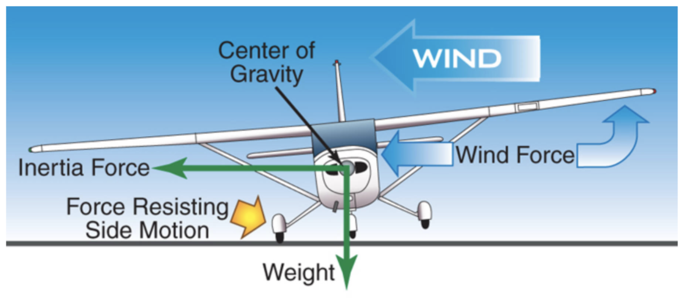
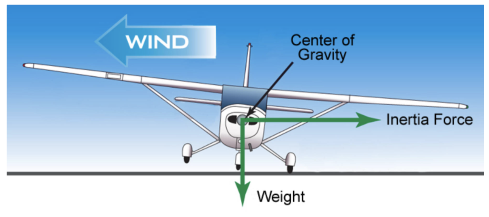

# Learning to Land

- [Learning to Land](#learning-to-land)
  - [I. Faulty Approaches and Balked Landings](#i-faulty-approaches-and-balked-landings)
    - [Final Approach](#final-approach)
      - [Low Final Approach](#low-final-approach)
      - [High Final Approach](#high-final-approach)
      - [Slow Final Approach](#slow-final-approach)
      - [Slips](#slips)
    - [Roundout](#roundout)
    - [Touchdown](#touchdown)
    - [Correcting for Crosswinds](#correcting-for-crosswinds)
      - [Touchdown in a crab](#touchdown-in-a-crab)
      - [Wing rising after touchdown](#wing-rising-after-touchdown)

## I. Faulty Approaches and Balked Landings

### Final Approach

#### Low Final Approach
* Caused by
  * Lower than normal in traffic pattern
  * Insufficient pattern
  * Increasing flaps before necessary
  * Misjudging wind velocity (strong winds on final)
* Solution
  * Add power and hold altitude/airspeed
  * Do not increase pitch without adding power
  * Adjust power to normal and lower nose once you intercept appropriate glide path

#### High Final Approach
* Caused by
  * Too much power
  * Starting descent late
  * Not extending sufficient flaps soon enough
* Solution
  * Add flaps as needed
  * Reduce power
  * Simultaneously lower the nose to steepen approach path and maintain approach speed
  * Adjust power to normal and adjust nose to normal glide path once you intercept appropriate glide path

#### Slow Final Approach
* Caused by
  * Lack of attention to appropriate air speed
  * Not adding power when pitching up to correct for low approach
* Solution
  * Increase power and/or pitch down to accelerate
* Risks
  * Difficult to judge rate of sink and height of roundout
  * Pitch attitude will be higher
  * Wing near critical AOA
    * May stall and hit the ground
* Go around if too slow and too low

#### Slips
* Forward slip can increase rate of descent
* Put longitudinal axis at angle to flight path, presenting side of fuselage to wind and causing increase in drag/increased rate of descent without increasing airpseed
* Lower wing into wind, simultaneously apply sufficient opposite rudder to maintain ground track without raising nose
  * Amount of sink rate is determined by bank angle
    * Steeper the bank, steeper the descent
  * Usually limited by rudder not being able to keep up with ailerons (unable to maintain heading)
  * Known as **practical slip limit**
* To get out of a slip, level wings and release rudder pressure while readjusting pitch to normal glide attitude

### Roundout
* Correcting for high roundout and early flare
  * Causes
    * Using focal point too near the nose of the aircraft
  * Solution
    * May be corrected by holding existing attitude (slight relaxation of back pressure) or adding power to make controlled descent to the runway
    * May be corrected by going around
    * If slightly high, hold attitude and apply sufficient power to help ease aircraft onto the ground
    * But if more than slightly high, go around
* Correcting for late roundout and rapid flare
  * Causes
    * Using focal point too far from nose of aircraft
    * Losing awareness of altitude, striking nose wheel first or landing flat (all three wheels at same time) and bouncing
  * Solution
    * Correct bounces (if sufficient runway) by prompt and positive application of power and re-establishment of flare
  * If you strike nose wheel first, **go around immediately**
* Floating during roundout and flare
  * Causes
    * Flare with excessive airspeed by diving towards a landing point or using excessive airspeed on final
  * Solution
    * Smoothly and gradually adjust pitch attitude as airplane slows to touchdown speed and starts to settle
    * Go-around if runway is short or there is a crosswind causing the aircraft to drift sideways
* Balooning
  * Causes
    * Pulling back on stick too rapidly for airspeed, resulting in a climb
  * Solution
    * If slight and sufficient runway, may be corrected by holding existing attitude and slightly relaxing back pressure while adding power to make controlled descent to runway
    * Go-around if ballooning is excessive; avoid stalling

### Touchdown
* Ideal touchdown
  * Touching down gently on main wheels only with raised nose on centerline pointed down the runway
  * Just above stall speed
  * No sideways movement (using rudder to control wall and bank to control drift)
* Flat landing or landing on nosewheel
  * Causes
    * Failure to hold aircraft off until in nose-up landing attitude
    * Too fast
    * Forcing the airplanedown
    * Causes bounces and prop strikes
  * Either re-stablish flare or go-around
* Porpoising
  * Airplane bounces, pitches down and strikes nosewheel, and continues bouncing
  * Each bounce is harder, usually there is damage on third contact (nosewheel or prop)
  * Can cushion subsequent touchdown by applying power and adjusting pitch to proper attitude
  * Or, just go-around
* Bouncing
  * Touchdown with excessive rate of sink and higher airspeed
  * Corrective action depends on severity
    * Slight with no extreme attitude change &#8594; apply sufficient power to cushion touchdown, smothly adjust pitch to proper touchdown attitude
  * If crosswind, maintain crosswind correction at all times
  * Go around if bounce is hard
* Severe bouncing
  * Excessive sink rate and rebound to higher than normal flare altitude (10-20 feet above runway)
  * Go-around
* Hard landing &#8594; caused by flaring too high
* Landing with sideways movement &#8594; not enough bank used to control sideways drift, not enough rudder to align airplane with runway

### Correcting for Crosswinds

#### Touchdown in a crab
* When crabbing, it is important to transition to "wing-low method" on short final (rudder to place nose down middle of runway, ailerons to control drift) otherwise airplane may contact ground while moving sideways, placing extreme side loads on landing gear
* Common mistake is to release crosswind correction during landing flare, which causes sideways drift touchdown
* Must simultaneously flare and maintain crosswind control
* Increased control deflection needed as flight controls become less effective
* Can cause a ground loop if touchdown with drift occurs

* Keep full deflection when rolling off runway and through taxi

#### Wing rising after touchdown
* If crosswind is strong enough, upwind wing may rise since it is receiving greater force from wind
* Increases AOA of upwind wing, producing lift
* If this occurs, immediately apply more aileron pressure towards high wing, maintaining directional control with rudder
