# Charts, Publications, Hazards, and Emergencies

- [Charts, Publications, Hazards, and Emergencies](#charts-publications-hazards-and-emergencies)
  - [I. VFR Aeronautical Charts](#i-vfr-aeronautical-charts)
    - [Locating your Position using Latitude and Longitude](#locating-your-position-using-latitude-and-longitude)
    - [Airport Symbols](#airport-symbols)
    - [Obstructions and Visual Checkpoints](#obstructions-and-visual-checkpoints)
    - [VFR Chart Types](#vfr-chart-types)
      - [Sectional Charts](#sectional-charts)
      - [Terminal Area Charts](#terminal-area-charts)
  - [II. FAA Publicationos](#ii-faa-publicationos)
    - [Chart Supplement](#chart-supplement)
      - [Aiport info](#aiport-info)
    - [Notices to Airmen (NOTAMs)](#notices-to-airmen-notams)
      - [NOTAM (D)](#notam-d)
      - [Flight Data Center (FDC) NOTAMs](#flight-data-center-fdc-notams)
      - [Remarks](#remarks)
    - [FAA Reference Materials](#faa-reference-materials)
      - [Federal Aviation Regulations](#federal-aviation-regulations)
      - [Aeronautical Information Manual](#aeronautical-information-manual)
      - [Advisory Circulars](#advisory-circulars)
      - [FAA Handbooks](#faa-handbooks)
  - [III. Hazards](#iii-hazards)
    - [Wake Turbulence Avoidance](#wake-turbulence-avoidance)
    - [Wind Shear Awareness and Recovery Procedures](#wind-shear-awareness-and-recovery-procedures)
  - [IV. Emergencies](#iv-emergencies)
    - [Emergencies in Flight](#emergencies-in-flight)
    - [Basic Engine Failure Procedures](#basic-engine-failure-procedures)
    - [Emergency Approach and Landing](#emergency-approach-and-landing)
    - [Engine Failure During and After Takeoff](#engine-failure-during-and-after-takeoff)
      - [Engine Failure Immediately After Takeoff](#engine-failure-immediately-after-takeoff)
    - [Fires](#fires)
      - [Engine Fire During Start](#engine-fire-during-start)
      - [Engine Fire in Flight](#engine-fire-in-flight)
      - [Electrical Fire in Flight](#electrical-fire-in-flight)
      - [Cabin Fire In Flight](#cabin-fire-in-flight)
    - [Emergency Equipment and Survival Gear](#emergency-equipment-and-survival-gear)
      - [Planning for an Emergency](#planning-for-an-emergency)
      - [Ballistic Recovery System (for the Cessna SkyCatcher as an add-on)](#ballistic-recovery-system-for-the-cessna-skycatcher-as-an-add-on)
      - [Off-Airport Forced Landing](#off-airport-forced-landing)

## I. VFR Aeronautical Charts

### Locating your Position using Latitude and Longitude
* Equator divides Northern and Southern hemisphere
* Prime meridian and interenational date line divides Eastern and Western hemispheres
* Distance between lines of latitude is 60 nautical miles anywhere on earth with minor variations due to spherical imperfections
* 90° north &#8594; North Pole
* 90° south &#8594; South Pole

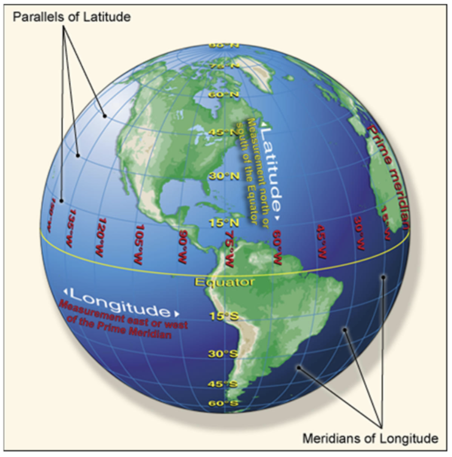

* Distance between lines of longitude varies with how fall from the equator you are
* Latitude and longitude are further broken down into 60 minutes in each degree and 60 seconds in each minute
* Descriptions of a position on earth will use one of two forms
  1. Degrees, minutes, seconds: 40° 32' 30"N 110° 57' 12"W
  2. Degrees, minutes, decimals: 50° 32.5'N 110° 57.2'W
* Latitude comes first, longitude comes second
* Latitude increases as you move north in northern hemisphere
* Longitude increases as you move west in western hemisphere

### Airport Symbols
See section in CTA for detailed photo examples.
* Magenta for uncontrolled airports

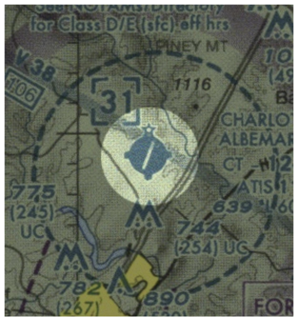

* Blue for airports with at least part-time control towers

* Circle with no tick marks
  * Airports with no public services

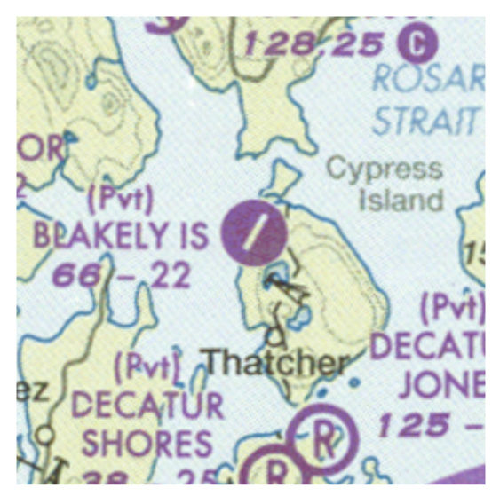

* Circle with tick marks at top, button, and sides
  * Fuel available during normal working hours (1000-1600 LT)

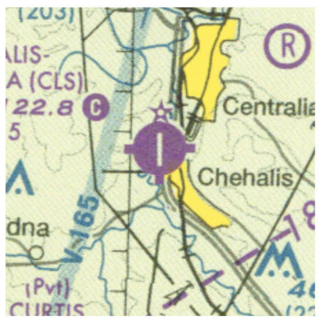

* Circle with letter "R" for restricted or private airports
  * Only for use in emergency or with authorization

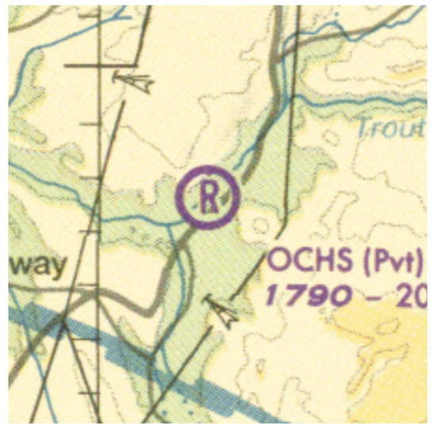

* Hard-surfaced runway at least 1,500 feet long have runway symbol
  * Contained in circle if runway less than 8,069 feet loong
  * If no circle, there are multiple runways or a runway longer than 8,069 feet

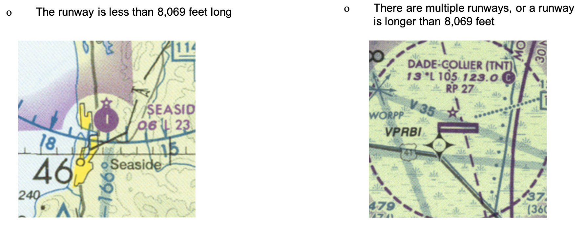

* Military airports
  * Identified by name (MCAS, NAS, AFB)
  * Circle within a circle if small
  * Require special permission or an emergency for civilian aircraft to use them
  * Some airports are joint-use, which means civilian aircraft may use them
  * Small joint-use airports are circles within circles with tick marks on top/bottom/sides

* Large joint-use are depicted the same as civil airports
* Abandoned airports are shown with magenta circle and X across circle if runway is at least 3,000 feet long and paved

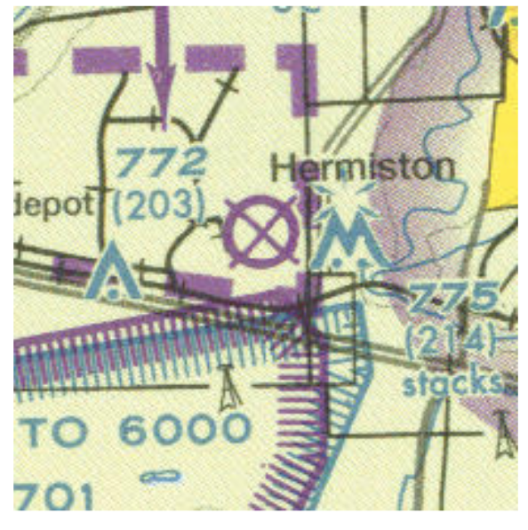

* Airport data
  * Name, identified in parenthesis, elevation in feet MSL
  * Lighting information
    * Star indicates rotating beacon
    * `L` indicates surface lighting is in operation sunset to sunrise
    * `*L` indicates surface lighting limitations exist
      * Not on automatically, usually pilot controlled

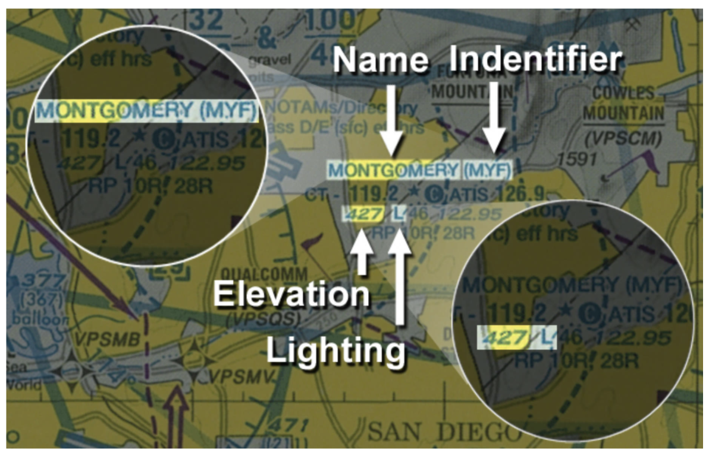

* Communication services
  * `C` for `CTAF`
  * `CT` for control tower with a star for part-time operation
  * `ATIS` for ATIS frequency
  * `ASOS/AWOS` for ASIS/AWOS frequency
  * `U` for UNICOM

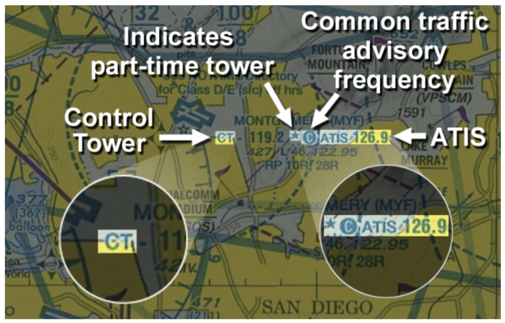

* Length of longest runway in hundreds of feet; rounded down at 69 feet and below, rounded up at 70 feet and above
* Traffic pattern info for runways using right traffic pattern

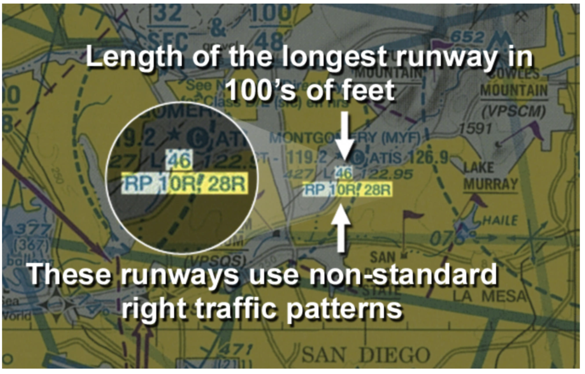

* VFR charts will have a legend

### Obstructions and Visual Checkpoints
* Maximum Elevation Figure (MEF) shown in hundreds of feet MSL
* Usually includes possible vertical error, around 100 feet
* Another 200 feet added when terrain is highest feature
* Rounded up to nearest 100 feet
* Upside-down `V` with dot underneath (showing precise location) used when more than 200 feet AGL or hazardous
* Obstacles with Eiffel Tower symbol when 1000 feet AGL or more
* Bursts surrounding top of symbol when tower has high-intensity strobe lighting
* Numbers beside tower to show:
  * Top number - elevation of top in MSL
  * Bottom number - height of the top of the tower in AGL

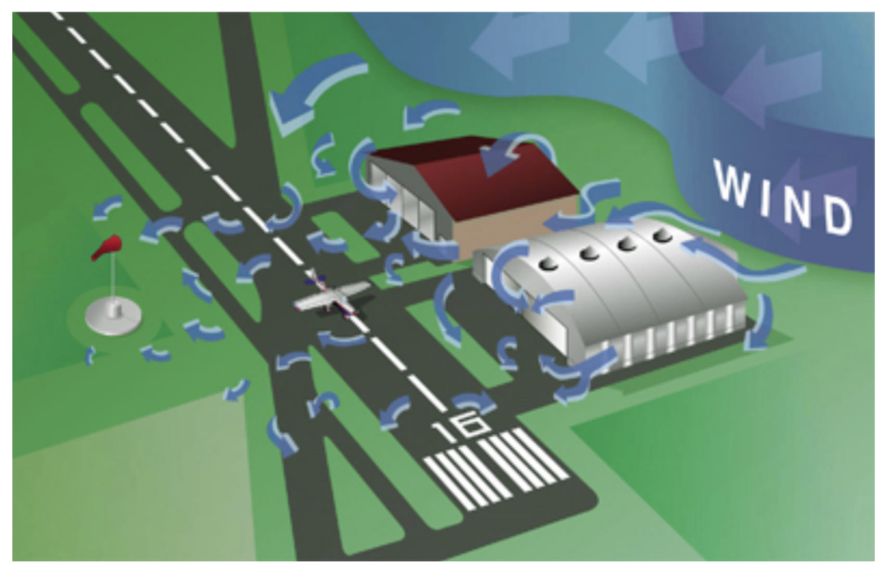

* Circular restricted airspace with unmarked balloon cables

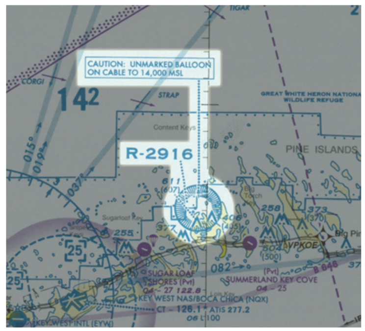

* Visual reporting points to provide common reference and identify positions
* Sometimes shown with magenta flag
* Black underlined for prominent structure
* Blue underlined when collocated with a VOR
* Magenta underlined to identify uncontrolled airport

### VFR Chart Types
* Two types: sectional charts and terminal area charts
* Have expiration date, are not static

#### Sectional Charts
* Scale of 1:500,000 (1 inch is about 6.86 nautical miles)
* Revised every 6 months, except Alaska which is annually
* Named for major city
* 37 charts to cover contiguous US
* Front panel contains major contour interval of chart, highest elevation and location, and color scale indicating height of terrain

#### Terminal Area Charts
* Used around busiest airports, available for all airports with Class B airspace
* Revised every 6 months, except Puerto Rico/Virgin Islands which is annually
* Include info about VFR Flyways, Corridors, and Routing

## II. FAA Publicationos

### Chart Supplement
* Includes information on all public airports, seaplane bases, and heliports
  * Communication data, navigational facilities, special notices
  * Published every 56 days/8 weeks
  * Runways and services available
  * Weather data sources
  * Communications, airspace types
  * Radio aids to navigation
* Divided into seven regional volumes
* Available online (1800wxbrief)

#### Aiport info
* Has latitude and longitude info about airport
* Has a `B` if there is rotating beacon
* Notes services available
* Notes TPA (Traffic Pattern Altitude) in the format `MSL (AGL)`
  * If TPA not shown, TPA is assigned by ATC

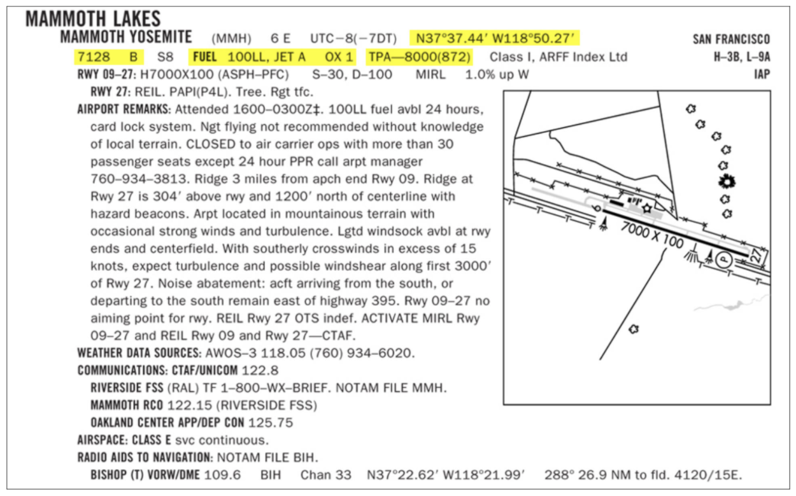

* Runway (RWY shown above) includes designations, dimensions including displaced thresholds, type of surface, lighting and visual glide slope indicators, runway slope when exceeding 0.3%, and runway end data
  * Lighting near end, obstructions, non-standard or RP
* Airport remarks include further info (parachute jumping, landing fees, etc.)
* Communication facilities include ATC callsign if it differs from airport
  * CTAF/UNICOM frequency, ATIS freequency

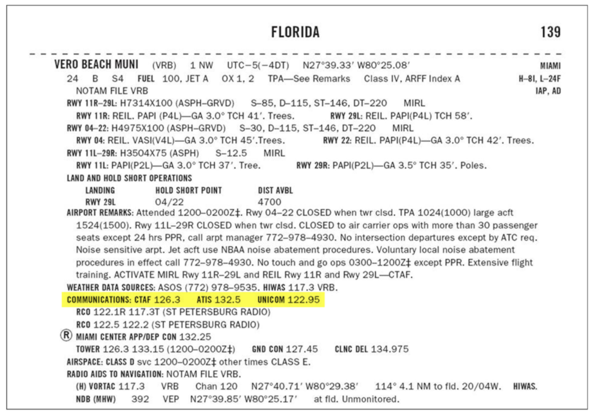

* FSS identifier and communication info
  * `T` if facility can only transmit on that frequency
  * `R` if facility can only receive on that frequency
* Approach and departure control frequencies
* Circled `R` indicates radar approach control is available

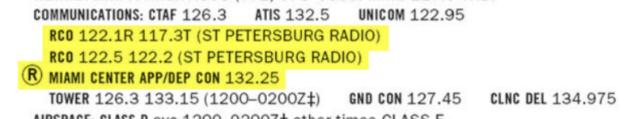

* Aeronautical Chart Bulletin section contains changes to Sectional/Terminal Area Charts (since last publication)
* Chart supplement contains selected towered airport diagrams in the Airport Diagrams section
* Additional information follows the Airport/Facility Directory
  * Seaplane areas, special notices, FAA phone numbers, FSDO location, parachute, Land and Hold Short Operations (LAHSO)
* Back cover depicts which states are covered by the chart

### Notices to Airmen (NOTAMs)
* Provide time-critical aeronautical information of temporary nature
* Not known sufficiently in advance to include publication in a chart
* Two categories
  * NOTAM (D) - distant dissemination
  * Flight Data Center (FDC) NOTAMs
* Available by telephone (1-800-WX-BRIEF)
* Available online ([1800wxbrief.com](https://www.1800wxbrief.com/) or [FltPlan.com](https://www.fltplan.com/))

#### NOTAM (D)
* Disseminated to all navigational facilities that are a part of the National Airspace System (NAS), facilities for public use, seaplane bases, and heliports
* Distributed via Service A telecommunications system for period of validity or until published on aeronautical charts
* Included in standard weather briefing if NOTAM not published or published NOTAMs are requested by pilot
* Format
  * Exclamation point
  * Identifier for location
  * Identifier for affected location or nearest public-use airport
  * One of 12 keywords
    * AD - aerodrome
    * APRON/RaMP
    * RWY - runway
    * TWY - taxiway
    * AIRSPACE
    * OBST - obstruction
    * COM - communications
    * NAV - navaid
    * SVC - services
    * O - other
    * U - unverified movement area
  * Surface identification
  * Condition being reported
  * Effective times - WEF (with effect from)

#### Flight Data Center (FDC) NOTAMs
* Deal with changes to instrument flight procedures
* Navigation charts, until incorporated into Chart Bulletin section of Chart Supplement

#### Remarks
* FDCC NOTAMs and NOTAMs (D) that are long-term will be published every 28 days in *Notices to Airmen* publication, available online

### FAA Reference Materials
* Federal Aviation Regulations (FARs)
* Aeronautical Information Manual (AIM)
* FAA Advisory Circulars (ACs)
* All can be found on [faa.gov](https://www.faa.gov/) or through publications like FAR/AIM

#### Federal Aviation Regulations
* Stem from Titles 14 and 49 of the Code of Federal Regulations (CFR)
* Private pilot
  * 14 CFR Part 1: Definitions and Abbreviations
  * 14 CFR Part 43: Maintenance, Preventive Maintenance, Rebuilding, and Alteration
  * 14 CFR Part 61: Certification: Pilots, Flight Instructors, and Ground Instructors
  * 14 CFR Part 91: General Operating and Flight Rules

#### Aeronautical Information Manual
* Non-regulatory, written for readability and quick reference
* Procedures for flying in US NAS
* Information of interest to pilots, pilot/controller glossary

#### Advisory Circulars
* FAA publication to provide guidance in a specific area
* Explain a method acceptable to the Administrator for compliance with an FAR
* Not regulatory
* Available online (faa.gov) or via U.S. Government Printing office
* Numbered for identification (i.e. AC 61-21B)
  * Advisory Circular for FAR Part 61, the 21st document and a revision (B) to 61-21

#### FAA Handbooks
* Provide commonly-used reference material
  * Pilot's Handbook of Aeronautical Knowledge
  * Aircraft Weight and Balance handbook
  * Airplane Flying Handbook

## III. Hazards

### Wake Turbulence Avoidance
* Wake turbulence occurs any time an airplane is flying
* High pressure air circulates from area of high pressure beneath the wing upward and around wingtip to fill low pressure area on top of the wing
* Creates a vortex

[Wing vortices](images/vortex.png)

* Strongest when airplane is at high AOA, slow speed, heavy weight, and clean configuration (since all require higher AOA)
* Vortices occur whenever there is lift and sink behind the airplane at a rate of several hundred feet per minute
  * Slow rate of descent and strength over time
  * Spread outward on ground at rate of 2-3 knots
  * Drift with the wind (hazardous when light quarting tailwind blows upwind vortext back over the runway)

[Crosswind vortices](images/crosswind-vortices.png)

* Avoid wake turbulence by noting where departing aircraft rotated; try to lift off before that aircraft's rotation point
  * Turn away from aircraft's departure path, preferably upwind, to avoid vortices
* Note where landing aircraft lowers nose wheel to runway
  * Allow time for dissipation
  * Allow time if light quartering tailwind is present
  * Plan to become airbone after the landing aircraft's nose wheel touchdown point
* Stay at or above large aircraft's fligth path when in flight to avoid vortices
* When landing, note large aircraft's nose wheel touchdown point, and plan to touch down beyond that point
* Allow two minutes of separation

### Wind Shear Awareness and Recovery Procedures
* Wind shear is any sudden change in wind speed or direction
* Can occur at all altitudes and both horizontally and vertically
* Most frequent causes are thunderstorms, fronts, low-altitude temperaturer inversions, or obstructions
  * Thunderstorms are worst (vertical speeds of 6,000 fpm)
* Wind changing from headwind to decreasing headwing or a tailwind will decrease airspeed and pitch (and vice versa)
  * Either may indicate a microburst
* Generally, in a microburst, you will have first a strong increase in headwind, followed by a strong downdraft then a rapidly increasing tailwind
* At first sign of microburst, apply full power and go-around
* Frontal wind shear
  * Stronger when temperature difference of two air masses is greater
* Low-altitude temperature inversions
  * Cold, calm air is at surface and warmer air is in motion above the cold air
  * Can cause chaing in airspeed of 25 knots or more when climbing or descending through inversion boundary
  * Be aware of winds aloft; compare with surface winds and respond promptly to airspeed changes

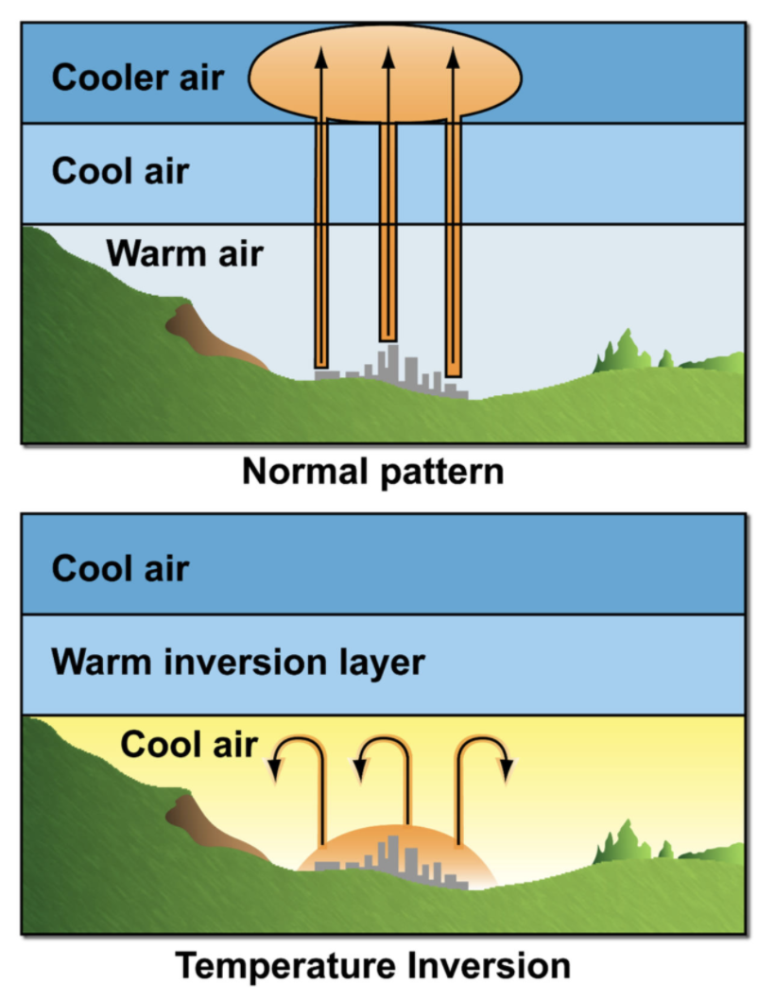

* Obstructions
  * Disrupt normal airflow
  * Produce varying wind directions and velocities
  * Compensate for known wind shear by carrying additional airspeed if runway length permits; or, land on different runway or divert to another airport

## IV. Emergencies

### Emergencies in Flight
* Aviate, navigate, communicate
* FADD
  * **F**ly the airplane
  * **A**ssess the situation
  * **D**ecide what to do
  * **D**o it
* Know emergency checklists, and memorize boldface items
* Land as soon as possible: field
* Land as soon as practical: airport
* Radios
  * Transmit on current frequency if already talking with someone
  * 121.5 MHz otherwise, the international emergency frequency which is monitored by many government agencies and other aircraft
* Urgent: potential distress (i.e. low on fuel)
  * PAN-PAN-PAN
* Distress: serious/imminent danger
  * MAYDAY-MAYDAY-MAYDAY
* Squawk 7700
* Don't worry about paperwork
  * Only necessary to submit a detailed report if requested by ATC to the manager within 48 hours

### Basic Engine Failure Procedures
* ABC: Airspeed for best glide, Best field selected, Cockpit checks
  * **A**ttitude/airspeed for best glide speed
    * Use attitude, not airspeed, and don't fixate on the panel
  * **B**est field selected
    * Start looking for best area for emergency landing
    * A field is generally within gliding distance if it is not moving higher on the windshield
    * Don't pass up a good landing area to get to a better one
    * Best if it's upwind
    * Runway is best
    * Fields generally better than roads
      * Use caution for tall crops, soft conditions (following rain)
      * Land parallel to furrows if field is furrowed
    * Roads which are smooth; watch for traffic, wires, and poles
    * Dry lake beds and beaches, which are best just landward of the waterline
  * **C**ockpit checks performed (floor to door)
    * Perform checklist memory items for Engine Failure During Flight (Restart Procedures) checklist
      * Don't rush
    * Follow up with remaining checklist items if time
    * Apply carb heat before exhaust has a chance to cool down (prevent icing)
    * Fuel starvation is one of most common causes of engine failure
      * Turn on auxiliary fuel pump
      * Ensure fuel selector on both, or switch tanks
      * Ensure fuel shutoff valve is on "on"
      * Pushing mixture in (except at high altitudes)
      * Making sure primer is locked
    * Verify ignition on Both
    * Did you just change something before engine died? Change it back!
* Don't worry about saving the airplane
* Example Engine Failure During Flight (Restart Procedures) checklist (check POH for a real one)
  * Airspeed - 68 KIAS (VG)
  * FUEL SHUTOFF Valve - ON
  * FUEL SELECTOR Valve - BOTH
  * FUEL PUMP Switch - ON
  * Mixture Control - RICH (if restart has not occured)
  * MAGNETOS Switch - BOTH (or START if propeller is stopped)
* Always remember to fly the airplane

### Emergency Approach and Landing
* Remember ABC
* Only change mind on selected field early in approach
* DEF
  * **D**ialog
  * **E**verybody ready
  * **F**inal checks
* Dialog
  * Communicate condition while descending with ATC/Guard
  * Provide position so search and rescue can find you
  * Squawk 7700 if unable to communicate
    * ATC radar recordings are saved for 30 days, so SAR will be able to find you based on your squawk
* Everybody ready
  * Items on Emergency Landing Without Engine Power related to passenger safe landing and egress
    * Seatbacks upright
    * Seat and seat belts secure
    * Doors unlached
  * Establish meeting point well away from aircraft
* Final checks
  * Just before touchdown
  * Mixture - idle cutoff (prevent fire)
  * Fuel Shutoff Valve - off (prevent fire)
  * Magnetos - off (remove electrical energy as source of combustion)
  * Master switch - off, when landing assured and flaps ALREADY LOWERED (remove electrical energy as source of combustion)
* Only lower flaps when you are sure you will make the field
  * Full flaps recommended when on final to touch down as slowly as possible
  * Door unlatched - prevent door from jamming in closed position, use something to keep it open
  * Touchdown - slightly tail low
  * Brakes - apply heavily
* Only pick up emergency landing checklist when you have the field made and have time
  * Focus on landing when at pattern altitude
  * Have passenger read checklist
* After landing
  * Evacuate quickly
  * If airplane upside down, brace yourself before releasing seat belt
  * Kick/smash out window if necessary
  * Get away

### Engine Failure During and After Takeoff
* Lern boldface items from emergency checklist by memory
  * **Throttle Control IDLE**
  * **Brakes - APPLY**
* Remaining items:
  * Wing Flas - RETRACT
  * Mixture Control - IDLE CUTOFF
  * MAGNETOS Switch - OFF
  * STBY BATT Switch - OFF
  * MASTER Switch - OFF
* Make radio call
* Evacuate airplane
* Move upwind
* Be alert for emergency equipment - don't get run over

#### Engine Failure Immediately After Takeoff
* Very critical - lack of altitude, limited number of landing sites
* Prompt application of ABCs
  * Glide airspeed will require firm and immediate push
  * Generally best to land straight ahead, not more than 60° to either side of the nose
  * If only trees, maneuver to have wings absorb impact
  * Cockpit checks
    * Boldface/memory items only; use flow
    * When committed to land, kill fuel and electrical power
  * Maintain control and don't hit anything with the *cabin* of the airplane
* Don't attempt to return to field without sufficient altitude - at least TPA
* Avoid stalling or flying uncoordinated
* Engine Failure Immediately After Takeoff (example for C172SP)
  * Airspeed 70 KIAS flaps up
  * Airspeed 65 KIAS flaps 10° - FULL
  * Mixture idle cutoff
  * Fuel shutoff valve off
  * Magnetos off
  * Wing flaps as required, full recommended
  * STBY BATT switch off
  * Master off
  * Cabin door unlatch
  * Land straight ahead

### Fires

#### Engine Fire During Start
* Usually casued by excess fuel and/or over-priming the engine
* Engine Fire During Start checklist - memorize **boldface** items
  * **MAGNETOS Switch - START** - pull fire into engine
  * If engine starts
    * Power - 1800 RPM, to ensure flames pulled into engine
    * Engine - SHUTDOWN, inspect for damage
  * If engine fails to start
    * **Throttle Control - FULL** (allow for greatest amount of air to be sucked into engine)
    * **Mixture Control - IDLE CUTOFF** (cut off fuel to fire)
    * **MAGNETOS Switch - START, continue cranking** (pull fuel into engine)
    * **FUEL SHUTOFF Valve - OFF**
    * **FUEL PUMP Switch - OFF**
    * **MAGNETOS Switch - OFF**
    * **STBY BATT Switch - OFF**
    * **MASTER Switch - OFF**
    * Engine - SECURE (master and ignition off)
    * Parking brake - release (so airplane can be moved away from other airplanes/buildings)
    * Fire Extinguisher - OBTAIN (might be a bigger one at pump or somewhere else at airport)
    * Airplane - EVACUATE
    * Fire - EXTINGUISH (fire extinguisher, wool blanket, dirt)
    * Fire Damage - INSPECT and repair; do not fly until inspected and repaired

#### Engine Fire in Flight
* Indications
  * Flames or smoke coming from engine compartment
  * Present of heat at engine firewall
  * Smell of smoke in cockpit
* Engine Fire During Flight checklist - memorize **boldface** items
  * **Mixture Control - IDLE CUTOFF**
  * **FUEL SHUTOFF Valve - OFF**
  * **FUEL PUMP Switch - OFF**
  * **MASTER Switch - OFF**
  * Cabin Vents - OPEN as needed
  * CABIN HT and CABIN AIR control knobs - OFF (avoid drafts)
    * Keep smoke or heat from entering cockpit
    * Keep overhead vents open to bring resh air
  * Airspeed - 100 KIAS (if fire not extinguished, increase glide speed to find an airspeed (within limitations) that will provide an incombustible mixture to help blow fire out)
  * Forced Landing - EXECUTE (see EMERGENCY LANDING WITHOUT ENGINE POWER)
* Emergency descent
  * Rapid descent may be necessary due to cockpit smoke, unextinguished fire, or loss of pressurization (if applicable)
* Two ways to descend quickly
  * High-speed descent
    * Idle power
    * 30-45° bank with positive load factor
    * Lower nose and descend no faster than VNE in smooth air and top of green arc VNO if air is not smooth; VA in turbulent air
    * High speed may blow out an engine fire and you will have excess airspeed to get rid of before landing
  * High-drag descent
    * Idle power
    * Full flaps (do not exceed VFE)
    * 30-45° bank positive load factor
  * If engine fire persists during final approach, try to keep flames away from cockpit; consider a forward slip

#### Electrical Fire in Flight
* Indications
  * Acrid odor from burning insulation
  * Sparks or flames from instrument panel
* Electrical Fire During Flight checklist - memorize **boldface** items
  * **STBY BATT Switch - OFF**
  * **MASTER Switch - OFF**
  * **Cabin Vents - CLOSED** (avoid drafts)
  * **CABIN HT and CABIN AIR Control Knobs - OFF (push full in)**
  * **Fire Extinguisher - ACTIVATE**
  * AVIONICS Switch (BUS 1 and BUS 2) - OFF
  * All other switches (except MAGNETOS) - OFF
* Ventilate cabin after fire extinguished
  * **After fire extinguisher has been used, ensure fire is extinguished before exterior air is used to remove smoke from the cabin**
  * Cabin vents - OPEN, ensure fire is completely extinguished first
  * CABIN HT and CABIN AIR Control Knobs - ON (pull full out), ensure fire is completely extinguished first
* Best to leave all electrical equipment OFF
* If you absolutely need something that depends on electrical power
  * Check for OPEN circuit breakers; do NOT reset them, a popped circuit breaker may indicate the source of the fire
  * MASTER Switch - ON
  * STBY BATT Switch - ARM
  * AVIONICS Switch (BUS 1) - ON
  * AVIONICS Switch (BUS 2) - ON
* If odor or sparks appear, turn off whatever you just turned on

#### Cabin Fire In Flight
* Unlikely and generally caused by a portable electronic device
* Best extinguished by removing power from any electronic source; if no extinguisher is available, douse fire with any available liquid, or smother it with clothing of natural fabric (cotton/wool)
* Cabin Fire During Flight checklist
  * **STBY BATT Switch - OFF**
  * **MASTER Switch - OFF**
  * **Cabin Vents - CLOSED** (avoid drafts)
  * **CABIN HT and CABIN AIR Control Knobs - OFF (push full in)** (avoid drafts)
  * **Fire Extinguisher - ACTIVATE**
* Ventilate cabin after fire extinguished
  * **After fire extinguisher has been used, ensure fire is extinguished before exterior air is used to remove smoke from the cabin**
  * Cabin vents - OPEN, ensure fire is completely extinguished first
  * CABIN HT and CABIN AIR Control Knobs - ON (pull full out), ensure fire is completely extinguished first
  * Land ASAP to inspect for damage

**Remember: study the checklists from YOUR AIRCRAFT'S POH over the checklists noted here, which are academic in nature and serve as GUIDES**

### Emergency Equipment and Survival Gear
* Familiarize yourself with emergency equipment and procedures and checklists in Section 3 and systems and equipment in Section 7 of POH/AFM
* Important to be as familiar with emergency checklists/operations as much as possible
  * Checklist from memory and then confirm later

#### Planning for an Emergency
* Be familiar with weather and terrain along route
* Carrying emergency equipment appropriate to flight environment
  * First aid kit
  * Food and drink
  * Emergency banana
  * Flotation devices for overwater flights beyond gliding distance to shore
* Wear appropriate clothing for environment (departure, destination, and en route)
  * Closed-toed shoes
  * Long pants (fire protection)
  * Natural fabrics (fire protection)
* Always file a flight plan
* Review installed emergency equipment as noted in POH
* Be familiar with operation of major systems in the airplane (GPS, electrical, powerplant, fuel)
* Be familiar with performance of airplane for current conditions
  * Carb icing
  * Glide distance for proposed altitude
  * Climb performance, crosswind limitations

#### Ballistic Recovery System (for the Cessna SkyCatcher as an add-on)
* Rocket deployed parachute that recovers aircraft and occupants, lowering it to the ground at safe rate of descent
* Stowed and mounted in baggage compartment and attaches to airplane primary structure upon deployment
  * Rocket motor mounted aft or parachute canister
* Designed for use when pilot is no longer able to fly airplane safely or airplane is no longer controllable
* Deployment
  * Remove protective cover from activation handle box
  * Pull on handle with at least 40 lbs of force

#### Off-Airport Forced Landing
* Immediate concer should be caring for injuries, avoiding hypothermia (too cold) or hyperthermia (too hot), and having enough water
* Stay with your airplane
  * ELT will be focus of rescue operations
  * Aircraft can be used as shelter, source of fuel to start a fire (small quantity of gasoline), and means for communicating with rescuers (via VHF radio)
