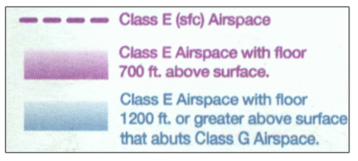

# Airspace

- [Airspace](#airspace)
  - [I. Airspace](#i-airspace)
    - [Basics of the Airspace System](#basics-of-the-airspace-system)
    - [Class G Airspace](#class-g-airspace)
    - [Class E Airspace](#class-e-airspace)
    - [Class D Airspace](#class-d-airspace)
    - [Class C Airspace](#class-c-airspace)
    - [Class B](#class-b)
    - [Class A Airspace](#class-a-airspace)
  - [II. Other Airspace](#ii-other-airspace)
    - [Special Use Airspace](#special-use-airspace)
    - [Other Airspace Areas](#other-airspace-areas)
    - [Temporary Flight Restrictions](#temporary-flight-restrictions)
  - [III. Airspace Rules](#iii-airspace-rules)
    - [Speed Limits](#speed-limits)
    - [Weather Minimums](#weather-minimums)

## I. Airspace

### Basics of the Airspace System
* Organized into several classes
* Comply with International Civil Aviation Organization (ICAO) format of airspace classification
* Depend on complexity/density of air traffic, nature of operations in airspace, level of safety required, national interests
* Two types
  * Uncontrolled airspace
    * No separation service for IFR flights
    * Less restrictive weather minimums
    * No clearance to enter, requires no communications
    * Can include airspace around an airport without an operating control tower
  * Controlled airspace
    * Provides separation service for IFR flights
    * More restrictive weather minimums
    * May require clearance to enter, communications, transponder and ADS-B Out
    * Can include airspace around an airport with an operation control tower (Class D, C, and B) or elsewhere (i.e. Class E that surrounds airport)
* Controlled airspace
  * Class A (think altitude)
    * 18,000 feet MSL through 60,000 feet MSL
    * Must be instrument rated and equipped (transponder/ADS-B) and on IFR flight plan
  * Class B
    * Surrounds airports with most airline service
    * Requires clearance to enter
    * Requires transponder and ADS-B Out
  * Class C (think congested)
    * Surrounds airports not as busy as Class B but busier than Class D
    * Requires two-way communications
    * Has radar services
    * Requires a transponder and ADS-B Out
  * Class D (think dialog)
    * Lowest level of airspace that requires communications
    * Occurs where there is a control tower and airspace is not class B or C
  * Class E (think elsewhere)
    * Controlled airspace that is not Class A, B, C, or D
    * Does not require communications
    * Class E at and above 10,000 feet MSL and 2,500 feet AGL requires a transponoder and ADS-B Out since there is no airspeed restriction under Mach 1
* More complex airspace &#8594; more IFR traffic
* Uncontrolled airspace includes Class G (go for it)
  * No communications requirements
* Class F - not used in United States, but used in Canada as military/special use airspace

### Class G Airspace
* "Go for it"
* Uncontrolled airspace
* No ATC separation service
* No mandatory communication requirements
* Less strict weather minimums
* May be used by pilots with any level of certificate
* Not directly depicted on sectionals
* Default airspace if no controlled airspace depicted
* Generally starts at surface and extends to base of Class E airspace

* Boundary of Class E implies boundary of Class G

* Magenta dashed line - class G airspace does not exist at surface, common around airports with instrument approaches

* Inside fuzzy/faded side of magenta vignette, Class G airspace extends from surface up to but not including 700 feet AGL, where Class E begins

* Inside fuzzy/faded side of blue vignette, Class G extends from surface up to but not including 1,200 feet AGL, where CLass E begins
* Common around airways

* So, class G extends up to but not including either 700 or 1,200 feet AGL
* Can extend up to 14,500 feet MSL, where class E usually begins everywhere if it has not begun already
* Generally
  * East of Rocky Mountains: Class G tends to go up to but not including 1,200 feet AGL, where Class E starts
  * West of Rocky Mountains: some areas where class G goes up to but not including 14,500 feet MSL

### Class E Airspace
* "Elsewhere"
* Controlled airspace not designated Class A, B, C, or D
* Separation IFR service provided by ATC
* Legal for VFR flights to fly in it without talking to anyone if weather is good enough
* Does not require specific pilot certification, navigation or communications equipment (except transponder and ADS-B Out when at and above 10,000 feet MSL and above 2,500 feet AGL)
* Established in 48 states and Alaska above 14,500 feet MSL unless noted on sectional
* Class E airspace protects Federal airways, which
  * Extend 4 nautical miles or 4.5 degrees, whichever is greater, from centerline on each side
  * Begin at 1200 feet AGL unless noted on sectional
  * Extend upward to base of overlying controlled airspace
  * Centerline depicted with blue line
  * Class E airspace shown by fuzzy side of blue vignette

* Class E airspace also protects approach area for airports with instrument traffic
* Referred to as a "transition area" for IFR aircraft
* Depicted on sectional with fuzzy side of either magenta or blue vignette
* Magenta - begins at 700 feet AGL
* Class E airspace also found in more congested areas of country in spaces between airways
* Sometimes down to the surface (surface area Class E)
  * Depicted by dashed magenta line
  * Provides separation service for IFR aircraft fown to the ground at non-towered airport with instrument approach
  * Shaped to provide airspace for instrument approach; extends upward to base of overlying controlled airspace
  * Can be used as extension of Class B, C or D surface areas
  * Not in effect at surface when ATC communications/weather reporting services unavailable (times can be found in Chart Supplement)
* In summary:
  * Dashed magenta line: Class E at surface
  * Fuzzy side of magenta vignette: Class E at 700 feet AGL
  * Fuzzy side of blue vignette: Class E at 1200 feet AGL
  * Not charted: begins at 14,500 feet MSL
* Upper limit is 17,999 feet MSL (after which class A starts)
* Class E starts again above 60,000 feet and up to space
* Basic radar service for VFR flights workload permitting

### Class D Airspace
* "Dialogue"
* Surrounds airports with operational control tower
* When tower is part-time, only exists when tower is in operation and reverts to a difference classification (usually E, sometimes combination fo E and G) when tower closed
* Requirements
  * Two-way communication equipment (VHF transmitter and reciever)
  * Establishing two-way communications prior to entry
  * May enter Class D if acknowledged by callsign and not told to remain clear of Class D airspace (clearance not required)
* Depicted on Sectional Charts with blue dashed line
* Dimensions
  * Usually a circle with radius of 5 statute miles with extensions to contain instrument approaches
  * Usually extends vertically from surface to 2,500 feet above airport elevation (AGL)
    * Shown on charts in MSL so you can refer to altimeter to know if in or above it
    * Rounded upward to next 100 foot interval
    * Vertical limits are depicted in hundreds of feet MSL in sectional

* Class D ATC
  * Separation on runway
  * Radar services may be available
  * No separation for VFR flights
  * Sequencing of all IFR and participating VFR traffic to primary airport
  * Separation between IFR and participating VFR aircraft

### Class C Airspace
* "Congested"
* Found around large airports with operation control tower and radar service
* More traffic than Class D but less than Class B
* Requirements
  * Two-way communication equipment
  * Radar beacon transponder with altitude reporting equipment (Mode C) and ADS-B Out when operating in and above class C
  * Pilots must establish two-way radio communication prior to entering the surface area or shelf area by having ATC identify you with callsign and not having ATC tell you to remain clear of Class C airspace
* Depicted on sectional charts with solid magenta lines

* Generally includes three areas
  * Surface area
    * Extends laterally for 5 nautical miles
    * Vertically to 4000 feet above the airport elevation
    * Depicted in hundreds of feet MSL on chart in magenta
  * Shelf area
    * Extends laterally for a radius from 5 to 10 nautical miles
    * Vertically from no lower than 1,200 feet AGL to 4,000 feet AGL (above airport elevation)
    * Also depicted on chart in magenta
  * Outer area
    * Not depicted on charts
    * Extends from 10 nautical miles outward to 20 nautical miles from primary airport
    * Communication with ATC is recommended but not required
* Deviations from standard shape are common and depicted on sectional charts
* Pilots departing from the primary airport in Class C airspace must contact clearance delivery and sometimes ground control before taxiing to obtain a clearance from ATC specifying the heading and altitude to fly
* Pilots arriving at the primary airport must contact approach control before entering Class C airspace
* Arrivals/deprture from secondary airport within Class C surface area must contact approach/departure control for the class C airport prior to entering the Class C airspace to land at the secondary airport
  * And, as soon as practical when taking off from the secondary airport
* ATC services
  * Aircraft separation on runway
  * Basic radar service, separation between IFR and VFR aircraft, sequencing of VFR arrivals
* Floor of shelf area is shown by bottom of fraction inside sector on chart; read by adding two zeros as an MSL atltitude

### Class B
* "Big jets, Boeing country"
* Busiest airports with operating control tower and radar service
* Includes at least one primary airport and often several secondary airports
* Requirements
  * Two-way communications equipment
  * Operable radar beacon transponder with altitude reporting equipment (mode C) and ADS-B Out
  * ATC clearance specifically clearing you into the Class Bravo airspace
  * At least a Private Pilot certificate
* Uniquely shaped to each Class B airport
* Depicted by solid blue lines
* MSL floor and ceiling altitudes of the segments are shown in hundreds of feet above and below a line
  * Floors shown below the line
  * Ceiling shown above the line
* Includes a Mode C veil extending 30 nautical miles from the center of the primary airport
  * Surface up to 10,000 feet MSL
  * Defines area where Mode C transponder is required, with few exceptions including
    * Balloons, gliders, aircraft not equipped with engine-driven electrical system when operating outside the Class B below the lower 10,00 feet MSL or the ceiling of the Class B
* Student, Sport, and Recreational Pilots are permitted to fly in Class B if:
  * Logged ground and flight instruction in specific Class B airspace to be used
  * Logbook has been endorsed for Class B operations (within last 90 days for student pilots)
  * Take off and land at primary Class B airport if:
    * Received ground and flight instruction for that specific airport
    * Compenent to take off and land at that airport
    * Airport is not one of the 12 Class B airports listed in the AIM, for which PPL is required
* ATC services
  * Separation of aircraft on runway
  * Basic radar service
  * Separation of ALL aircraft VFR and IFR
  * Sequencing of VFR arrivals to the primary airport

### Class A Airspace
* "Altitude"
* Most restrictive and provides positive separation from all trafic
* Includes:
  * Laterally the lower 48 states and Alaska
  * Vertically 18,000 MSL to Flight Level 600 (60,000 feet pressure altitude)
* Requirements
  * Instrument rated and instrument current pilots
  * Flying instrument equipped aircraft
  * IFR flight plan
  * Mode C transponder
  * ADS-B Out
* Not depicted on charts

## II. Other Airspace

### Special Use Airspace
* Occurs where limitations are imposed on use of the airspace
  * Prohibited, restricted, warning, military operation, alert, controlled firing areas
* All special use airspaces (except conotrolled firing areas) is depicted on VFR aeronautical charts with hash marks in blue or magenta with effective altitude shown in table in border of chart

* Prohibited areas
  * Prohibited flight for security reasons
  * Depicted on VFR aeronautical charts with blue hash and the letter `P` followed by a number

* Restricted area
  * Flight of aircraft is subject to restrictions for listed altitude and times
  * Unusual or invisible hazards exist
  * Depicted on VFR aeronautical charts with blue hash marks and the letter `R` followed by a number
  * May be used by pilots if times of use are continuous with permission of controlling agency
  * If times of used published, may be used by pilots with permission of the controlling agency
    * Permission not required outside the times of use
* Temporary Restricted areas (TRA)
  * Established in otherwise undesignated airspace
  * Details and times are published on FAA Special Use Airspace (SUA) website or in the Notices to Airmen Publication (NTAP)
  * Graphically depicted on electronic chart applications
* Warning areas
  * Contain airspace where unusual or invisible hazards exist
  * Extends from three miles outward from the coast
  * Usually located over international waters
  * Depicted on VFR aeronautical charts with blue hash marks and the letter `W` followed by a number
  * May be used at pilots at their own risk because airspace over international waters
  * Important information can be found on border of aeronautical chart

* Military operations areas (MOAs)
  * Airspace of defined vertical and lateral dimensions
  * Military aircraft practice aerobatic and simulated combat maneuvers
  * Created to separate military training activities from IFR traffic, which will be routed around the area
  * Depicted with magenta hash marks and the name of the MOA
  * Accessible to pilots without special permission but require extreme vigilance and caution
  * Important information can be found on border of aeronautical chart

* Alert areas
  * Contain airspace that may have high volume of pilot training or unusual type of aerial activity
  * Depicted on VFR aeronautical charts with boundaries marked using magenta hash marks
  * Letter `A` followed by a number
  * Accessible to pilots without special permission but require extreme vigilance and caution

* Controlled firing area
  * Airspace activities which could be hazardous to non-participating pilots
  * Not charged on VFR aeronautical charts
  * Require no special action
  * Will suspend their activity immediately when an aircraft approaches the area

### Other Airspace Areas
* Military Training Routes (MTRs)
  * Military aircraft may be flying low and fast
  * Require vigilance to cross
  * Depicted on charts with thin black line and a number
  * May be flown by the military as IFR (shown as IR) or VFR (shown as VR)
  * Use their number system to indicate the altitudes they are flown at
    * 1,500 feet AGL and below shown with four digit numbers
    * Routes that have a segment higher than 1,500 feet AGL are shown with three digit numbers
* National security areas
  * Established to provide security for sensitive ground facilities
  * Depicted on sectional charts; pilots are requested to voluntarily avoid flying through the area
  * May temporarily prohibit flying through the area

* Parachute jumping areas
  * Listed in chart supplement and shown on sectional charts

* Published VFR routes
  * Used for transitioning around, under, and through complex airspace
  * VFR Flyway
    * General flight path, extends down to surface, no ATC clearance
  * VFR Corridor
    * Tunnel through class B airspace
    * Has defined vertical and lateral boundaries
    * Does not require ATC clearance
  * VFR Transition Route
    * Specific flight course at specific altitude
    * Requires ATC clearance

* Special conservation areas
  * Protect national parks, refuges, primitive/wilderness areas
  * Depicted by blue line with dots along inside of border
  * Request that pilots not overfly them lower than 2,000 feet AGL

* Terminal radar service areas (TRSAs)
  * Provide radar service on voluntary basis to pilots
  * Enhance mid-air collision avoidance; separate participating VFR aircraft and all IFR aircraft
  * Depicted by gray line
  * Surround primary airport with Class D airspace

* Airport advisory/information service
  * Operates on and within 10 miles of a field where FSS is located but no tower exists
  * Rare
  * Provides information from FSS personnel concerning traffic and weather

### Temporary Flight Restrictions
* Estblished to protect persons and property on the surface
* Used for airshows, sporting events, forest fire fighting, disaster relief, space operations, and executive protection
* Published in NOTAMs
* Graphically shown on 1800wxbrief.com
* Can appear on short notice and should be checked on preflight weather briefing
* Major sporting even TFRs issued for any stadium with seating capacity in excess of 30,000 people
* Active one hour before scheduled time of event until one hour after the end of the event
* Prohibit all aircrft and parachute operations at and below 3,000 feet AGL within a 3 nautical mile radius

## III. Airspace Rules

### Speed Limits
* Usually will not apply to single-engine piston planes but must be known for FAA knowledge test
* Speed limits
  * No faster than the speed of sound at any altitude without special permission
  * 250 KIAS below 10,000 feet MSL
  * 200 KIAS below the floor of Class B airspace, in a VFR corridor in Class B airspace, or within 4 nm of a Class C or Class D primary airport and up to 2,500 feet AGL
  * No additional speed limits exist in Class E and G airspace

### Weather Minimums
* Different weather requirements for controlled vs. uncontrolled airspaces
  * Most IFR operations conducted in controlled airspace
  * VFR flight in controlled airspace close to clouds and in poor visibility can present conflict with IFR flights

VFR weather requirements in controlled and uncontrolled airspaces:

* Doubling method when flying below 10,000 feet MSL
    * Start with 500 feet below clouds
    * Double for 1,000 feet above the clouds
    * Double for 2,000 feet to side of clouds
* "Ones" when flying above 10,000 feet
  * 1,000 feet below
  * 1,000 feet above
  * 1 mile from the sides
* Special situations
  * Below ceiling in surface area contrrolled airspace, must have 1,000 foot ceiling and 3 miles visibility
  * Traffic pattern in Glass G during night, within 0.5 miles of runway and below 1,200 feet AGL
    * Clear of clouds with 1 statute mile visibility
  * Class B
    * ATC controlling everyone
    * Only required to be clear of clouds
    * Still need 3 miles visibility
* Student pilot weather minimums
  * 3 miles visibility in daytime
  * 5 miles visibility at night
  * Cannot fly over the top of cloud layer (out of sight of ground)
* Sport pilot weather minimums
  * 3 miles visibility
  * Cannot fly over top of cloud layer
* Special VFR
  * Special clearance from ATC when weather is less than standard minimums
  * Can operate to or from an airport inside the lateral boundaries of surface area Class B, C, D, or E airspace with minimums of clear of clouds and 1 statute mile of flight and ground visibility
  * Require clearance from ATC, provide separation from other trarffic
  * Prohibited at busiest airports (NO SVFR on chart)
  * Not issued at night unless pilot is IFR rated, current, and in IFR aircraft
  * Must be requested with aircraft identification, position, and "Requesting Special VFR for departure/landing from/at..."
  * Cancel your SVFR clearance after clear of airspace on departure or have landed at destination airport
