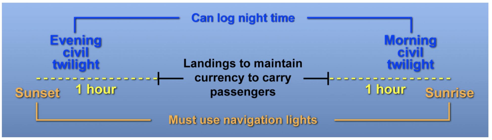
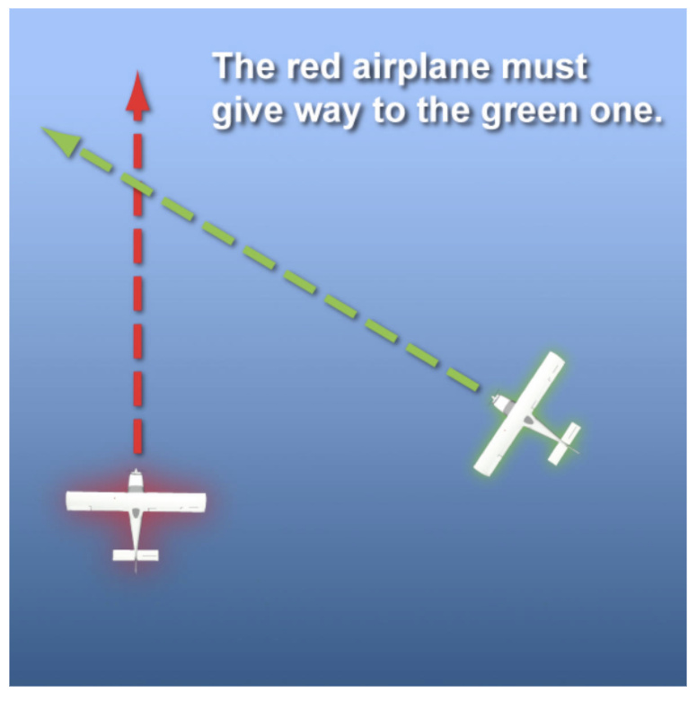
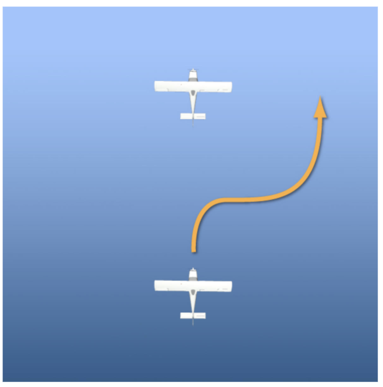
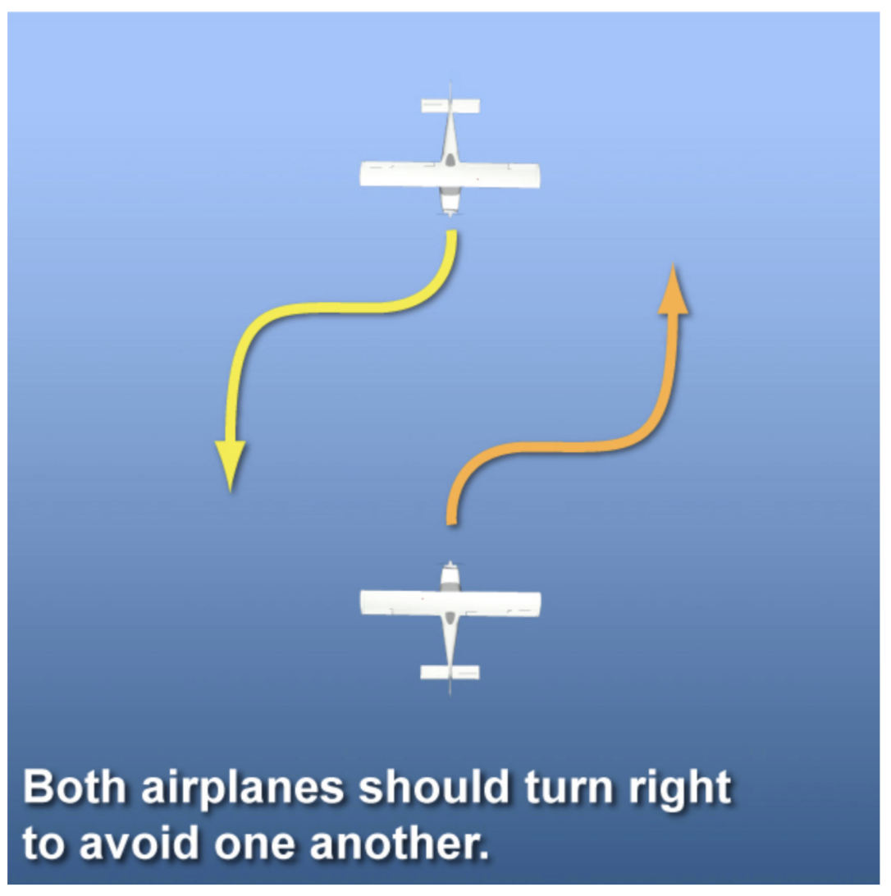
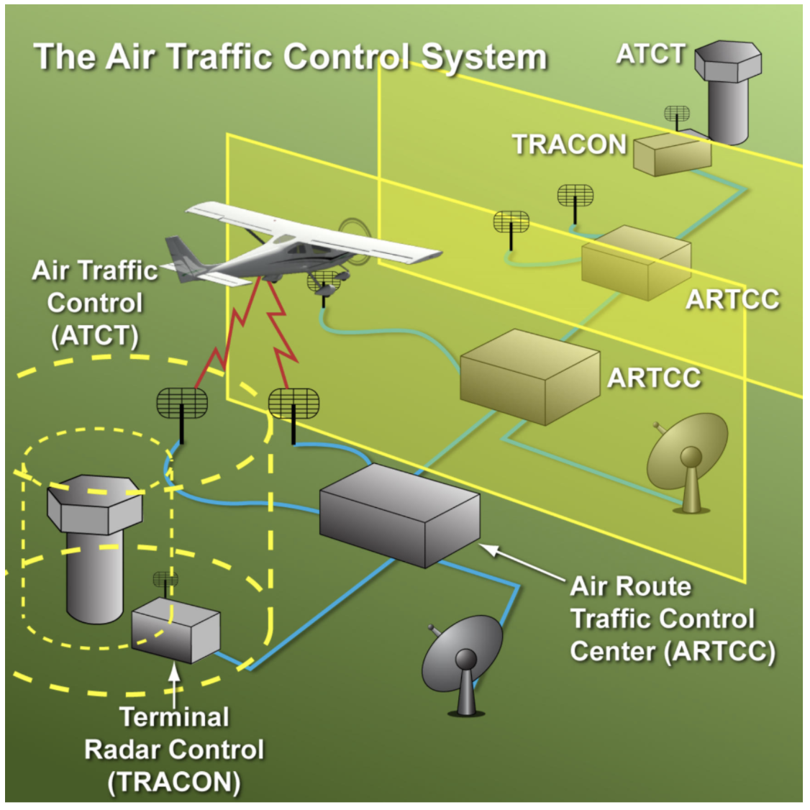
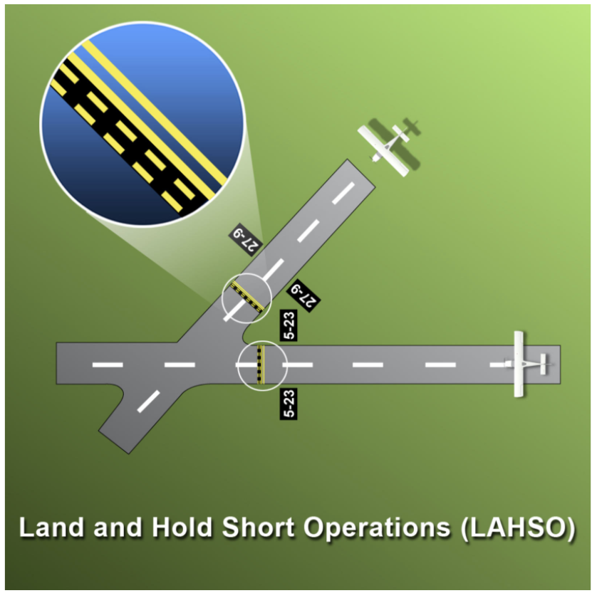

# Aviation Rules and Terminology

- [Aviation Rules and Terminology](#aviation-rules-and-terminology)
  - [I. Rules Governing Pilots](#i-rules-governing-pilots)
    - [Pilot and Airplane Certification](#pilot-and-airplane-certification)
      - [Pilot Certification](#pilot-certification)
    - [Medical Certification](#medical-certification)
    - [Student Pilot, Sport Pilot, and Private Pilot Privileges](#student-pilot-sport-pilot-and-private-pilot-privileges)
    - [Staying Current and Qualified](#staying-current-and-qualified)
      - [Change of address](#change-of-address)
    - [Before You Fly](#before-you-fly)
  - [II. Rules for Flight](#ii-rules-for-flight)
    - [Right-of-way Rules](#right-of-way-rules)
    - [Collision Avoidance](#collision-avoidance)
      - [Aerobatics](#aerobatics)
      - [Cruise Flight](#cruise-flight)
      - [Unmanned Aircraft Systems (UAS)](#unmanned-aircraft-systems-uas)
      - [Near Midair Collision (NMAC) Reporting](#near-midair-collision-nmac-reporting)
    - [Flying at High or Low Altitude](#flying-at-high-or-low-altitude)
      - [Minimum altitudes](#minimum-altitudes)
    - [Air Traffic Control and LAHSO](#air-traffic-control-and-lahso)
      - [Land And Hold Short Operations (LAHSO)](#land-and-hold-short-operations-lahso)
  - [III. Rules for Reporting Accidents and Incidents](#iii-rules-for-reporting-accidents-and-incidents)
    - [Accident and Incident Notification](#accident-and-incident-notification)

## I. Rules Governing Pilots

### Pilot and Airplane Certification
* Found in Title 14 of Code of Federal Regulations and known as the FARs
* Documents that must be in physical possession when flying
  * Pilot certificate
  * Photo ID
  * Medical certificate
  * PPM
* To cross international borders, must also have a Restricted Radiotelephone Operators Permit

#### Pilot Certification
* Pilot certificates
  * Testifies to fact that you have fulfilled requirements
  * Not licenses
  * Issued to fly an aircraft in a specific category (i.e. airplane) and class (single-engine land)
* Aircraft categories
  * Airplane
  * Rotorcraft
  * Glider
  * Lighter than air
  * Powered lift
  * Powered parachute
  * Weight-shift-control aircraft
* Aircraft classes
  * Single-engine land
  * Multiengine land
  * Single-engine sea
  * Multiengine sea
* Aircraft classes are further divided into types
* Rotorcraft classes
  * Helicopter
  * Gyroplane
* Pilots must obtain specific make and model type if aircraft has turbojet or exceeds 12,500 pounds maximum gross weight
* Standard airworthiness certificate is categorized by FAA by maneuvers they can do
  * Normal - normal operation
  * Utility - limited aerobatic maneuvers
  * Aerobatic, Commuter, Transport, etc.
* Special airworthiness certificate
  * Prohibit carriage of people or cargo fore hire
  * Categorized by type of operation they can be used in

### Medical Certification
* First class
  * Required to be PIC of airline flight
  * Valid until end of 6th calendar month after it was issued (if 40 or older) or 12th if under 40 at time of issuance
  * Downgrades to second class after another 12 months
  * Downgrades to third class medical after another 12 months, which is good for 24 months if over 40 and 60 months otherwise
* Second class
  * Required for pilots who fly for hire or are flight crew on a scheduled airline flight but not acting as the captain
* Third class
  * Required for pilots not flying for hire, except for Sport Pilots and BasicMed
* BasicMed
  * Holders of pilot certificates other than Sport may fly without medical if they comply with BasicMed
  * Requirements
    * Valid U.S. driver's license
    * Held a valid medical after July 14, 2006 and never revoked
    * Agree to National Driver Register check
    * Complete online medical education course every 24 months
    * Complete a comprehensive medical evaluation (CME) with a state licensed physician who completes and signs a Comprehensive Medical Examination Checklist (CMEC) every 48 months
  * Restrictions
    * Cannot fly fore hire
    * No more than 6 seats; 6,000 pounds or less takeoff weight
    * 250 knots max IAS
    * 18,000 feet max altitude

### Student Pilot, Sport Pilot, and Private Pilot Privileges
* Student pilot
  * Privileges
    * May act as PIC of an airplane you are endorsed for by authorized instructor, pursuant to any limitations in logbook
    * May not fly solo without the requisite endorsement; endorsement lasts 90 days
    * Must have endorsement before making a solo flight that is greater than 25 nautical miles from departure point, or when landing at any location other than the departure point
    * Specific night endorsement necessary to fly aircraft solo at night for a specified airport; endorsement lasts 90 days
  * Restrictions
    * Cannot carry a passenger
    * Cannot fly for hire, in Class B airspace (without endorsement), or internationally (except exceptions in Alaska)
    * Sport student pilots have further restrictions
* Sport pilot
  * Privileges
    * May act as PIC of a light-sport aircraft; can operate any light-sport aircraft in same category and class of aircraft within thee same set of aircraft for which endorsement was received
    * Must receieve endorsement to operate aircraft in different set of aircraft
    * Must pay at least 50% of operating expenses of flight
  * Restrictions
    * No more than two seats
    * No flying for hire/charity
    * No towing
    * No flying at night (civil twilight)
    * No Class A, B, C, or D airspace (unless endorsed)
    * At an altitude higher than 10,000 feet MSL or 2,000 feet MSL, whichever is higher
* Private pilot
  * Privileges
    * May act as PIC of light-sport or single-engine airplane certified under Part 23
    * Endorsement requires for high performance, complex, or tailwheel aircraft
    * No limit to number of passengers
    * May flight in Class B, C, and D airspace
    * May act as PIC for charity flight
    * May be reimbursed for search and location operation expenses
    * May share the expense of a flight, but must pay at least pro rata share
      * Fuel, oil, airport, rental fees
    * Demoonstrarte an aircraft to a prospective buyer (at least 200 hours flight time)
    * Act as tow plane pilot with training requirements of 61.69
    * May receive compensation for acting as PIC of flight is only incidental to that business or employment and does not carry passengers/property for hire
  * Restrictions
    * Must hold instrument rating to fly in Class A airspace or IMC
  * May also have privilege of operating an unmanned aircraft system (UAS) for hire

### Staying Current and Qualified
* FAR 61.56, 61.57, 61.60
* To keep pilot certificate valid to serve as PIC, must have done one of the following **in the past 24 months**
  * Completed a flight review with a CFI
    * One hour of ground training
    * One hour of flight training
    * Logbook endorsement
  * Passed a proficiency check
    * Conducted by examiner, approved pilot check airman, or U.S. Armed Forces designee
  * Satisfactorily accomplished one or more phases of an FAA sponsored pilot proficiency award program (Wings program)
* To serve as a PIC of an aircraft carrying passengers, within preceding 90 days must:
  * Perform 3 takeoffs and 3 landings in aircraft of same category and class (and type, if type rating required)
  * For tailwheel, 3 takeoffs and landings must be full stop, and count for currency in a nosewheel airplane
  * For night flights, must also be full stop and also count for daytime currency
* Night flying
  * For carrying passengers: one hour after sunset until one hour before sunrise
  * For logging flight time: end of evening civil twilight to beginning of morning civil twilight (about 30 min after sunset and before sunrise)

* Complex airplane
  * Has all of retractable landing gear, flaps, and controllable pitch propeller
  * Requires ground training, flight training, and endorsement
* High-performance airplane
  * Engine of more than 200 horsepower
  * Requires ground training, flight training, and endorsement
* Tailwheel airplane
  * Requires flight training, consisting of normal and crosswind takeoffs/landings, wheel landings, and go-around procedures
  * Requires endorsement

#### Change of address
* Must notify FAA Airman Certification Branch within 30 days or cannot legally fly
* Mail notification to:
FAA Airman Certification Branch
PO Box 25082
Oklahoma City, OK 73125
* Or, IACRA

### Before You Fly
* Regulations require that you must be familiar with all available information concerning the flight
* IFR not in vicinity of airport:
  * Weather reports and forecasts
  * Alternatives
  * Traffic delays
* All:
  * Distance available and required for takeoff and landing
  * Runways you intend to use
* Fuel requirements
  * Sufficient fuel to fly to the first point of intended landing; 30 minutes thereafter for day VFR and 45 minutes thereafter for night VFR
  * Better idea to have an hour of reserve
* Alternatives
  * Alternate airport for destination and consideration of suitable airports along route
* Crew members must remain at crew stations unless absence is necessary to perform required duty or physiological needs
* Passengers
  * Seat belts must be used for taxi, takeoff, and landing, but not necessarily en route
  * PIC must brief passengers on how to use them
* Crew
  * Seat belts must be used during takeoff, landing, and while en route
  * Shoulder harnesses must be used during takeoff and landing unless it will interfere with duties
* Alcohol
  * 8 hours bottle to throttle
  * BAC limit of 0.04%
  * Cannot transport someone under the influence except in emergencies

## II. Rules for Flight

### Right-of-way Rules
* Less maneuverable category aircraft gets right-of-way
* Right-of-way:
  1. Aircraft in distress always has right-of-way over all other traffic at all times
  2. Hot-air ballooon
  3. Glider (over all powered aircraft)
  4. Airship (over more maneuverable aircraft including powered parachute, weight-shift-control aircraft, airplane, rotorcraft)
  5. Aircraft towing or refueling another aircraft
  6. Helicopters and airplanes are equal to each other
* When two aircraft are converging, the aircraft on the right has right-of-way

* When one aircraft is overtaking another, the aircraft being overtaken has right-of-way and overtaking aircraft should alter course to the right and pass overtaken aircraft on right

* If two aircraft approaching head on, they should alter course to the right, regardless of category

* Aircraft on final approach to land have right-of-way over all other aircraft in flight or on the surface
* They cannot take advantage of this to force an aircraft off the runway when it has landed or trying to make way for an aircraft on final
* If two or more aircraft approaching to land, lower aircraft has right-of-way, but cannot cut in front of aircraft on final

### Collision Avoidance
* When climbing, good idea to make shallow turns or periodically lower nose to scan for traffic
* Formation flying
  * Only permitted by prearrangement
  * Prohibited if carrying passengers for hire
  * Requires training

#### Aerobatics
* Prohibited:
  * Within lateral boundaries of Class B, C, and D airspace, and Class E when it is designated for an airport
  * Below 1,500 feet AGL
  * Less than 3 miles of visibility
  * Over any populated area
  * Over any assembly of people without a waiver
* Must wear a parachute inspected within previous 180 days if any maneuver exceeds 60 degree bank or 30 degree nose-up or down attitude

#### Cruise Flight
For VFR:
* Above 3,000 feet AGL on a heading of between 360 and 179 degrees (N and E), must fly at odd altitude plus 500 feet
* 180 through 359 degrees must fly at even altitudes plus 500 feet
* ONE
  * Odd, North, East
* Provides 1000 feet separation between opposite direction VFR traffic and 500 feet separation from IFR traffic, which flies at thousand foot intervals

#### Unmanned Aircraft Systems (UAS)
* Generally cannot fly above 400 feet AGL or in vicinity of airport without permission from tower
* Be aware of UAS that violate these rules
* UAS activity may be shown in NOTAMs or graphically on reports from 1800wxbrief

#### Near Midair Collision (NMAC) Reporting
* Possibility of collision occurs of less than 500 feet to another aircraft, or pilot states a collision hazard existed
* Report to ATC/FSS or to FSDO

### Flying at High or Low Altitude
* Atmosphere
  * Oxygen is approximately 21% of atmosphere and remains the same percentage as you climb
  * Increasing altitude decreases atmospheric pressure, causing less oxygen to get to tissues
* Supplemental oxygen is required based on cabin pressure altitudes
* Crew member rules regarding supplemental oxygen
  * Not required 12,500 feet and blow
  * Required 12,500 feet through 14,000 feet for the part of flight at this altitude that lasts longer than 30 minutes
  * Required continuously above 14,000 feet
* Passenger rules
  * Must be provided with supplemental oxygen above 15,000 feet (and must be aware of it) but not required

#### Minimum altitudes
* Must always be high enough to make an emergency landing without hazard to people or property, except during takeoff or landing
* Above congested area or assembly of people, must remain 1000 feet above highest obstacle within a 2000 foot horizontal radius of aircraft
* Above uncongested area, must remain 500 feet AGL
* Over open water or sparsely populated areas, must remain 500 feet away from any person/vessel/vehicle/structure

### Air Traffic Control and LAHSO
* FSS provides search and rescue operations
* Air Route Traffic Control Centers (ARTCC) and Terminal Radar Approach Control (TRACON) services
  * Separation services to IFR aircraft within controlled airspace
  * VFR flight following
    * Traffic advisories **on a workload-permitting basis**
  * No guarantee of search and rescue
  * Emergency services (aircraft in distress or lost)

* ATC clearance
  * Authorization the allows you to proceed under specified conditions
  * Does not necessarily separate you from other traffic
  * Does not give you priority over other traffic
  * Must be adhered to when accepted and may be amended at your request
* Emergency
  * May do whatever is required, including deviating from clearance
  * If given priority by ATC, a full report may be requested within 48 hours

#### Land And Hold Short Operations (LAHSO)
* Simultaneous aircraft landings on intersecting runways
* Increase airport capacity and operation
* Require one landing to hold short of an intersecting runway
* Require minimum visibility of 3 statute miles

* PIC has final authority to accept or decline a LAHSO
  * Student and unfamiliar pilots should not participate
  * Should decline LAHSO clearance when it compromises safety
  * Must determine that they can safely stop within Available Landing Distance (ALD)
    * Published in Chart Supplements/U.S. Terminal Procedures
  * Should read back clearance with "hold short of ..."

## III. Rules for Reporting Accidents and Incidents

### Accident and Incident Notification
* Job of determining cause of accidents is responsibility of National Transportation Safety Board (NTSB)
  * May delegate investigation to FAA
* 49 CFR NTSB 830
  * Require notification on operator who caused or authorized use of the aircraft involved
* Definition of an accident
  * Occurs between the time any person boards the aircraft with the intention of flight until all such persons have disembarked
  * When any person suffers death or serious injury
  * Any time there is "substantial damange" to an aircraft regardless of injury
* Immediate notification to NTSB required when:
  * Aircraft is involved in an accident or for following incidents (which are not accidents):
    * Aircraft is overdue which may have been in accident
    * Crew member unabled to perform normal duties
    * Flight control system malfunction or failure
    * Fire in flight
    * Collide in flight
    * $25,000 or more in damage to property other than aircraft
* Written report required within 10 days after the event for all accidents, but only if required for incidents
* NTSB takes control of aircraft wreckage; it should not be moved
