# Flight Instruments and Cockpit Displays

- [Flight Instruments and Cockpit Displays](#flight-instruments-and-cockpit-displays)
  - [I. Primary Flight Displays](#i-primary-flight-displays)
    - [AHRS and Air Data Computer](#ahrs-and-air-data-computer)
    - [Attitude Direction Indicator](#attitude-direction-indicator)
    - [Horizontal Situation Indicator](#horizontal-situation-indicator)
    - [Engine and System Indicators](#engine-and-system-indicators)
    - [Map Display](#map-display)
    - [Annunciations and Messages](#annunciations-and-messages)
  - [II. Multifunction Displays](#ii-multifunction-displays)
    - [Engine and System Indicators](#engine-and-system-indicators-1)
    - [Map Display](#map-display-1)
  - [III. Gyro-Based Instruments](#iii-gyro-based-instruments)
    - [Basic Gyroscopic Principles](#basic-gyroscopic-principles)
    - [Gyro-Based Instruments at Work](#gyro-based-instruments-at-work)
  - [IV. Basic Flight Instruments](#iv-basic-flight-instruments)
    - [Pitot-Static Instruments](#pitot-static-instruments)
      - [Required inspections and operation](#required-inspections-and-operation)
    - [Pitot-Static System Errors](#pitot-static-system-errors)
    - [Altimeter Errors](#altimeter-errors)
      - [Temperature errors](#temperature-errors)
  - [V. Magnetic Compass](#v-magnetic-compass)
    - [Magnetic Compass Principles](#magnetic-compass-principles)
      - [Magnetic Compass](#magnetic-compass)
    - [Compass Errors](#compass-errors)
    - [Using the Magnetic Compass](#using-the-magnetic-compass)

## I. Primary Flight Displays

### AHRS and Air Data Computer
* Altitude Heading Reference System (AHRS) consists of 3-axis sensors that provide heading, attitude, and yaw information
  * Also uses GPS, magnetometer, and air data
* Air data computer
  * Processes data from pitot-static system and OAT probe
  * Provides pressure altitude, airspeed, vertical speed, and OAT

### Attitude Direction Indicator
* Attitude indicator displays pitch, roll, and slip/skid information
* Horizontal white lines show degrees of nose-up and nose-down pitch
  * Big lines are 10° increments
  * Smaller lines show 2.5° and 5° increments

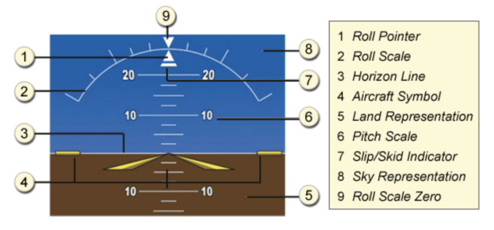

* Large red chevrons will appear if airplane is at least 50° nose up or 30° nose down
* On roll scale, major tick marks are at 30° and 60°, and minor tick marks are at 10°, 20°, and 45°

### Horizontal Situation Indicator
* Below attitude indicator
* Shows magnetic heading on a rotating compass card oriented heading up
  * Also shows the course you've selected and any deviation (shown by course deviation indicator, or CDI)
* Actual magnetic heading is shown above HSI, provided by AHRS/magnetometer
* Heading display is stable; no gyroscopic precession

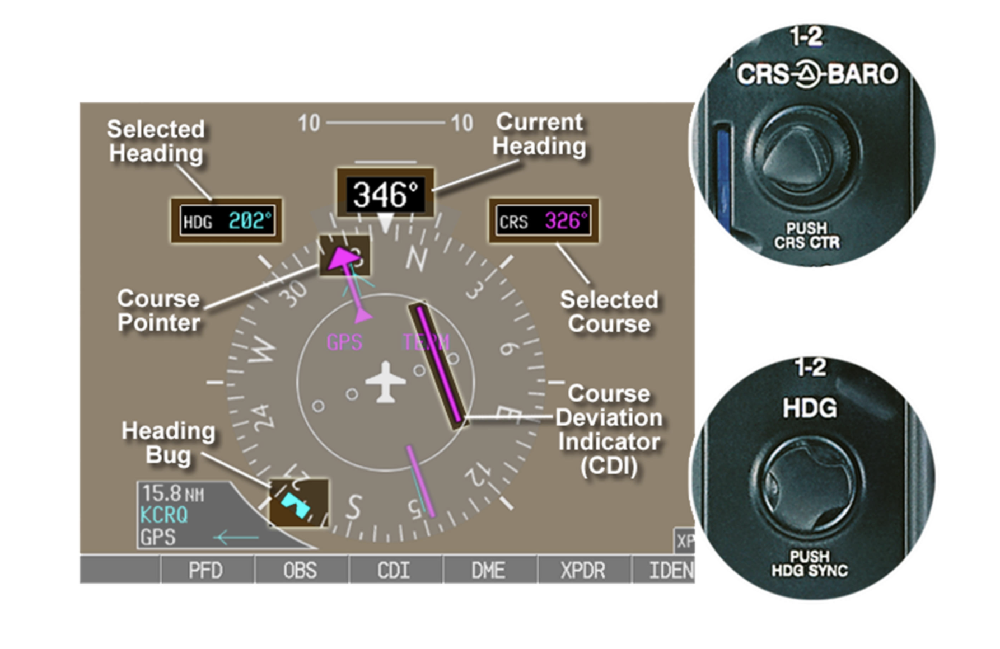

### Engine and System Indicators
* Shows on PFD during normal startup and on MFD after
* Will be shown on remaining display if one fails during flight

### Map Display
* Shown on the MFD
* Will be inset on remaining display if one fails; can trigger this *reversionary mode* by pressing `DISPLAY BACKUP` code

### Annunciations and Messages
* Alerts on the G1000 are conveyed through:
  * Annunciation window
    * Yellow = caution; red = warning
  * Alerts window
  * Alerts softkey annunciation
    * Pressing this acknowledges alerts; pressing again views alert text messages
  * System annunciations
    * Show with large red `X`
  * Audio alerting system

## II. Multifunction Displays

### Engine and System Indicators
* EIS shown on left side of MFD
* Updating fuel information
  * Reset fuel used and fuel remaining with `Engine` &#8594; `System` &#8594; `Reset Fuel`
  * Enter fuel on board by pressing `Gallons Reamining` and appropriate keys for quantities

### Map Display
* Navigation map display aviation (airports, airspace, VORs, airways) and topographic data
* Declutter `DCLTR` softkey sets amount of detail
* Can be oriented north, track, desired track, or current heading "up"
* Range knob can be used to zoom
* Press range knob to activate pointer and pan map

## III. Gyro-Based Instruments

### Basic Gyroscopic Principles
* Gyroscope is a spinning disc which resists changes to its plane of motion, known as *rigidity in space*
* Trying to tilt the plane of rotation results in a movement of the plane of rotation, 90 degrees later along the plane of rotation in the direction of the rotation; known as *precession*

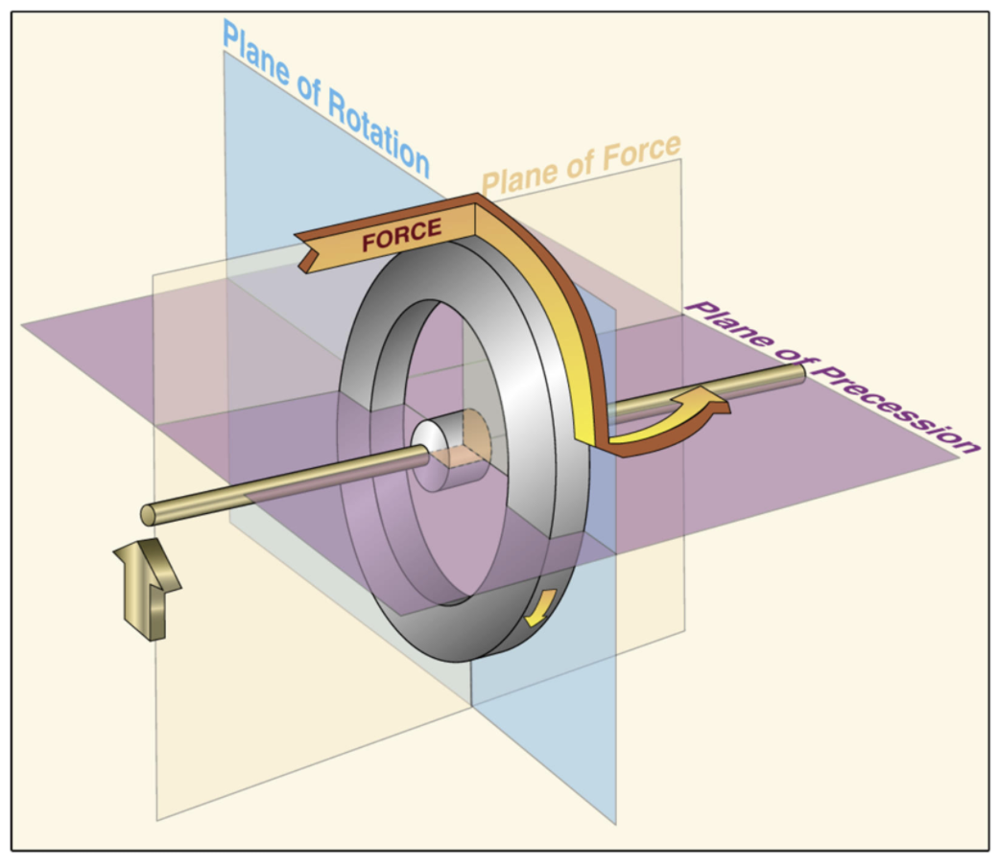

* Three instruments are gyroscopic
  * Attitude indicator
    * Spinning disc mounted **horizontally** in gimbals so that it can stay on the same plane while the airplane pitches and rolls
    * Measures angles between rigid disc and the airplane attitude to show the pitch and roll
  * Heading indicator
    * Spinning disc mounted **vertically** in gimbals so that it can stay on the same plane while the airplane changes heading
    * Measures angles between rigid disc and airplane's new heading to show the current heading
  * Turn coordinator
    * Spinning disc mounted **at an angle** so that it resists changes in heading and roll
    * Measures resultant force when roll begins and as heading changes
    * Displays results by tilting the miniature airplane
* Rotation of gyros is powered either by or with a combination of:
  * Vacuum
    * Comes from engine-driven vacuum pumps
    * Powers the attitude indicator nad heading indicator
  * Electricity
    * Powers turn coordinator
* Vacuum
  * Air drawn into instrument case from cabin and exhausted into the atmosphere
  * Moving air spins the instrument gyros by blowing past a water-wheel-like disc; gyro spins at 10,000 to 18,000 RPM
  * Vacuum gauge displays vacuum in inches Hg; normal is 4.5-5.5 inches when engine at 1800 RPM
* Electric gyro-driven instruments
  * Small electric motor used to drive internal gyro
  * Have `FAIL` flag to warn of instrument failure
* Gyro will have `VACUUM` or `ELECTRIC` displayed on the face of the instrument

### Gyro-Based Instruments at Work
* Attitude indicator
  * Displays pitch about lateral axis and bank about longitudinal axis
  * Contains horizontal bars showing pitch degrees and bars around arc showing bank
  * Subject to small precession error after a 180° turn
  * Operates on principle of rigidity in space
* Heading indicator
  * Displays magnetic heading of the aircraft
  * Has small airplane and tick marks on face; airplane is always pointing up
  * Tick marks are at cardinal and 45° points; use these marks for quick reference for 45, 90, 135, and 180 degree turns
  * Numbers every 30° and marks every 5°
  * Older-style heading indicators have no directional sensing and must be set to a heading using the magnetic compass
    * Subject to precession and must be corrected about every 15 minutes
    * **Heading compass (to which you set heading indicator/directionoal gyro) is only accurate in straight-and-level unaccelerated flight**
    * Not required for VFR flight but required for IFR flight
  * Operates on principle of rigidity in space
* Turn coordinator
  * Displays direction of turn and rate of turn
  * Senses roll about longitudinal axis and yaw about vertical axis
  * Shows rate of turn to be half standard rate (1.5° per second) when halfway between indicators
  * Shows rate of turn to be standard rate (3° per second) when airplane wing is on second index
  * Shows coordinated turn via curved glass tube filled with fluid containing a ball (inclinometer)
  * Has red flag when electrical power is lost (but not necessarily when motor fails)
  * Ball works regardless of electrical/vacuum power
  * Operates on principle of precession
  * Earlier version of instrument was the turn-and-slip indicator

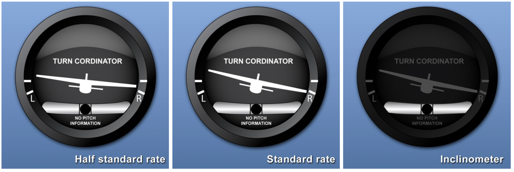

## IV. Basic Flight Instruments

### Pitot-Static Instruments
* Static system
  * Measures pressure of static or still air surrounding airplane
  * Provides measurement of air pressure to the pitot-static system
  * Uses vent located at the side of the airplane so that it is not affected by the slipstream
  * Transmits calm air pressure via tubing
* Pitot-static system instruments consist of airspeed indicator, vertical speed indicator, and altimeter

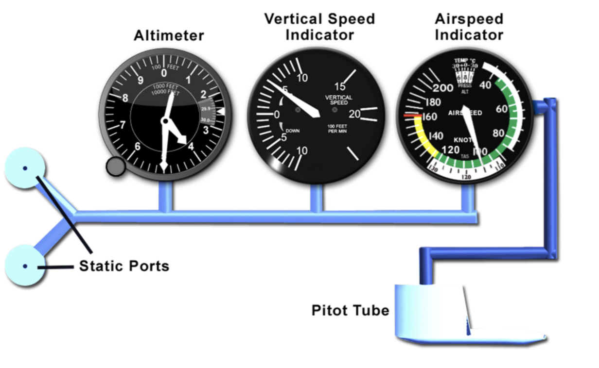

* Altimeter
  * Only has static pressure input
  * Measures air pressure like a barometer
  * Converts into indicated altitude
  * Contains diaphragm that expands and contracts with outside pressure changes
    * Low pressure causes expansion; high pressure causes contraction
  * Altimeter setting window/Kollsman window adjusts local altimeter setting
  * The hands on the altimeter tell you the difference between the air pressure at static port and setting in the window
  * Chevron pattern shows you how close to 0 you are - more chevron, closer to ground, helps show 10,000 feet increments
* Vertical speed indicator
  * Only has static pressure input
  * Indicates pressure changes by measuring rate of airflow through a calibrated leak from the static port into and out of a chamber
  * High pressure to low pressure indicates a climb
  * Low pressure to high pressure indicates a descent
  * In level flight, pressure in the case and static pressure will be the same, so visual indicator will read zero
* Airspeed indicator
  * Has static and ram air pressure (from pitot tube) inputs
  * Displays indicated airspeed by using a diaphragm between two pressure sources which is connected to the airspeed needle
  * Greater pressure differential is shown as higher airspeed
  * Lower pressure differential is shown as lower airspeed
* Airspeed terms
  * Indicated airspeed (IAS) - indicated by airspeed indicator
  * Calibrated airspeed (CAS) - indicated airspeed corrected for mechanical errors in the instrument and position error (occurs in some flight conditions because of locations of static port and pitot tube)
  * True airspeed (TAS) - calibrated airspeed corrected for pressure and temperature
    * The actual speed of your airplane through the air
  * Ground speed (GS) - speed over ground
    * Sum of aircraft's true airspeed and the winds aloft, where headwings reduce ground speed and tailwinds increase ground speed
  * V-speeds, which are unique to each make/model, and may vary with weight or altitude
    * Listed [here](../1.1-learning-your-airplane/3-more-about-your-airplane.md#v-speeds)

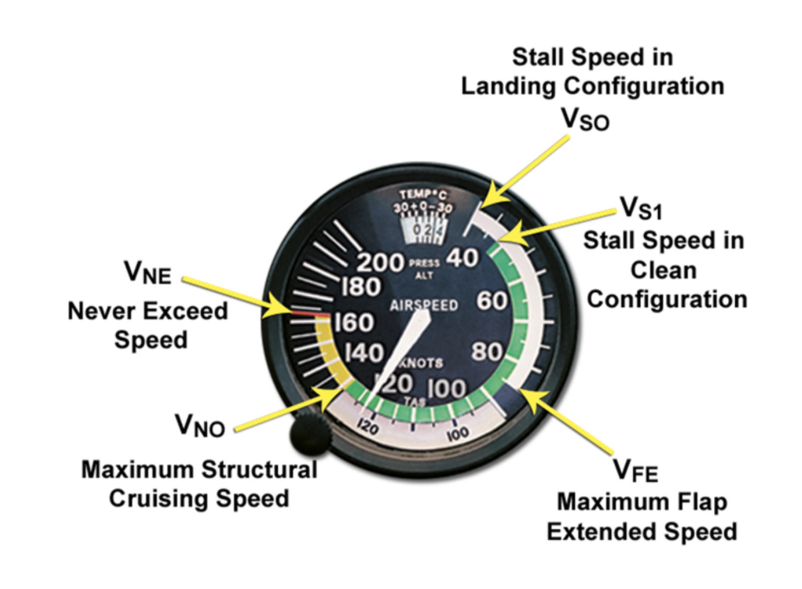

#### Required inspections and operation
* Pitot-static system and altimeter must be tested and inspected every 2 years if airplane is to be flown IFR
* If altimeter reads more than 75 feet from field elevation, should be repaired
* If altimeter setting unavailable prior to departure, set indicated altitude to field elevation of departure airport and obtain altimeter setting from radio ASAP
* If vertical speed indicator indicates a climb or descent when on the ground, adjust indicatings in flight for this discrepancy

### Pitot-Static System Errors
* Blockages can occur in pitot tube, drain hole, and static port

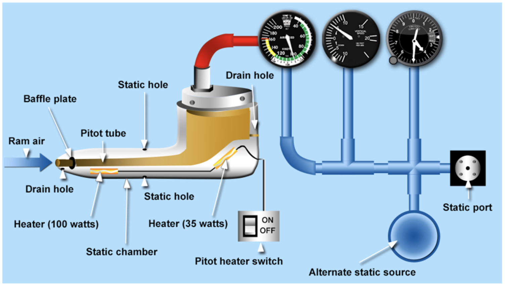

* Pitot tube blockage
  * Partial
    * Low airspeed
  * Complete
    * Zero airspeed
    * Airspeed will remain at zero during takeoff
    * Airspeed will gradually drop to zero during flight (turn on pitot heat)
* Pitot tube and drain hole blockage
  * Airspeed indicator will behave like altimeter, showing constant airspeed in cruise flight, increasing airspeed in climb, and decreasing airspeed in descent
* Static port blockage
  * Airspeed indicator will operate but will be inaccurate
  * Vertical speed indicator will read zero
  * Altimeter indication will not change
* Pitot tube and static port blockage
  * Airspeed indicator will read zero if drain hole is clear
  * Vertical speed indicator will read zero
  * Altimeter indication will not change

### Altimeter Errors
* Indicated altitude is altitude read from altimeter
  * Uses local altimeter setting
  * Indicates altitude above sea level when the correct setting is in the window
* Calibrates altitude
  * Indicated altitude corrected for instrument error
* True altitude
  * Actual height above sea level
  * May not be the same as indicated altitude because of instrument error or temperature deviation from standard
* Absolute altitude
  * Height above terrain

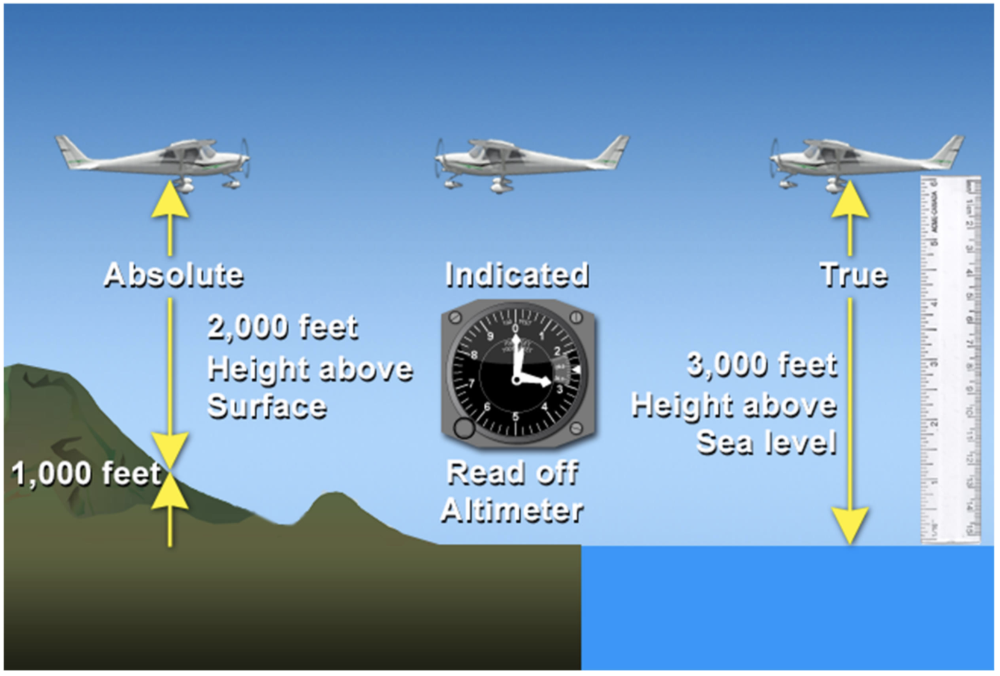

* Pressure altitude
  * Altimeter reading when altimeter is set to 29.92 inches of mercury
  * Pressure at sea level on a standard day
  * Not the same as true altitude, because if instrument error, difference in pressure from standard, and difference in temperature from standard
  * Used for performance computations
* Density altitude
  * Pressure altitude corrected for nonstandard temperature
  * Determines performance of airplane
* Atmospheric pressure decreases at approximately 1 inch of mercury for every 1000 increase in altitude
* Changes from place to place due to weather
* Errors will arise if altimeter is not set to local altimeter setting
* High pressure to low pressure &#8594; will fly too low/altimeter reads high (high to low, look out below)
* Low pressure to high pressure &#8594; will fly too high/altimeter reads low (low to high, clear the sky)

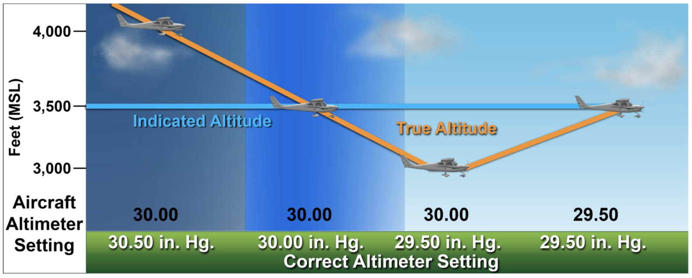

* Altitude error can be calculated by finding difference between set altimeter and actual local altimeter
* Altimeter works by telling you the difference between pressure at altitude you are flying and the setting in the window
* Local altimeter is pressure at reporting airport adjusted to sea level

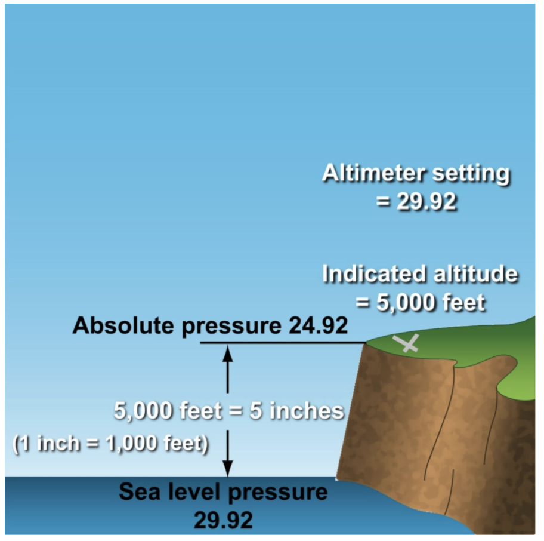

#### Temperature errors
* Altimeter gives true altitude based on assumption that the temperatures are standard between station reporting the altimeter and your altitude
* If termperatures are much colder than standard, altimeter will read high and you will be lower than it indicates (pressure levels squeezed together)
* If temperatures are much warmer than standard, altimeter will read low and you will be high (pressure levels spread apart)

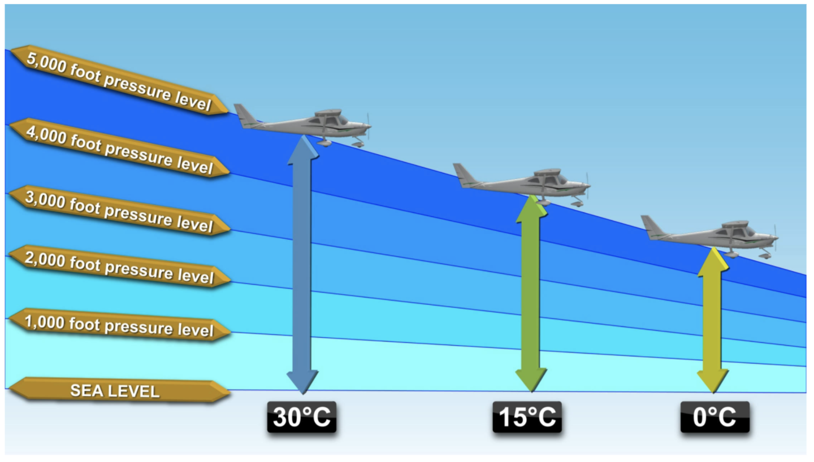

* Temperature effect becomes a consideration when significant altitude above reporting station, temperatures are much colder than standard, and flying close to terrain (i.e. mountains)

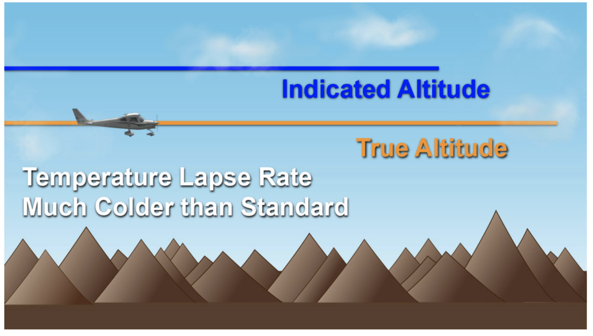

* Decreasing altimeter setting decreases altitude and vice versa

## V. Magnetic Compass

### Magnetic Compass Principles
* Earth's magnetic field encircles globe from North Magnetic Pole to South Magnetic Pole and is composed of lines of flux
* North Magnetic Pole does not coincide with true north
* Direction that refer to true north are called `true`
* Direction that refer to magnetic north are called `magnetic`

#### Magnetic Compass
* Constructed with bar magnets mounted under a floating compass card in a white kerosene medium for lubrication, dampening, and freezing prevention
* Bar magnets attempt to align with the lines of the magnetic force and point to magnetic north
* Tend to follow the lines of magnetic force downward toward the earth (magnetic dip)
* Tall tick marks indicate 10 degrees; shorter marks indicate 5 degrees

### Compass Errors
* Magnetic variation
  * Occurs because Magnetic North Pole and True North Pole are not in the same place
  * Variation between heading to magnetic north and true noth
  * Lines of equal magnetic variation are shown on sectional as isogonic lines
  * Described in relation to your position as westerly variation if magnetic north is west of true north and easterly variation if east of true north
  * To correct from true course to magnetic rouse, add westerly variation or subtract easterly variation
* Magnetic deviation
  * Occurs because metal parts and magnetic fields in each airplane affect its magnetic compass
  * Varies with heading
  * Compensated for with ground adjustments to magnetic compass to compensating screws in the compass housing while airplane sits on compass rose painted on ramp
  * Or, via a compass correction card to indicate known deviations that remain after ground adjustments have been made, which display the corrected heading to fly for a known deviation
  * Do not keep iron or steel objects on glare shield
  * Be aware of items that may contain magnets
  * Turning alternator on or off in flight can induce large errors

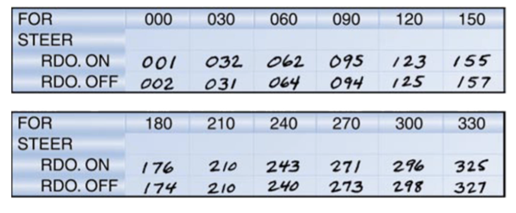

* Magnetic dip

### Using the Magnetic Compass
* Magnetic dip errors
  * Occur because compass magnets not only parallel the earth's magnetic field but also are pulled downward (dip) toward the Magnetic North Pole when compass card is not level (happens during accelerations, decelerations, or banks)
* Lines of magnetic flux are parallel to earth at equator and dip down sharply at the poles
* Farther away from magnetic equator you are, stronger the dip is
* Two forms of magnetic dip error: acceleration and turning error

* Acceleration/deceleration error
  * Occurs on easterly or westerly headings when aircraft accelerates or decelerates
  * Compass float card tilts, allowing north-sensing part of the compass to rotate towards the earth
  * When airplane accelerates, indicates a turn to the north
  * When airplane decelerates, indicates a turn to the south
  * ANDS - Acceleration North Deceleration South

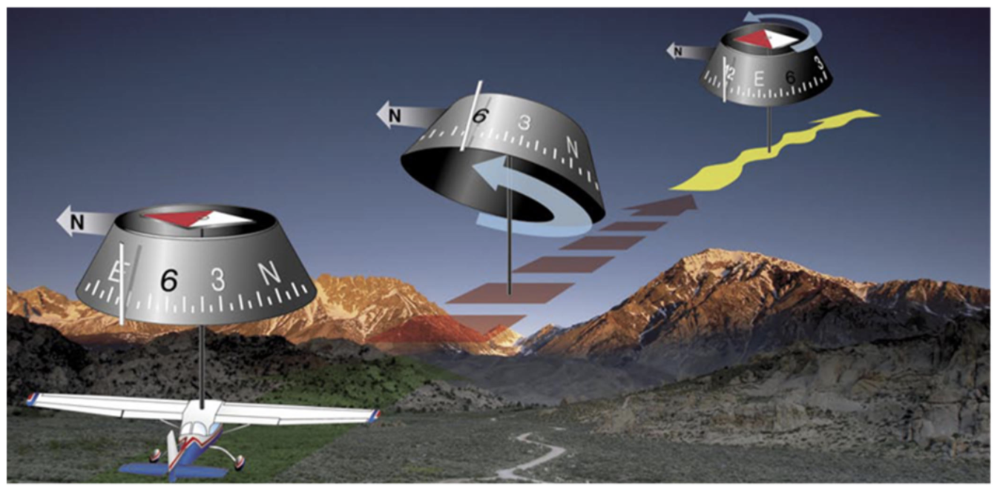

* Turning error
  * Occurs in turns near headings of north or south
  * Bank angle allows the north-sensing part of the compass to rotate toward the earth
  * Turn near north &#8594; compass indicates turn in opposite direction
    * NO - North Opposite
  * Turn near headings of south &#8594; compass indication jumps ahead of actual heading
    * FSS - False Start South
  * COSUN - Compass Overshoots South, Undershoots North
  * These acronyms suck, it's probably best to just avoid using the magnetic compass to determine heading when not in straight-and-level flight
  * Review this section in CTA for Knowledge Test

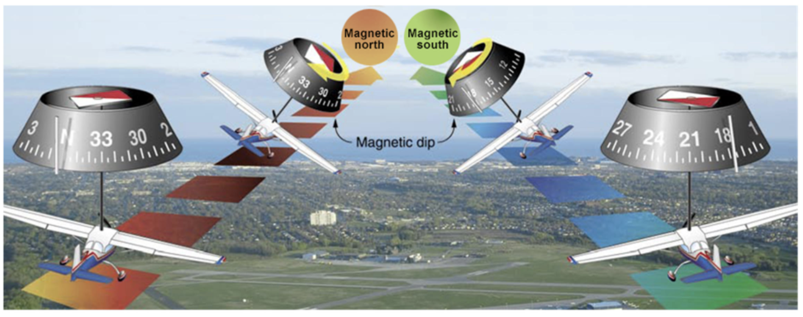
