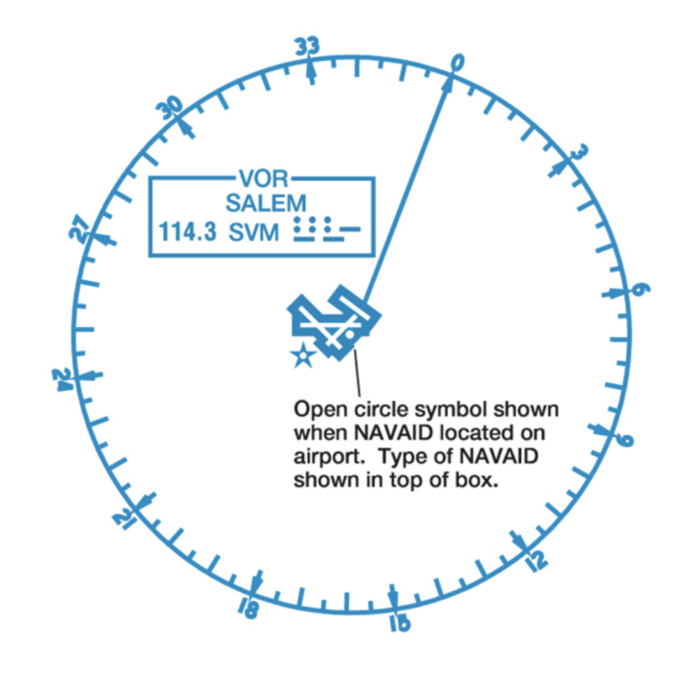
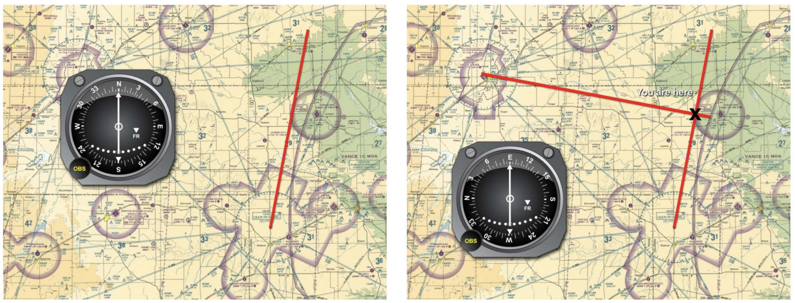

# GPS, Lost Procedures, and Emergency Instrument Skills

- [GPS, Lost Procedures, and Emergency Instrument Skills](#gps-lost-procedures-and-emergency-instrument-skills)
  - [I. Advanced Navigation](#i-advanced-navigation)
    - [Global Positioning System (GPS)](#global-positioning-system-gps)
    - [Getting There with GPS](#getting-there-with-gps)
  - [II. Lost Procedures](#ii-lost-procedures)
    - [Climb Call Get Help](#climb-call-get-help)
    - [Using Radios to Find your Location](#using-radios-to-find-your-location)
  - [III. Recovering from Unusual Attitudes](#iii-recovering-from-unusual-attitudes)
    - [Using Emergency Instrument Skills](#using-emergency-instrument-skills)
      - [Turns](#turns)
      - [Climbs](#climbs)
      - [Descents](#descents)
      - [Combined](#combined)
      - [Unusual Attitudes](#unusual-attitudes)
      - [Nose-High Recovery](#nose-high-recovery)
      - [Nose-Low Recovery](#nose-low-recovery)
      - [Instrumentation](#instrumentation)
      - [Returning to VMC](#returning-to-vmc)

## I. Advanced Navigation

### Global Positioning System (GPS)
* Satellite-based radio navigation operated by the U.S. Department of Defense
* 24 satellites, but 30 are in orbit at any one time and a minimum of 5 are always observable from anywhere on earth
* Each satellit broadcasts position and time of broadcast
* With 4 satellites, GPS can determine an aircraft's precise position by measuring the time each signal took to reach the airplane
* Combined with a database of airports and waypoints, this allows you to follow any route
* GPS digital cards are used for updating the database in a Garmin; not required for VFR flights

### Getting There with GPS
* G1000
  * Can set Direct-To course to a waypoint
  * Entering list of waypoints into a flight plan
  * Use "nearest" function to locate nearest airports, intersections, NDBs, VORs, user waypoints, frequencies, airspace sectors
  * Can be useful in an emergency
* Cautions
  * GPS will not function with data card removed
  * Do not enter data during taxi
  * GPS will not guarantee terrain clearance or avoiding special use airspace

## II. Lost Procedures

### Climb Call Get Help
* May be lost when looking at features outside of airplane and trying to find on achart
* If you believe you are lost:
  * Continue to hold planned heading, because can determine position from dead reckoning with a known heading and time since last position
  * Do not panic
  * Chart may not look like the real world due to various weather or lighting conditions
  * Look for big features on chart (mountain peak, large lake or major river, large city)
  * Go from big features to smaller features
* Check heading to ensure it is correct and that math was correctly performed
* Review navigation log
* Start with last known position, project where you should be now, recalculating time since last checkpoint
* Normally, you fly about 1.5-2 miles per minute
* Make an estimate of the wind to see if it is different from forecast (observe drift over ground)
* Draw a circle of error on sectional using elapsed time since last checkpoint, compass heading, and true airspeed equal to the maximum wind drift, by taking forecast wind velocity in knots, multiplying it by the time since last known checkpoing, and using this distance as radius of circle
  * Can approximately determine position
  * See CTA for example
* 4 C's
  * Climb to a higher altitude
    * Easier to see landmarks and increase range of communication radio
  * Conserve fuel by reducing power and adjusting the mixture
  * Communicate to get help by calling ATC at a control tower or center (or 121.5 MHz)
  * Comply with instructions; advise them of estimated fuel remaining in hour and minutes

### Using Radios to Find your Location
* Can use GPS to determine location (`NRST` function on G1000)
* VOR cross check
  * Can use two nearby VORs to determine location in addition to GPS or instead of GPS
  * Locate two nearest VORs in sectional chart (VORs depicted on chart with a compass rose)

* Locate and enter first VOR frequency
  * Verify frequency by listening to Morse code audio identifier and compare to what is published on sectional
  * Center the course deviation indicator with a "FROM" indication
  * Draw this line on the sectional chart
  * Repeat this process for the second VOR you chose
  * Intersection of two lines determines position; compare to what you see outside

* Radar equipped ATC facilities can help determine your position
* Locate a frequency near your estimated position that has radar
  * Use sectional and look for frequency boxes, usually around Class C or B airports with radar services (some Class D)

* Contact facility, informing them you are unsure of current position or requesting radar vectors
* Enter transponder code give to you by ATC
* Follow suggested headings if able

## III. Recovering from Unusual Attitudes

### Using Emergency Instrument Skills
* Critical to trust flight instruments when visual reference is lost
* Use attitude indicator as primary instrument for attitude control
* Use trim and limited inputs; keep at cruise airspeed
* No attitude changes should be made unless flight instruments indicate a need for change
* Smooth, small, positive inputs to make attitude changes

#### Turns
* Riskiest maneuver for VFR pilot in instrument conditions
* Tendency is to over-control aircraft into graveyard spiral
* Use smallest practical bank angle, usually no more than 10°
* Better to turn slightly, return level and turn slightly over a steep turn

#### Climbs
* Apply power and limit nose-up to one bar-width on attitude indicator
* Don't worry about specific climb airspeed

#### Descents
* Reduce power in increment of no more than 100 RPM or 1 inch of manifold pressure
* Limit nose-down to no more than one bar-width on attitude indicator
* Don't worry about specific descent airspeed

#### Combined
* Better to perform climb or descent separately from a turn

#### Unusual Attitudes
* Check attitude indicator for excessive bank angle or pitch attitudes
* Nose-high attitude
  * Confirm with low airspeed, increasing altimeter, climbing vertical speed indicator
* Nose-low attitude
  * Confirm with high airspeed, decreasing altimeter, descending vertical speed indicator

#### Nose-High Recovery
* Increase power and lower nose to level
* Level wings with aileron and rudder
* Confirm stable attitude with instrumentation

#### Nose-Low Recovery
* Decrease power to idle and raise nose to level
* Level wings with aileron and rudder
* Confirm stable attitude with instrumentation

#### Instrumentation
* Spinning-mass gyro can hit the limits of its gimbals and tumble, making it unreliable and confusing
* Must refer to reversal and stabilization of altimeter and airspeed indicator to determine level flight attitude
* Confirm wings-level with turn coordinator
* G1000 cannot tumble

#### Returning to VMC
* 180° turn: if you came from VMC, you might be able to return to them
* If you cannot return to VMC, contact ATC on last frequency in use or 121.5 MHz
* Do not use sense of balance to help you fly the airplane; it's very easy to get disoriented
