# Reading Weather Reports and Charts

- [Reading Weather Reports and Charts](#reading-weather-reports-and-charts)
  - [I. Printed Reports and Forecasts](#i-printed-reports-and-forecasts)
    - [Aviation Routine Weather Report (METAR)](#aviation-routine-weather-report-metar)
    - [Terminal Aerodrome Forecast (TAF)](#terminal-aerodrome-forecast-taf)
    - [Graphical Forecasts for Aviation (GFA)](#graphical-forecasts-for-aviation-gfa)
    - [Wind and Temperature Aloft Forecast](#wind-and-temperature-aloft-forecast)
    - [Radar Weather Report](#radar-weather-report)
    - [Inflight Aviation Weather Advisories](#inflight-aviation-weather-advisories)
  - [II. Graphic Weather Products](#ii-graphic-weather-products)
    - [Surface Analysis Chart](#surface-analysis-chart)
      - [The Station Model](#the-station-model)
    - [Weather Depiction Chart](#weather-depiction-chart)
    - [Low-Level Significant Weather Prog Chart](#low-level-significant-weather-prog-chart)
    - [Weather Radar Information](#weather-radar-information)
    - [Convective Outlook Chart](#convective-outlook-chart)
  - [III. More Sources of Weather Information](#iii-more-sources-of-weather-information)
    - [In-Flight Weather Services](#in-flight-weather-services)
    - [Cockpit Weather Displays](#cockpit-weather-displays)

## I. Printed Reports and Forecasts

### Aviation Routine Weather Report (METAR)
* Or, aviation selected special weather report (SPECI)
* Determines if airport is VFR, MVFR, IFR, or LIFR
* METAR observed hourly within the time period of 45 after last hour until new hour and transmitted in the last 10 minutes of the hour
* SPECI observed when significant changes occur and is transmitted immediately; usually only contains elements that changed

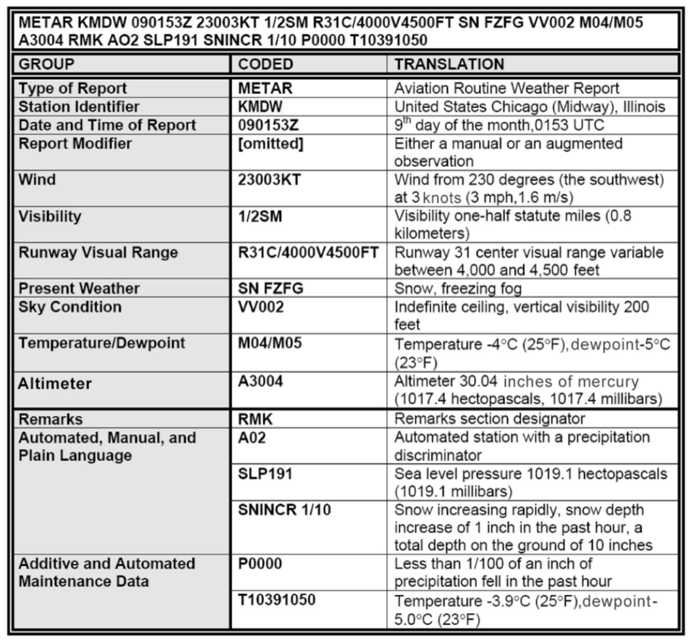

* AUTO if report made automatically
* COR if report is corrected
* Wind direction is in tens of degrees referenced to **true north**(tower-reported winds are magnetic direction)
* 00000KT means wind less than 3 knots
* V or VRB if wind is 6 knots or less, or if direction varies by 60° or more
* G if gusting
* RVR: runway visual range, for a particular runway, how far down that runway you can see
* Qualifiers
  * Intensity
    * `-` for light
    * nothing for moderate
    * `+` for heavy
  * Proximity
  * `VC` for vicinity (within 5 to 10 miles)
  * Descriptors
    * `MI`: shallow
    * `BC`: patches
    * `DR`: low drifting
    * `BL`: blowing
    * `SH`: showers
    * `TS`: thunderstorm
    * `FZ`: freezing
    * `PR`: partial
* Phenomena
  * `DZ`: drizzle
  * `RA`: rain
  * `SN`: snow grains
  * `IC`: ice crystals
  * `PL`: ice pellets
  * `GR`: hail
  * `GS`: small hail or snow pellets
  * `UP`: unknown precipitation
* Obscuration
  * `BR`: mist, visibility restricted to between 5/8 and 6 miles
  * `FG`: fog, visibility less than 5/8 miles
  * `DU`: dust
  * `SA`: sand
  * `HZ`: haze
  * `PY`: spray
  * `VA`: volcanic ash
  * `FU`: smoke
* Other
  * `PO`: dust/sand whirls
  * `SQ`: squalls
  * `FC`: funnel cloud (does not touch ground)
  * `+FC`: tornado or waterspout (touches ground)
  * `SS`: sandstorm
  * `DS`: dust storm
* Amount of cloud cover
  * `SKC` or `CLR`: clear
  * `FEW`: few clouds, less than 1/4 coverage
  * `SCT`: scattered clouds, between 3/8 and 1/2 coverage
  * `BKN`: broken clouds, between 5/8 and 7/8 coverage
  * `OVC`: overcast, full coverage
  * `VV`: vertical visibility
* Height reported in hundreds of feet above ground level
* Type
  * `TCU`: towering cumulus
  * `CB`: cumulonimbus
* `VV` indicated indefinite ceiling/height
* Cloud ceiling: the lowest broken or overcast cloud layer, or vertical visibility into an obscuration
* Cloud ceiling and visibility determine if airport is VFR (1000 feet ceiling and visibility of 3sm or greater) or IFR
* Remarks are denoted with `RMK` and indicate:
  * Station type
    * `A01`: cannot discriminate between liquid and frozen precipitation
    * `A02`: can discriminate between liquid and frozen precipitation
  * Beginning and end of precipitation
    * `RAB05`: rain beginning 5 minutes after the hour (i.e. METAR issued at 1856, rain began 1805)
    * `SNE20`: snow ended 20 minutes past the hour
  * Variable ceiling height (`CIG005V010`- ceiling 500 feet variable to 1000 feet)

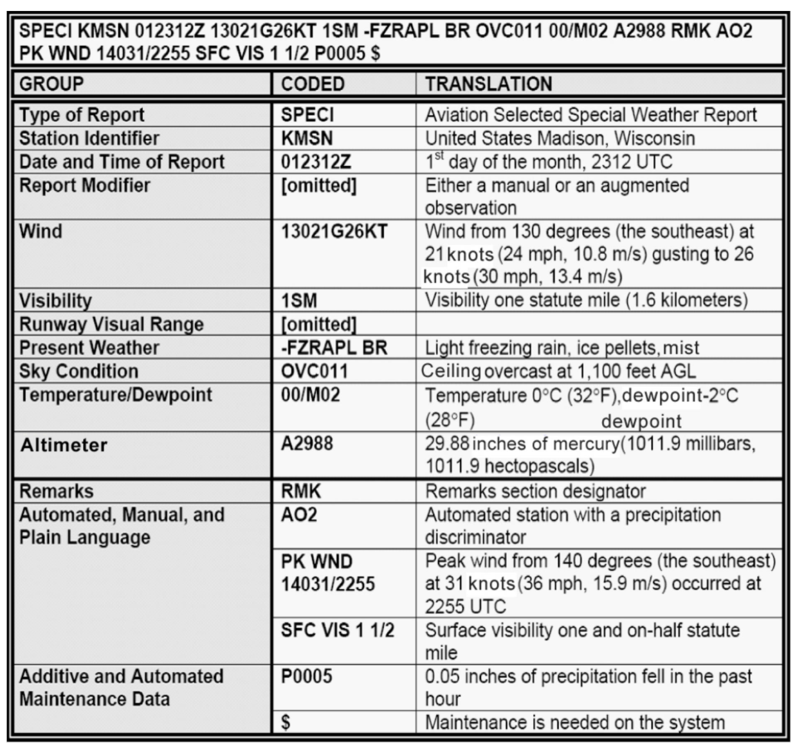

### Terminal Aerodrome Forecast (TAF)
* Forecast of weather conditions within a five statute-mile radius from center of major airport's runway complex
* 24 or 30 hour time period
* Issued for times a day at 0000Z, 06000Z, 1200Z, and 1800Z
* TAF AMD is an amended TAF when current conditions differ from TAF
* Date of issue is DDHHHHZ and comes first
* Valid period date follows as DDHH/DDHH; 1312/1418 is valid from 13th at 1200Z to 14th at 800Z
* Followed by wind forecast
* Visibility and ceiling are same as METAR
* `BKN025CB`: broken cumulonimbus with base of 2500 feet
* `VC`: conditions that will occur within the vicinity of an airport (5-10sm)
* Non-convective low-level windshear forecast included when wind shear criteria have been met
* Includes heigh and speed of windshear
* `WS020/35035KT`: wind shear 2000 feet AGL from 350° at 35 knots
* Forecast change indicators tell when significant change is expected
* `FM` (from) when rapid/significant change is expected, usually within the hour in `DDHHMM` format
* `BECMG` (becoming) when gradual change is expected, usually within two hours, followed by four tigit `HHHH` containing beginning and ending hours of the gradual change
* `TEMPO` (temporary) when temporary fluctuations expected to last for less than an hour/during less than half of the time period (`DDHH/DDHH`)
* Probability forecast describes probability of thunderstorms/precipitation events, wind, visibility, sky conditions
  * `PROB30`: 30% probability
  * `DDHH/DDHH`: time period of probability forecast

### Graphical Forecasts for Aviation (GFA)
* Contain multiple displays of weather phenomena in a single interactive online domain for CONUS only
* CONUS: continguous United States
* Area Forecast (FA) for AK, Gulf of Mexico, Hawaii/Caribbean
* [aviationweather.gov/gfa](https://aviationweather.gov/gfa)
* Not a replacement for a weather briefing
* Good for enroute weather
* OBS/WARN category brings up observations and warnings with SIGMETs, warnings, etc.
* For limited internet connection, Aviation Cloud Forecast and Aviation Surface Forecast are available
* Note that GFA is entirely computer generated with no human intervention
* Based on:
  * METARs
  * LAMP: Localized Aviation MOS (Model Output Statistics) Program
    * Generalized model applied to a specific location

### Wind and Temperature Aloft Forecast
* Forecast of winds and temperatures at various flight levels
* Prepared twice daily at 0000Z and 12000Z
* Displays wind direction, velocity, and temperature as six digits
  * First two are wind direction rounded to nearest 10° to true north
  * Second two digits are velocity in knots
  * Last two digits are temperature Celsius; `-` omitted above 24,000 feet
  * Example: `ABQ 9000 2826-14`
    * Wind at 9000 feet MSL is forecast to be from 280° true at 26 knots with temperature -14°C
  * Forecasts not issued for altitudes within 1500 feet of a location's elevation; temperature not issued within 2,500 feet
* Wind in excess of 99 knots
  * Coded with a wind direction between 51 and 86
  * Subtract 50 from the wind direction indicated and add 100 to the wind velocity indicated
  * Example: `STL 34000 730649`
    * Wind at 34000 feet MSL are forecast to be from 230° true north (73-50 = 23) at 106 knots (06+100 = 106) with temperature of -49°C
* Light and variable winds are less than 5 knots
  * Entered with wind direction and code of 9900
  * Example: `MSP 6000 9900-04`
    * Winds at 6000 feet MSL are forecast light and variable with temperature -4°C

### Radar Weather Report
* Radar observation converted to text
* Reported every hour at the hour + 35 minutes
* Reports heights of precipitation in MSL
* Identifies precipitation type, intensity, and location
* Precipitation type:
  * `R` for rain
  * `RW` for rain shower
  * `S` for snow
  * `SW` for snow shower
  * `T` for thunderstorm
* Precipitation intensity:
  * `-` for light
  * nothing for moderate
  * `+` for heavy
  * `++` for very heavy
  * `X` for intense
  * `XX` for extreme
* Location is given relative to radar site referenced to true north in nautical miles

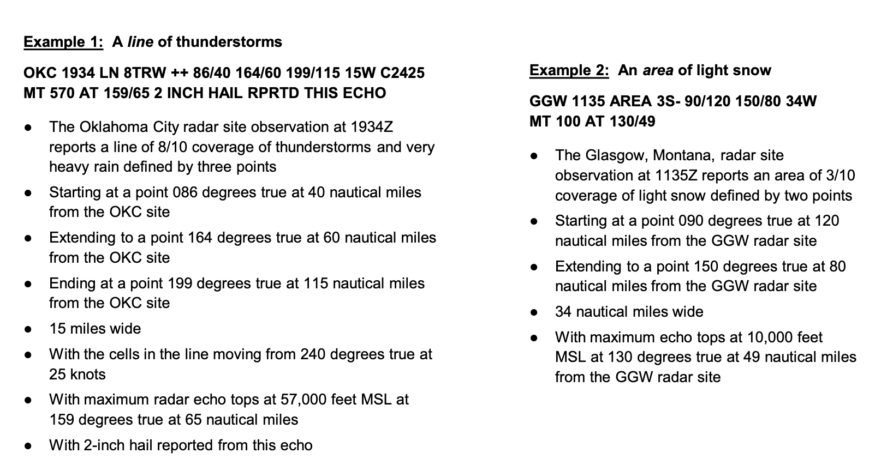

### Inflight Aviation Weather Advisories
* Forecast to advise en route aircraft of developing potentially hazardous weather
* AIRMETs, SIGMETs, Convective SIGMETs
* Referenced in relation to VORs, airports, other areas
* May be in weather brief, broadcast on a Center frequency, calling FSS
* AIRMET
  * Airmen's Meteorological Information
  * Provide notice of significant weather phenomena with particular hazard to small aircraft
  * Sustained wind in excess of 30KT, ceiling less than 1,000 feet, visibility less than 3SM, turbulence, icing, mountain obscuration, non-convective LLWS below 2,000 feet
  * Maximum forecast period of 6 hours; issued for 6 areas in CONUS

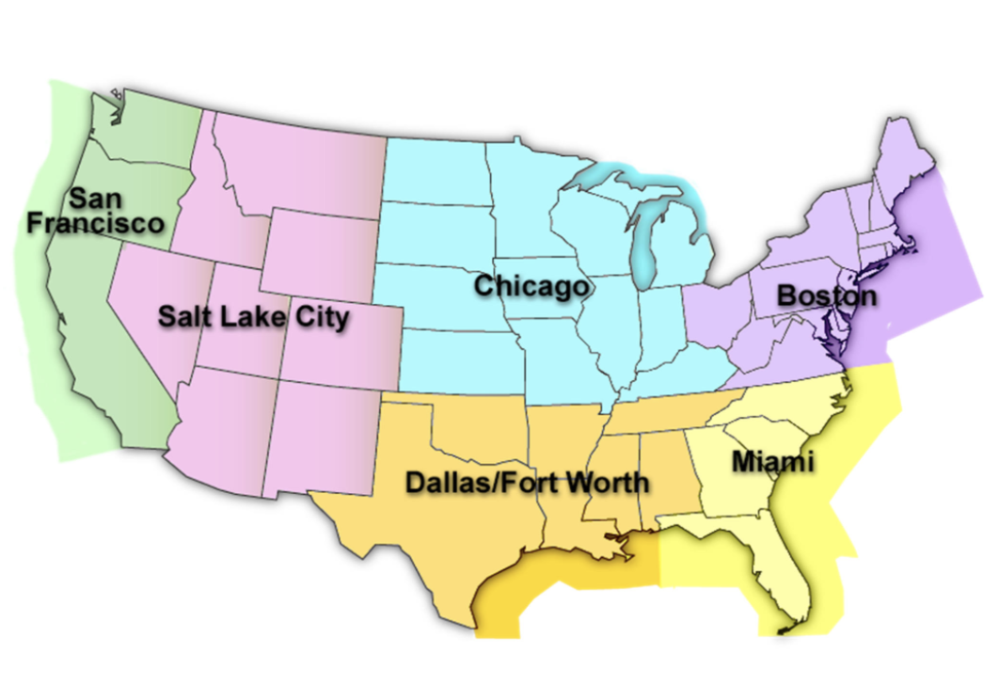

* SIGMET
  * Significant Meteorological Information
  * Provide notice of non-convective weather potentially hazardous for **all** aircraft
  * Issues for same 6 areas as AIRMETs
  * Thunderstorms, severe or greater turbulence, severe icing, dust/sandstorm, volcanic ash, tropical cyclone
  * Maximum forecast period of 4 hours
  * All heights referenced MSL
* Convective SIGMET
  * Severe thunderstorms occurring for more than 30 minutes
  * Severe classification: surface winds >= 50 knots, hail at surface >= 3/4 inches diameter, tornadoes
  * Embedded: obscured by haze or non-convective clouds/precipitation
  * Line of thunderstorms must be at least 50 miles long with thunderstorms at least 40% of its length
  * Area of thunderstorms produce precipitation >= heavy at least 40% of an area covering at least 3000 square miles
  * Issued hourly at 55 minutes past the hour
  * Valid for up to two hours
* Center Weather Advisory (CWA)
  * Issued by ATC and broadcast over center frequencies when AIRMET, SIGMET, or Convective SIGMET exists, or when conditions for them exist but they have not been issued
  * Or, when weather conditions exist that will adversely affect flow of traffic with center
  * Valid for up to two hours

## II. Graphic Weather Products

### Surface Analysis Chart
* Computer-generated; displays observed weather station data
* Transmitted every 3 hours; covers CONUS
* Depicts
  * Isobars: lines of equal barometric pressure adjusted for altitude, spaced at intervals of 4 millibars
  * Positions:
    * Areas of high and low pressure
    * Frontal systems
    * Troughs of low pressure (TROF)
    * Ridges of high pressure
  * Observations of reporting stations
    * Sky cover, air pressure, wind, temperature, dew point
* Fronts point in the direction they are moving

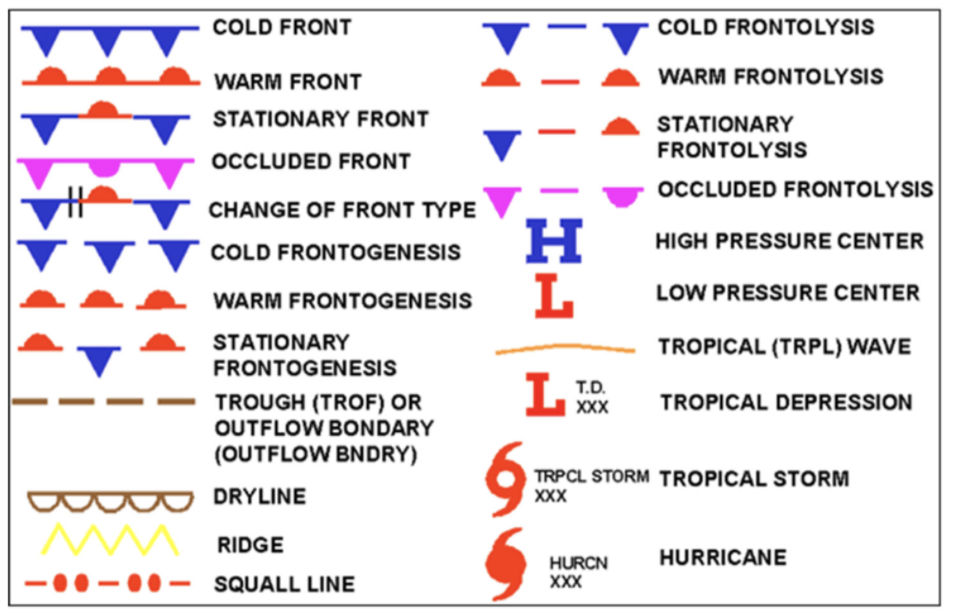

#### The Station Model
* Reports weather observations for selected stations across a wide area
* Open circle portrays clear skies; filled in portrays cloudy
* Wind direction and velocity with an arrow
  * Points toward station indicating from where wind is blowing
  * Velocity indicated by tick marks/feathers and pennants at the end of the arrow
    * Pennant for 50 knots
    * Full tick mark for 10 knots
    * Half tick mark for 5 knots
  * Temperature and dew point in °F
  * Sea level pressure in millibars using last three digits of the reading
    * 1010.7 millibars &#8594; 107

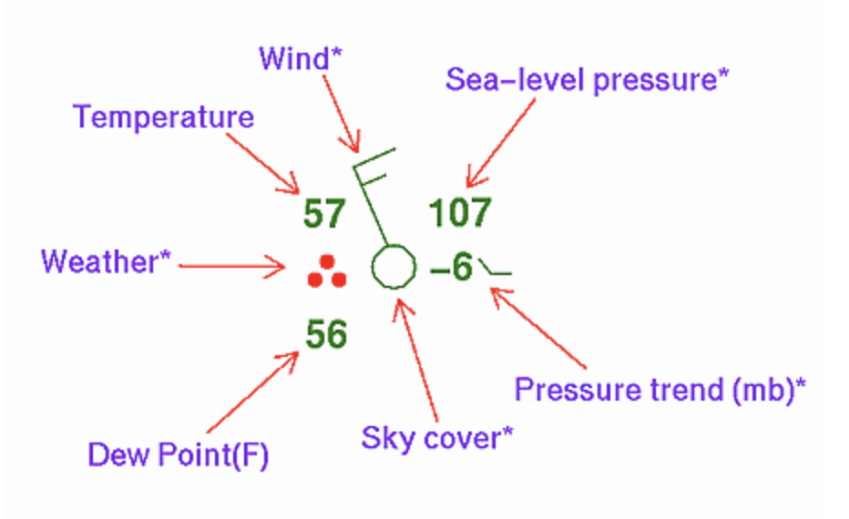

### Weather Depiction Chart
* Computer-generated; created from METARs
* Transmitted at 3-hour intervals beginning at 0100Z each day
* Displays general areas of weather as VFR (open with no lines around), MVFR (lines around but no crosshatching), and IFR (lines around with crosshatching)

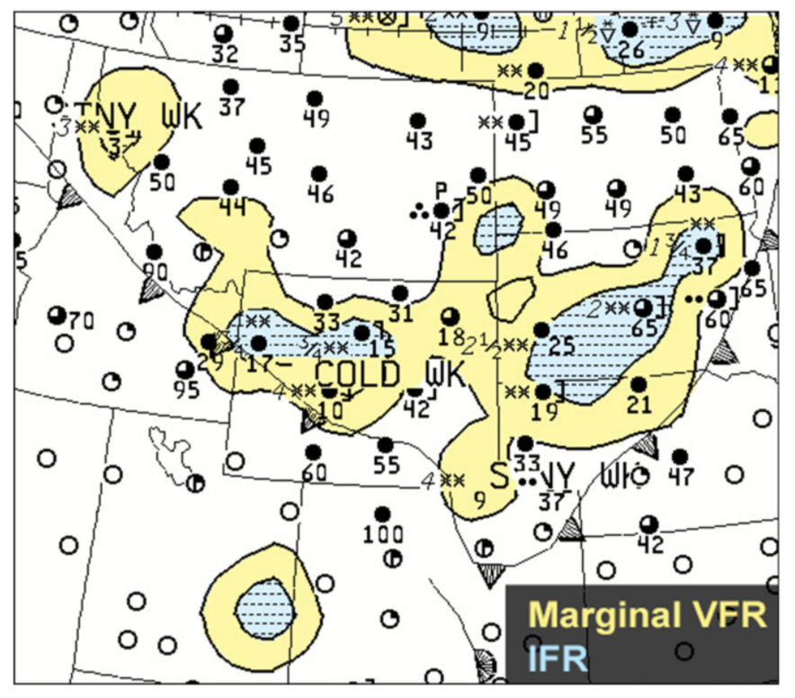

* Utilizies station model sky cover circle
* Weather depiction chart always displays past weather conditions, so always check METARs and TAFs

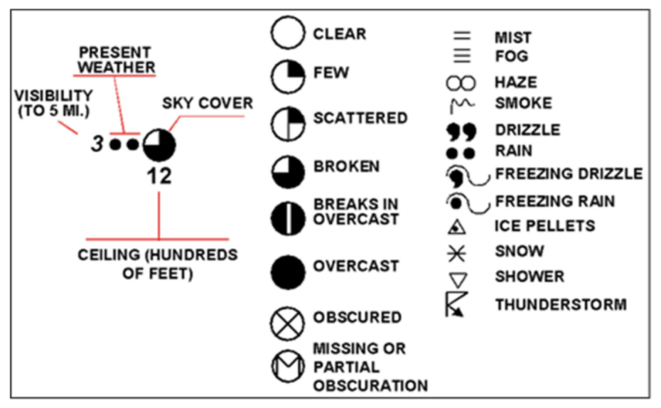

### Low-Level Significant Weather Prog Chart
* One-day forecast of significant weather to occur in 12 or 24 hours
* Prepared for CONUS four times at 0000Z, 0600Z, 1200Z, and 1800Z
* Forecast up to about 24000 feet

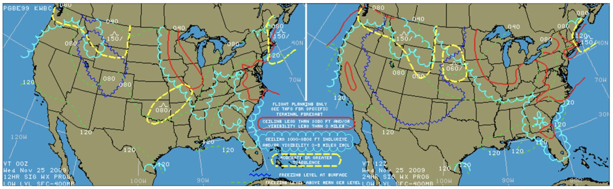

* Left panel depicts 12 hour forecast; right depicts 24 hour forecast
* Moderate turbulence shown as witch's hat: `_/ \_`   `^`
* Severe shows as inverted v on top of witch's hat: `_/\_`
* Freezing levels at surface as dotted lines
* Freezing levels aloft as a dashed line `80 -------` (freezing level starting at 8000 feet MSL)

### Weather Radar Information
* Weather radar images show location, intensity, and movement of returns from precipitation
  * Do not show clouds
  * Can indicate turbulence or icing (in cold temperatures)
* Ground-based weather radar: NEXRAD (Next Generation RADAR)
  * Create mosaic image from multiple ground radar stations
  * Composite or base reflectivity images
  * Composite show highest reflectivity in a column of air from the ground up, regardless of altitude at which maximum echo intensity occurs
  * Base shows returns from one of four tilt angles, which may miss areas of maximum echo intensity
* Some aircraft equipped with onboard weather radar
* Processing and transmission of NEXRAD data can take several minutes, so always assume data is 7-8 minutes old
* Do not try to use ground-based radar to thread through cells
* Onboard weather radar can be used for realtime avoidance if operated properly

### Convective Outlook Chart
* Forecasts potential for severe convective weather
  * Tornados, wind gusts in excess of 50KT, hail 3/4 inch diameter or greater
* And non-severe convection (general convective weather)
* Presented in day 1 and day 2 convective outlook
* Valid time goes out three days from issuance

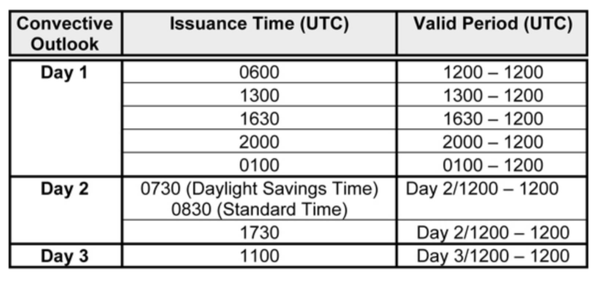

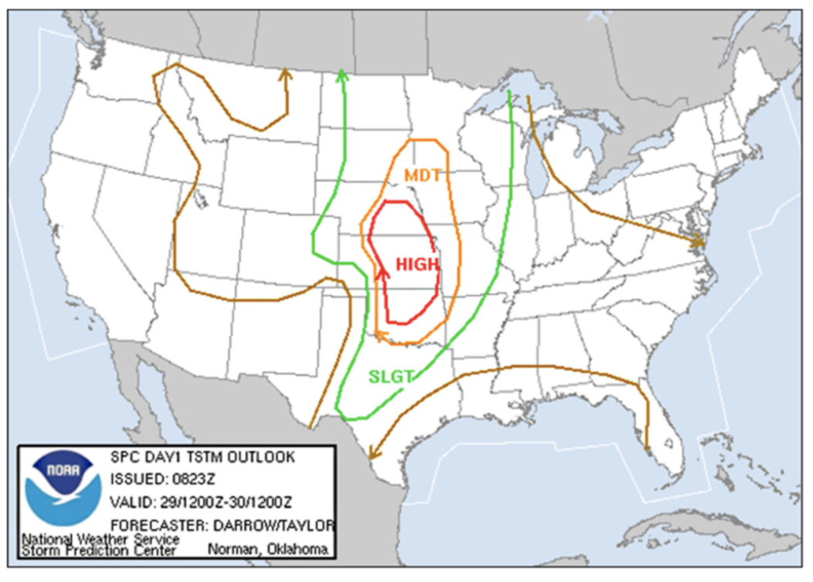

* Areas of general thunderstorms to right of arrow if no label, or severe thunderstorms labeled as slight (SLGT), moderate (MDT), or high (HIGH) risk

## III. More Sources of Weather Information

### In-Flight Weather Services
* Forecasts obtained before wheels-up may become unreliable due to extended travel time or fast-developing systems
* Pilots are strongly encouraged to make PIREPs, especially when encountering weather different from briefing or forecast (whether better or worse)
* Collected by FSS and ATC
* Altitude in MSL
* When making a PIREP:
  * Give location relative to geographical point, VOR, or airport
  * Time weather was observed
  * Altitude at which observation was made
  * Aircraft type
  * The weather itself

### Cockpit Weather Displays
* G1000 equipped with wind vector and outside air temperature display
* METAR for destination doesn't give you everything you get in the ATIS and may not be as current
* ATIS includes active runway, approaches in use, and airfield NOTAMs
