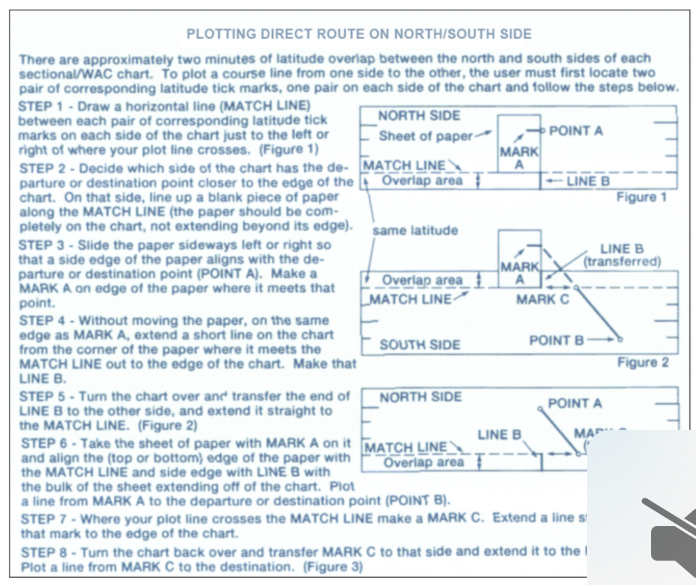
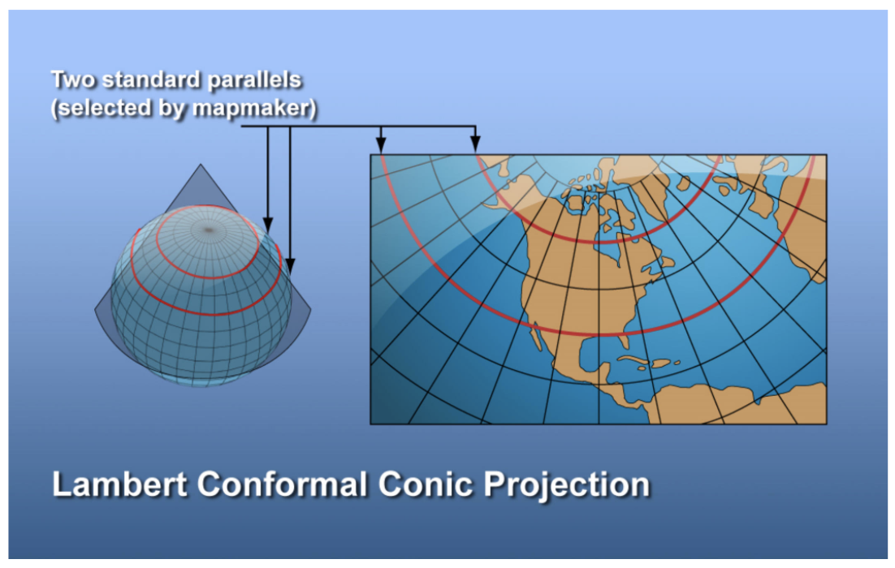
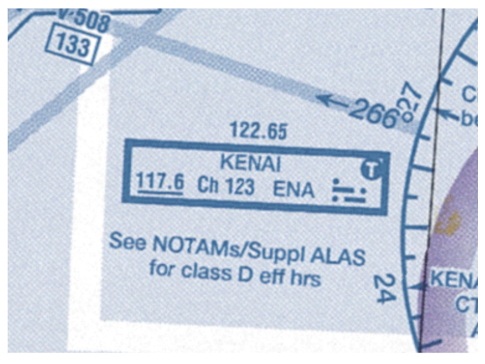
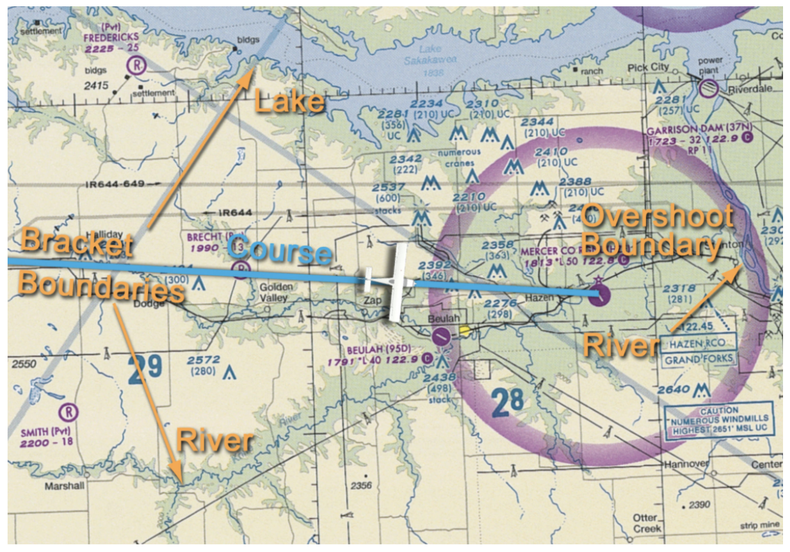

# Preparing For Your Cross-Country Flights

- [Preparing For Your Cross-Country Flights](#preparing-for-your-cross-country-flights)
  - [I. Sources of Flight Information](#i-sources-of-flight-information)
    - [Chart Supplement](#chart-supplement)
    - [Sectional and Terminal Area Charts](#sectional-and-terminal-area-charts)
    - [Flight Service Station](#flight-service-station)
      - [Calling an FSS](#calling-an-fss)
    - [NOTAMs](#notams)
  - [II. Planning and Organizing Your Cross-Country Flight](#ii-planning-and-organizing-your-cross-country-flight)
    - [Selecting Your Route](#selecting-your-route)
    - [Organiziing Your Cross-Country Information](#organiziing-your-cross-country-information)
      - [Assembling Preflight Information](#assembling-preflight-information)
    - [Survival Gear](#survival-gear)
      - [In the Event of an Emergency](#in-the-event-of-an-emergency)
  - [III. Cockpit Resource Management (CRM)](#iii-cockpit-resource-management-crm)
    - [Using Cockpit Resources](#using-cockpit-resources)
    - [Using Other Resources](#using-other-resources)

## I. Sources of Flight Information

### Chart Supplement
* Contains airport information, issued every 56 days, groups airports by state and city
* Make sure it is current
* Check NOTAMS for most up-to-date information
* Aeronautical Chart Bulletin section has updated to sectional/TACs
* Have Chart Supplement handy during cross-country flights

### Sectional and Terminal Area Charts
* Sectional scale is 1:500000; TAC is 1:250000 and more detailed
* Sectionals include airport data, navigational aids, airspace, topography
* Check expiration date
* Instructions on back for plotting a route that goes from one side of the sectional to the other

* Neatly fold sectional to show route when flying cross-country
* Align chart dirction with course
* Marine charts typically use Mercator projection (meridians parallel)
* Straight line is a rhumb line and is not the shortest distance between two points
* Sectional charts use a Lambert Conformal Conic Projection
* Meridians converge toward the nearest pole
* Straight course line approximates great circle route
  * Shortest distance between two points
  * Crosses each meridian at a different angle

### Flight Service Station
* Provide pilot briefings, flight plan processing, en route communications, initiation of search and rescue, assistance to lost/emergency aircraft/broadcast of aviation weather/other information
* Three hubs: Ashburn, Virginia; Fort Worth, Texas; Prescott, Arizona
* Telephone to 1-800-WX-BRIEF
* Standard (122.2 and 121.5) or discrete frequencies published in the Chart Supplement or at a RCO

#### Calling an FSS
* Refer to themselves by name and "Radio" (i.e. "Riverside Radio")
* "Riverside Radio, Skyhawk 52516, Blythe, receiving one-two-two-point-four"
* May need to wait your turn
* VOR box
  * Heavy line box indicates standard frequencies available
  * When VOR frequency underlined, no voice available

* Kenai available on 121.5 (emergencies), 122.5, and 122.65
* R indicates that FSS can only receive on that frequency; transmit on that frequency and listen on the VOR
  * "Wichita Radio, Skyhawk 52516, receiving Anthony V-O-R, over"
  * `NRST` and `FSS` buttons on GPS

### NOTAMs
* NOTAM-D (distant)
  * Attached to hourly weather reports, available through FSS
  * Contain temporary runway closures, nav aids out of service
  * Numbered MM/XXX
    * DAY 07/030; Dayton International's 30th NOTAM in July
* FDC NOTAMs (flight data center)
  * Issued through National Flight Data Center
  * Regulatory information
    * Changes to charts, instrument approaches; TFRs
    * Numbered by year and sequence
      * Year / issue sequence
      * 19/7656
        * NOTAM was 7,656th NOTAM of 2019
    * TFRs
* Always make sure there are no TFRs
  * tfr.faa.gov
  * FSS
* Also know all applicable NOTAMs published in Chart Supplement Aeronautical Chart Bulletin section
  * Published every 56 days
* Also know NOTAMs from sectional/TACs, NOTAM-Ds, FDC NOTAMs

## II. Planning and Organizing Your Cross-Country Flight

### Selecting Your Route
* Cross-country time is landing at an airport more than 50 nautical miles away from the departure airport via straight line
* First step is to choose a destination
* Obtain necessary sectionals and TACs
* Consider route restrictions like class B or restricted airspace
  * Terrain
  * Inhospitable terrain
  * Weather
* Optimize use of navigation aids for checkpoints and backups
* Consider selecting prominent checkpoints close to departure airport to help get established on course (i.e. the water tanks on the way out of the FRZ)
* Choose en route checkpoints that are prominent and specific
* Determine boundaries along each side of the route and beynod destination to limit you

### Organiziing Your Cross-Country Information

#### Assembling Preflight Information
* Assemble flight log, weather briefing information, navigation charts, information from Chart Supplements
* Flight log contains navigational computations performed in preflight planning
  * Comments about the route are included
* Weather briefing information from telephone or 1800wxbrief should be added to materials on clipboard
* Navigational charts should be folded and arranged prior to departure; panels organized in order in which they will be used
* Chart Supplement can be organized for ease of use with sticky notes to mark important pages and highlighted information

### Survival Gear
* Minimize search and rescue time
  * File and activate a flight plan
  * Make an emergency call on guard
  * Activating transponder to 7700
  * Activating the ELT
* Flotation gear, pyrotechnic signaling device for overwater flights beyond power-off gliding distance from shore
* Clothing appropriate for day/night environment in which you are flying
* Selective survival kit considering weight limitations
  * Water supply
  * Blanket
  * First aid kit
  * Multi-purpose tool
  * Matches in waterproof container
  * Signaling device
  * Large plastic bags (warmth and rain protections)
  * Duct tape
  * Candle/cooking fuel
  * If space and weight permit:
    * Flashlight and chemical light sticks
    * Handheld VHF transceiver
    * Energy bars, dried fruit, food
    * Handheld GPS and spare batteries

#### In the Event of an Emergency
* First priorities
  * Care for injuries
  * Avoid hypothermia and hyperthermia (getting to hot)
  * Stay with airplane (ELT) and use it as a shelter
  * Small quantity of gasoline to start fire
  * Use its VHF radio to communicate

## III. Cockpit Resource Management (CRM)

### Using Cockpit Resources
* PIC optimizing the use of human resources internal and external to the aircraft
  * Managing hardware (checklists, POH, autopilot, nav)
  * Management of workload
  * When workload low &#8594; perform tasks to manage future workload
  * Positioning flight gear correctly within the cockpit
  * Anticipating frequencies, descents, heading
  * Use of GPS and always keeping proper destination updated
  * **Constantly scanning instrument gauges for anything abnormal**

### Using Other Resources
* FSS, instructors, ATC, right-seat passenger
