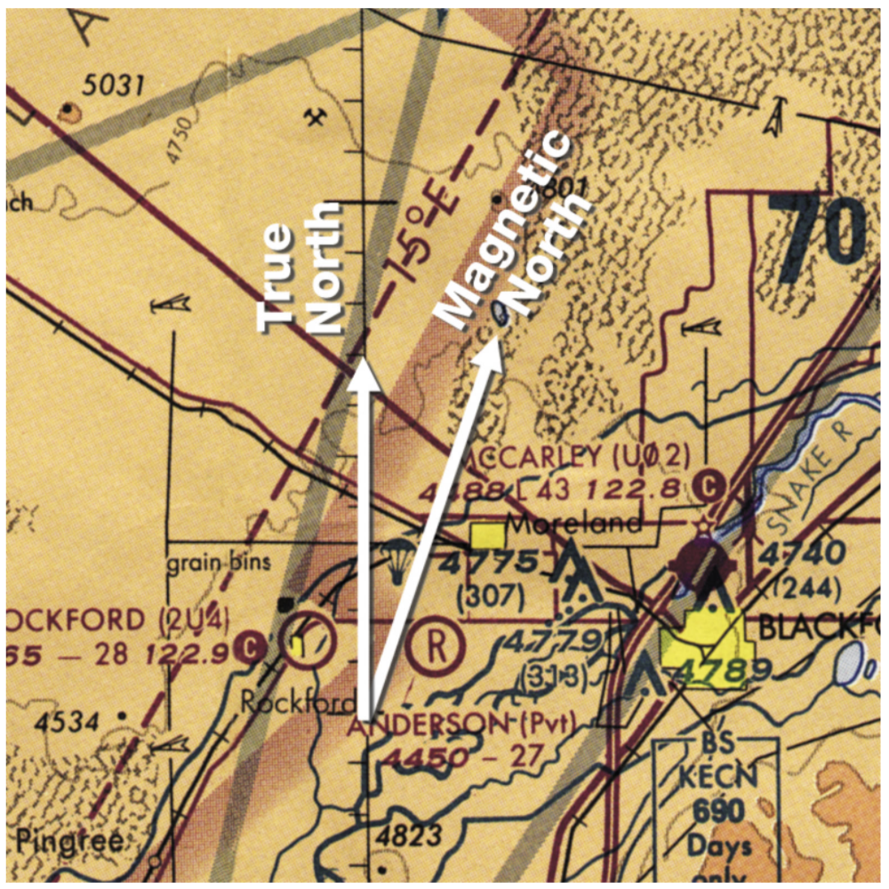

# Basic Navigation Procedures

- [Basic Navigation Procedures](#basic-navigation-procedures)
  - [I. Flight Computer](#i-flight-computer)
    - [Mechanical Flight Computer](#mechanical-flight-computer)
    - [Electronic Flight Computer](#electronic-flight-computer)
    - [Time-Speed-Distance Problems](#time-speed-distance-problems)
    - [Fuel Problems](#fuel-problems)
      - [Tips](#tips)
    - [Wind Problems](#wind-problems)
      - [True North and Magnetic North](#true-north-and-magnetic-north)
      - [Wind Correction Angle](#wind-correction-angle)
    - [Navigation Plotter](#navigation-plotter)
      - [Determining true course](#determining-true-course)
      - [Measuring distances](#measuring-distances)
    - [E6B Function on GPS/Multifunction Displays](#e6b-function-on-gpsmultifunction-displays)
  - [II. Navigating Using Checkpoints on the Ground](#ii-navigating-using-checkpoints-on-the-ground)
    - [Pilotage](#pilotage)
    - [Dead Reckoning](#dead-reckoning)
    - [Basic Compass Navigation](#basic-compass-navigation)
  - [III. Keeping Track of Your Location](#iii-keeping-track-of-your-location)
    - [Navigation Log](#navigation-log)
      - [Using the navigation log in flight](#using-the-navigation-log-in-flight)
    - [FAA Flight Plan](#faa-flight-plan)
    - [VFR Flight Following](#vfr-flight-following)

## I. Flight Computer

### Mechanical Flight Computer
* Problems: how long to fly to a destination, how much fuel you will consume, wind that will affect groundspeed and track
* E-6B flight computer: manual
  * Circular computer side on front
  * Wind side with clear plastic disc on back
* Multiply: set 10 on inner scale opposite first argument; opposite second argument on inner scale, read product on outer scale
* Divide: set number to be divided (dividend) opposite to the dividing number (divisor) on inner scale; read answer (quotient) opposite `10` on the inner scale (quotient will be on the outer scale)

### Electronic Flight Computer
* DPE may simulate battery failure

### Time-Speed-Distance Problems
* `speed * time = distance`
* Solve for time: speed on outer, align with 60; locate distance on outer, opposite that is time
* Solve for speed: distance on outer, align with time on inner, locate 60 minutes on inner, opposite is speed
* Solve for distance: locate speed on outer, align with 60 minutes on inner, locate time on inner, opposite time on inner is distance
* Miles on the outer (distance)
* Minutes on the inner (time)

### Fuel Problems
* `quantity burned = rate * time`
* Solve for time (burn / rate): locate rate in gallons on outer scale, align `60` on inner scale with that rate; locate quantity available on the outer scale, opposite that quantity on outer scale find time on inner scale
* Solve for rate (burn / time): locate quantity on outer scale, align with time on inner scale; opposite `60` on inner scale is rate on outer scale
* Solve for quantity burned: locate rate in gallons on outer scale, align rate with `60` on inner scale, locate time you will be flying on inner scale, opposite that on outer scale is quantity

#### Tips
* Gallons always go on outer
* Minutes always go on inner

### Wind Problems

#### True North and Magnetic North
* Lines of longitude extend from true North Pole to true South Pole
  * True poles are axis around which earth rotates
* Magnetic North Pole is slowly wandering point on Earth's surface located in the Canadian Arctic; magnetic fields point vertically downward

* Magnetic north is about 1,300 miles away from geographic North

* Difference between true and magnetic directions is called variation
* Lines of equal variation called isogonic lines
* Easterly variation: heading to magnetic north is east of the heading to true north (western US)
* Westerly variation: heading to magnetic north is west of the heading to true north (eastern US)
* Line of zero variation passes through Chicago (the agonic line) where headings of true and magnetic north are the same

* Aeronautical charts depic lines of longitude extending from true north to true south
* Magnetic variation depicted as magenta dashed lines extending from magnetic north to magnetic south
* Labeled with numbers E or W to depict the number of degrees of easterly or westerly variation

* Courses plotted on an aeronatucal chart are true courses as drawn on the chart and magnetic if variation is applied
* To convert a true course to a magnetic rouse:
  * Subtract easterly variation from the value of true course
    * East is least (subtract)
  * Add westerly variation to the value of the true course
    * West is best (add)

#### Wind Correction Angle
* Must compensate for effects of wind to maintain a desired course to a point
  * Turn nose of airplane into wind
* Wind correction angle (WCA)

* Wind side of an E6-B flight computer can find effect of wind on an aircraft in regard to:
  * Course: intended path
  * Heading: direction
  * Track: actual path made over the ground
  * Drift angle: angle between heading and track
  * Wind correction angle: correction applied to the course to establish a heading so that track will coincide with course
  * Airspeed
  * Groundspeed
* Use wind side to solve for compass heading
  * `TC +/- WCA = TH +/- VAR = MH +/- DEV = CH`
  * **Winds aloft are always given relative to true north**
* Problem
  * True course is 61°
  * Wind aloft for altitude is 280@30KT
  * True airspeed ia 110 knots (for altitude; found in POH)
  * Variation is 15° East (from isogonic line in chart)
  * Compass deviation is -1° (from compass card in cockpit)
  * Follow instructions on computer!
  * `061 - 10 = 051 - 15 = 036 - 1 = 035

### Navigation Plotter
* Combination of a protractor (compass rose) and a ruler calibrates in mileage scales
* Protractor used to measure course line on aeronautical chart
* Ruler calibrated in scales for sectionals, TACs, or world aeronautical charts (WACs)
* Compare with known mileage scale on an aeronautical chart in case the plotter plastic warps
* Protactor portion of plotter is used to determine angular difference between a line of longitude or meridian and desired course drawn on an aeronautical chart
  * Connect to points on an aeronautical chart to create desired course
  * Make a common sense estimate of direction you have plotted to compare with the course

#### Determining true course
* Place grommet over intersection of course line you have drawn on the aeronautical chart and either a line of longitude or line of latitude midway along course line
* Align either `0` on compass rose with a line of longitude, or a `90` with a line of latitude
* Read the true course of the line you have drawn in degrees under the compass rose in the direction that makes the most sense

#### Measuring distances
* Sides of navigational plotter are a ruler calibrated for use on aeronautical charts
* Measure distances on TACs, with a scale of 1:250,000; sectionals, with a scale of 1:500,000; and world aeronautical charts, with a scale of 1:1,000,000
  * 1:250,000: 1 inch represents 3.43 nautical miles / 4sm
  * 1:500,000: 1 inch represents 6.86 nautical miles / 8sm
  * 1:1,000,000: 1 inch represents 13.72 nautical miles / 16sm
* Always ensure you are using the correct scale for your chart of choice!

### E6B Function on GPS/Multifunction Displays
* G1000 MFD has many of these calculations built in (desired track, distance, altitude)
* `View` &#8594; `Wide` will show more stats (fuel remaining, estimated time en route, estimated time of arrival, bearing)
* Trip Planning page in `AUX` pages also has more statistics (fuel requirements, etc.)

## II. Navigating Using Checkpoints on the Ground

### Pilotage
* Two forms of non-electronic navigation: pilotage and dead reckoning
* Pilotage
  * Picking reference points on a chart and finding those same points on the ground
  * Backup for all other forms of navigation
  * Requires chart and visual sight of ground
* Landmarks are easy-to-see distance references
  * Best to use two landmarks to readily identify position from the air
  * Never rely on a single landmark
* Bracketing
  * Establish overshoot boundaries on each side of a course and beyond a planned destination (so you can know when you are drifting or overshooting)

### Dead Reckoning
* Navigation by means of calculations based on time, speed, distance, and direction
* Selecting prominent landmarks on the ground to use as checkpoints, calculating heading to be flown between checkpoints, time between checkpoints, length of entire trip, and fuel to be used
  * Preparing a flight log
  * Evaluates progress of flight by comparing forecast plan with actual conditions
  * Combined with pilotage to provide small corrections
* Checkpoints should be small, specific fixes that are easily distinguishable (i.e. not a huge lake or something)
  * Might be a good idea to select checkpoints where a flight must change course
  * Provide basis for computing ETE and ATE (estimated/actual time en route) and ETA/ATA (estimated/actual time of arrival)

### Basic Compass Navigation
* Check compass during preflight
  * Correct heading, not leaking fuild, swings freely during taxi
  * Compass "reads" backwards because you are reading the pack of the compass
* When resetting a DG to a compass, use average compass indication between oscillating swings

## III. Keeping Track of Your Location

### Navigation Log
* Sheet of paper to organize flight data information in a spreadsheet

* Checkpoints listed on the left
* Rows positioned between each checkpoint to provide data entry from one checkpoint to the next
  * Represent en route portion between checkpoints
* Columns represent variables of each leg/segment between checkpoints
  * Estimated time en route, actual time en route, etc.
* Preflight planning
  * Checkpoints to be used
  * Cruise altitude
  * True course (TC) determined using protactor on navigation plotted and sectional
  * Wind direction and velocity from weather briefing for cruise altitude
  * Wind correction angle (WCA) determined for each leg using wind direction and velocity, true course, and wind side of E6-B computer
  * True heading (TH) obtained by applying WCA to TC
  * Variation determined by using magnetic isogonic line on sectional chart
  * Magnetic heading (MH) determined by applying variation over TH
  * True airspeed (TAS) obtained from PIM
  * Distance determined by wind side of E6-B
  * Estimated time en route (ETE) determined by using circular side of E6-B
  * Fuel used determined by using circular side of E6-B
  * Fuel remaining by subtracting fuel used for each leg from fuel remaining at the end of the previous leg
  * Totals for distance, ETE, and fuel used during the flight (shown at bottom of page)

#### Using the navigation log in flight
* Information completed during the flight:
  * Compass heading (CH) filled in when you get to the airplane based off of compass deviation card
  * Actual time of arrival (ATA) by noting the time as you pass each checkpoint
  * Actual time en route (ATE) found by subtracting ATA of previous checkpoint from ATA of current checkpoint

### FAA Flight Plan
* VFR flight plan
  * Formal communication between pilot and Flight Service with standard format
  * Via internet, telephone, or radio
  * Primarily for timely notification to search-and-rescue services of an overdue flight
  * Activated/opened when pilot reports airborne
  * Maintained until pilot reports arriving at destination
  * **Considered overdue 30 minutes after pilot's ETA**
* Form 7233-4 "International Flight Plan"
* Box 8, Flight Rules; `V` for VFR, `I` for IFR
* Box 8, Type of Flight; `G` for GA
* Box 9, Number; 1 for just one plane
* Box 9, Wake Turbulence Cat; L for light
* Box 10, Equipment; S (VOR, radio, ILS) or G if GPS equipped
* Box 13, Departure Aerodrome; KVKX; if no ICAO, enter `ZZZZ` and then `DEP/2W5, Maryland` in Box 18 (using `2W5` as an example)
* Box 13, Time; ETD in Zulu
* Box 15, Cruising Speed; estaimted true airspeed; 5 characters, 1 letter and 4 digits, beginning with `N` for knots (i.e. `N0120` for 120 knots)
* Box 15, Level; maximum 5 characters, beginning with `A` for altitude, followed by 3 or 4 digits (`A045` for 4500 feet)
* Box 15, Route; `KVKX 2W5 IRONS DCT KEZF`
  * For direct between fixes/navaids/waypoints not using a published route, use DCT
  * For using a route (i.e. VFR cooridor) `PGY V186 OCN`
* Box 16, Destination Aerodrome; four letter ICAO or `ZZZZ`
* Box 16, Total EET; estimated elapsed time (i.e. ETE/estimated time en route)
* Box 16, ALTN Aerodrome; alternate destinations, not required but recommended (starting point for communications search when looking for overdue aircraft)
* Box 19, Endurance; total usable fuel not including reserves
* Box 19, Persons on board; mandatory
* Box 19, remarks; name/contact info for any party at ETA (FBO) who could verify VFR arrival/plan closure
  * Intermediate stops for changin number of passengers or adding fuel
* Box 19, PIC; name and phone number
* Call Flight Service once airborne to activate flight plan
  * Actual takeoff in Zulu
  * Used with EET to determine ETA
  * Activation must occur within 60 minutes of proposed departure time or updated with new departure time
  * Flight plan will be discared after it is one hour old
* Pilot must contact the FSS on radio before landing or on phone after landing to close flight plan
* Control towers do not automatically close VFR flight plans
* You are considered overdue if you do not arrive within 30 minutes of your ETA
  * Communications search will be launched by calling destination airport and contact, alternate airport, departure airport, home phone, aircraft base
  * SAR will be activated if communications unsuccessful

### VFR Flight Following
* Provided by ATC on a workload-permitting basis
  * ATC primary responsibility is separation of IFR traffic
* Benefits of flight following
  * Traffic alerts
  * Direct routing (cleared through special use airspace)
  * Constant contact (radar vectors if you get lost)
  * Cannot rely on ATC to notify SAR if you disappear from frequency
* Can be requested on ground via clearance delivery
* In air via ARTCC or TRACON facility
* Locate frequency of nearest air route traffic control center (ARTCC) or terminal radar approach control (TRACON) by looking up departure airport in Chart Supplement
  * Circled `R` denotes that there is radar capability
  * Frequency listed next to `R` is who you want to talk to to request flight following
  * If no circled `R`, locate nearest airport to your departure airport
  * Or, look for communications box on the sectional
  * Or, use list of ARTCCs in Chart Supplement (locate nearest facility and use frequency listed)
  * Or, contact local FSS for frequency information

* Study AIM and Pilot/Controller Glossary to understand terminology
* Know what you are going to say before you key the mic
* Fly the airplane
