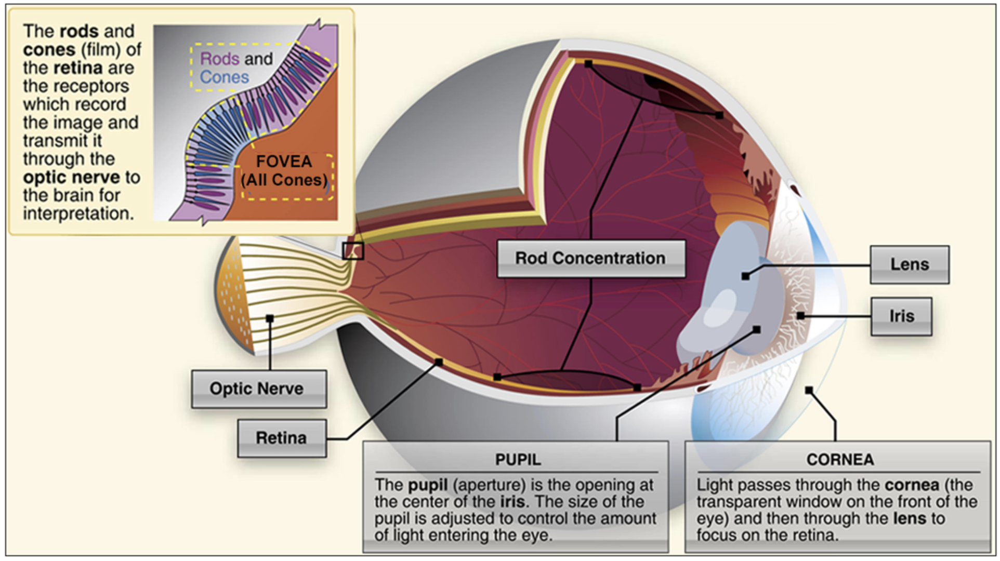
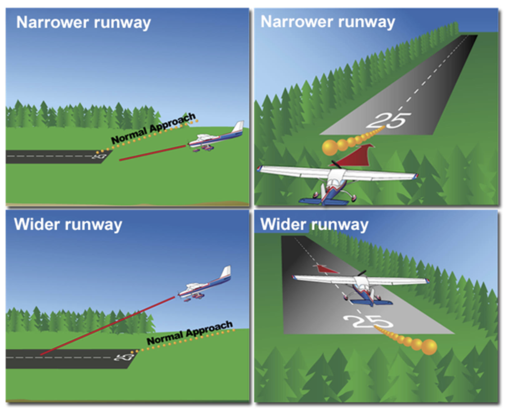
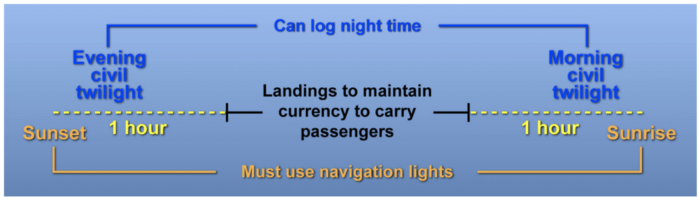

# Night Flying and the Human Body

- [Night Flying and the Human Body](#night-flying-and-the-human-body)
  - [I. Vision in Flight](#i-vision-in-flight)
    - [Night Vision](#night-vision)
      - [Night Blind Spot](#night-blind-spot)
    - [Visual Illusions](#visual-illusions)
      - [Avoiding Illusion Hazards](#avoiding-illusion-hazards)
    - [Spatial Disorientation](#spatial-disorientation)
      - [Sensing Orientation](#sensing-orientation)
  - [II. Night Operations](#ii-night-operations)
    - [Sunlight, Civil Twilight, and Night](#sunlight-civil-twilight-and-night)
      - [FAA Definition of Night](#faa-definition-of-night)
      - [Carrying Passengers at Night](#carrying-passengers-at-night)
    - [Preparation for Night Flying](#preparation-for-night-flying)
    - [Airplane and Airport Lighting](#airplane-and-airport-lighting)
      - [Airplane Lighting](#airplane-lighting)
      - [Rotating Beacon Lighting](#rotating-beacon-lighting)
      - [Obstruction Lighting](#obstruction-lighting)
      - [Surface Lighting](#surface-lighting)
      - [Pilot Control of Airport Lighting](#pilot-control-of-airport-lighting)
    - [Night Emergencies](#night-emergencies)
      - [Engine Failure](#engine-failure)
      - [Electrical Failure](#electrical-failure)
  - [III. Flying Cross-Country at Night](#iii-flying-cross-country-at-night)
    - [Preparation and Equipment](#preparation-and-equipment)
    - [Route and Altitude Selection](#route-and-altitude-selection)
    - [Using the G1000 at night](#using-the-g1000-at-night)

## I. Vision in Flight

### Night Vision
* Eyes contain cones and rods
* Cones
  * Color vision
  * Center of retina (fovea)
  * Detect fine detail in bright light
* Rods
  * Unable to discern color
  * Located throughout retina
  * Very sensitive when light low
  * Responsible for much of the peripheral vision

* Rods are 10,000 times more sensitive to light once fully adapted to darkness
* Can take 30 minutes to fully adjust
* Avoid bright light sources for 30 minutes before a night flight

#### Night Blind Spot
* Ability to see an object in the center of the visual field is reduced at night
* Cones lose much of sensitivity, few rods in center of eye
* Looking 5-10 degrees off center can help compensate for the night blind spot
* Increased altitude and decreased oxygen degrade night vision
* FAA suggests using oxygen for flights over 30 minutes when 5,000 feet MSL and above at night (compared to 10,000 MSL during the day)
* Unhealthy habits can also have an effect on night vision
  * Smoking, alcohol, lack of oxygen, fatigue, corbon monoxide posioning

### Visual Illusions
* Illusion: misleading visual image
* Can lead to landing errrors and spatial disorientation
* Runway width illusion
  * Occurs when length-to-width ratio is not typical
  * Narrower than usual
    * Creating illusion that the aircraft is higher than it actually is
    * Approach flown too low
    * Risk of striking objects in approach path or touching down short of runway
  * Wider than usual
    * Create illusion that aircraft is lower than it actually is
    * Approach flown too high
    * Risk of flaring too high and dropping down to a hard landing
    * Touching down too far down on the runway, overrun

* Runway and terrain slope illusions
  * Upslope
    * Creates illusion that the aircraft is higher than it actually is
    * Approach flown too low
  * Downslope
    * Creates illusion that the aircraft is lower than it actually is
    * Approach flown too high
* Refer to runway gradients in chart supplement
* Featureless terrain illusions
  * Occurs when absence of surrounding ground features
  * Approaching over water, darkened areas, terrain made featureless by snow
  * Creates illusion that the aircraft is higher than it actually is
  * Approach flown too low
* Atmospheric illusions
  * Such as rain on windscreen or atmospheric haze
  * Creates illusion that the aircraft is higher than it actually is
  * Approach flown too low
* Sudden loss of visual reference illusion
  * Similar to flying into fog or a cloud
  * Produces illusion of pitching up, which may cause you abruptly pitch down
* Ground lighting illusion
  * Straight path of lights mistaken for runway or approach lights
  * Bright runway lights or approach lights create the impression that you're closer to the runway than you actually are
* The black hole illusion
  * Occurs when flying a long, straight-in final approach
  * Little or no lighting around the airport, no surrounding ground features (overwater approach or over terrain made featureless by snow)
  * Amount of runway filling windscreen can increase by getting close to runway or low on approach
  * Avoid by not flying long, dark, straight in final; fly standard traffic pattern

#### Avoiding Illusion Hazards
* Anticipate possibility of illusions
* Conduct aerial visual inspection of unfamiliar airports before landing
* Use an electronic glide slope (ILS, GPS VNAV)
* Use a PAPI or VASI
* Know airport and TPA
* Refer to altimeter frequently
* Reference Chart Supplement to be familiar with obstructions
* Recognize that chances of approach accident increase when distraction occurs
* Maintain landing proficiency

### Spatial Disorientation
* Temporary state of confusion form lack of orientation with regard to airplane's position, altitude, and movement
* False sensation that airport is in a different position than its actual position
* Caused by continuing visual flight into bad weather; near top list of causes for aircraft accidents

#### Sensing Orientation
* Body uses visual, motion-sensing, and position sensing systems to establish orientation
  * Eyes are primary
  * Inner ear
  * Position-sensing (skin, joints, muscles, etc.)
* Avoiding spatial disorientation
  * Do not coninue flight into bad weather or darkness
  * Avoid sudden head movements
  * Be proficient in emergency instrument skills

## II. Night Operations

### Sunlight, Civil Twilight, and Night
* Position lgihts (red, green white) must be on
* Anti-collision lights (strobes) must be on if available
  * Not required when pilot determines it is best to keep them off, i.e. not on the ramp

#### FAA Definition of Night
* Time between end of evening civil twilight (around 30 min after sunset) to beginning of morning civil twilight (around 30 min before sunrise)
* Times for civil twilight are based on when sun is 6 degrees below the horizon, converted to local time
* To log night time, flight must take place after evening civil twilight and before morning civil twilight

#### Carrying Passengers at Night
* Three takeoffs and landings within past 90 days in aircraft of same category and class
* Currency time is **one hour** after sunset to **one hour** before sunrise

### Preparation for Night Flying
* Personal minimums should be higher for night
* Weather briefing, particularly spread between temperature and dew point
* Two flashlights
* Fuel reserves: 45 minutes at night

### Airplane and Airport Lighting

#### Airplane Lighting
* Position lights
  * Green on right
  * Red on left (port wine is red wine)
  * Neither can be seen from rear
  * White on tail
* Anti-collision lights
  * Rotating beacon (typically always on)
  * Strobes (just before taking runway until clear of runway after landing)
  * For 172, anti-collision lights are strobes, not beacon
* Green to left and red to write means airplane is heading towards you
* Red light means airplane is crossing from right to left
* Green light means airplane is crossing from left to right
* White light or strobes mean you are seeing tail of airplane
* Landing light must be operable if airplane operated at night for hire

#### Rotating Beacon Lighting
* Airport: alternate white and green
* Military: Green White White
* Heliport: Green Yellow White
* Seaport: White Yellow
* Unlit land: White

#### Obstruction Lighting
* Indicate a hazard that should be avoided
* Red lights flashing or steady
* Medium instensity white lights used during day on structures 500 feet AGL or less; reduced intensity at night
* Hihg intensity white with reduced intensity for night operations

#### Surface Lighting
* Not everything will be at every airport
* Runway edge light system
  * Normally light, except on instrument runways where yellow on last 2000 feet or last half if less than 2000 feet
  * High intensity runway lights (HIRL)
  * Medium intensity runway lights (MIRL)
  * Low intensity runway lights (LIRL)
* Green indicates threshold to landing airplanes
* Red seen when departing
* In-runway/embedded lighting
  * Runway Centerline Lighting System (RCLS)
    * White along centerline, alternating white and red 3000 feet from departure end, red 1000 feet from departure end
  * Touchdown Zone Lights (TDZL)
    * Multitude of white lights starting 100 feet beyond landing threshold extending to 3000 feet beyond the landing threshold or to midpoint of runway
  * Taxiway centerline lead-off lights
    * Provide visual guidance to exit the runway; alternate green and yellow
  * Taxiway centerline lead-on lights
    * Provide visual guidance to enter the runway; alternate green and yellow
  * Land and hold short lights indicating hold-short point on LAHSO runways
    * Pulsating white lights installed across runway
* Runway End Identifier Lights (REIL)
  * Pair of syncronized flashing lights located on each side of the runway threshold
* Approach Light Systems (ALS)
  * Configuring of signal lights leading to landing threshold providing a means to transition from instrument flight to a visual landing
* Visual glide slope indicators (proper glide path control)
* Taxiway
  * Edge lights mark edge of taxiway and are blue
  * Centerline lights at busier airports are green
  * Clearance bar lights consist of three in-pavement steady-burning yellowlights perpendicular to the direction of taxi
  * Installed at holding positions
* Runway guard lights
  * Flashing yellow lights installed in the taxiway or elevated on the side of the taxiway
  * Enhance conspicuity of taixyway/runway intersections

#### Pilot Control of Airport Lighting
* Available at selected airports
  * `L`: lighting from sunset to sunrise
  * `*L`: lighting limitations exist, refer to chart supplement for more info

* 3 clicks for low intensity, 5 for medium intensity, 7 for high intensity
* Usually best to go for highest level first and then reducing if needed
* Clicks are made on CTAF or elsewhere if indicated by Chart Supplement
* Stay on for 15 minutes
* Must be relatively close to activate system
* Should always be keyed on when overflying the airport

### Night Emergencies

#### Engine Failure
* Plan route close to airports
* Avoid overflying unfavorable terrain
* Same ABCs
* Best field
  * Look for highways or unlit, open areas (be cautious because these could be rough terrain)

#### Electrical Failure
* Indicated by low voltage light
* Reduce electrical load to absolute essentials (i.e. kill taxi and landing lights)
* Minimize radio transmissions
* Turn toward nearest lit airport with lit runways
* Might not be able to use pilot-controlled lighting
* Will need flashlight to see instruments
* Be vigilant for other traffic
* Quickly clear runway after landing and taxi to lighted area

## III. Flying Cross-Country at Night

### Preparation and Equipment
* Maintain 2-degree temperature/dew point spread
* Do not draw course lines in red since they cannot be seen with red lights
* Keep flashlights accessible

### Route and Altitude Selection
* Fly a well-lighted path avoiding large, uninhabited areas and terrain unsuitable for a forced landing
* Checkpoints should be easily seen in the dark and not a single point of light
  * May form shape or pattern
  * May provide contrast between light and dark background on the ground
    * i.e. a lake
* Cruising altitude
  * Selection starts with maximum elevation figures in various quardrangles along the route
  * Minimums should be based on highest terrain along and 5 miles on either side of your route
  * Add 1000 feet to the highest elevation or obstacle in flatlands; 2000 feet in mountainous areas
  * Generally at least 3000 feet AGL to make it easier to see VFR checkpoints and for best radio operations
* Familiarize yourself with terrain features surrounding an airport
  * Pay particular attention to obstacles

### Using the G1000 at night
* Brightness automatically adjusts
* Terrain proximity displays altitude of terrin and obstacles relative to aircraft position and altitude; helps avoid CFIT
  * Black: more than 1000 feet below
  * Yellow: Between 100 and 1000 feet below
  * Red: Above or within 100 feet of aircraft altitude
