# Radio Navigation

- [Radio Navigation](#radio-navigation)
  - [I. Automatic Direction Finder (ADF)](#i-automatic-direction-finder-adf)
    - [Understanding the ADF](#understanding-the-adf)
      - [ADF receivers](#adf-receivers)
    - [Using the ADF](#using-the-adf)
      - [Flying to a Station](#flying-to-a-station)
    - [Using the ADF to Determine Position](#using-the-adf-to-determine-position)
    - [Using an RMI to Intercept and Track a Bearing](#using-an-rmi-to-intercept-and-track-a-bearing)
  - [II. VHF Omnidirectional Range (VOR)](#ii-vhf-omnidirectional-range-vor)
    - [Understanding the VOR](#understanding-the-vor)
      - [VOR radials](#vor-radials)
    - [Using VOR Radials](#using-vor-radials)
      - [TO-FROM Indicator](#to-from-indicator)
      - [Using the VOR for Navigation](#using-the-vor-for-navigation)
    - [Testing VOR Accuracy](#testing-vor-accuracy)

## I. Automatic Direction Finder (ADF)

### Understanding the ADF
* Automatic Direction Finder
* Occassionally still used in the US for airways, generally Alaska
* Used more extensively outside the US
* Receives signal from nondirectional radio beacon (NDB) transmitters and commercial broadcast (AM) stations
  * Provide navigation by pointing a cockpit needle to the bearing to the station
* Includes receiver to receive and process signals from two antennas
  * Sense (nondirectional) antenna
  * Loop (bidirectional) antenna
* Radio magnetic indicator (RMI) consisting of:
  * Slaved compass card system showing current magnetic heading on a compass card in the cockpit
  * Two needs that can point ot the magnetic bearing to an NDB or VOR station
    * RMI needles can point to NAV, GPS, or ADF
* Operates in low frequency (LF) band of 190 kHz to 1750 kHz
  * Aeronautical NDBs transmit on 190 to 535 kHz
  * AM broadcast stations transmit on 540 to 1750 kHz
* NDB stations identified by magneta circle with dot in center and dotted pattern filling the circle
  * Magenta communication box containing the NDB name, frequency, and morse code identifier
* Commercial broadcast stations identified by blue box containing the letters `BS`, station identifier, and frequency

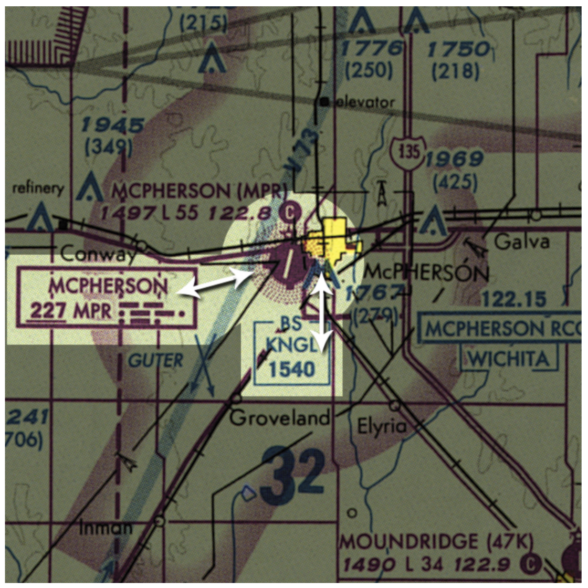

* Identify station by listening for morse code identifier or broadcast station callsign (i.e. "this is WMAQ")
* No OFF flag like VOR; only way to identify failed station is absence of identifier
* Reception is dependent on strength of transmitting signal
* Signal follows ground contours and is available at low altitude
* Signal disortion occurs in bad weather or near lakes; ADF needle may point at a thunderstorm

#### ADF receivers
* ADF switch uses loop antenna for direction-sensing information
* ANT switch uses sense antenna, no directional info, best for hearing station ID or listening to an AM radio station
* BFO switch is used in some non-US countries for the ID signal

### Using the ADF
* Can track inbound to an NDB station or outbound from it

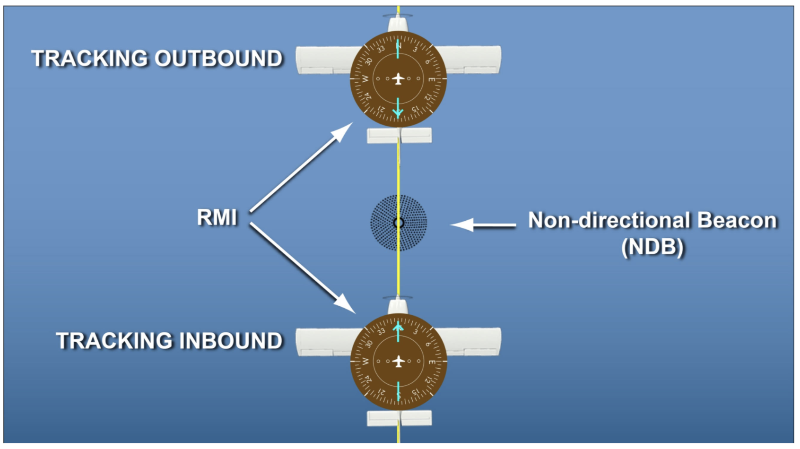

* Can intercept a bearing to or from an NDB station

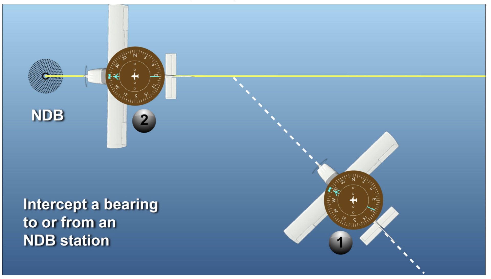

* Plot position via triangulation with two or more NDBs

#### Flying to a Station
* Known as homing to a station
  * Keep nose of airplane continually pointed at the station
  * Keep ADF needly pointed toward the top of the compass card
* Can result in flying an arc to station if there is wind and you do not compensate for it

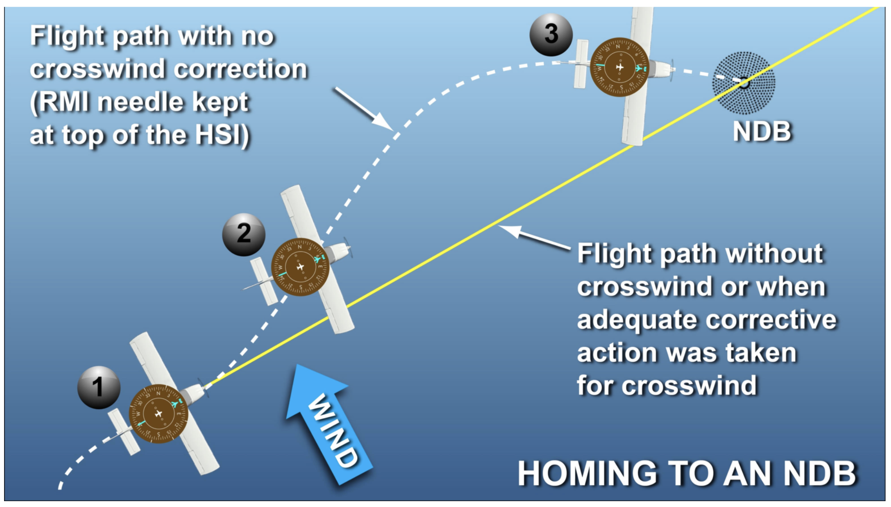

* Tracking to a station means flying to a station and maintaining a specified ground track while correcting for wind
* Nose pointed at windward side

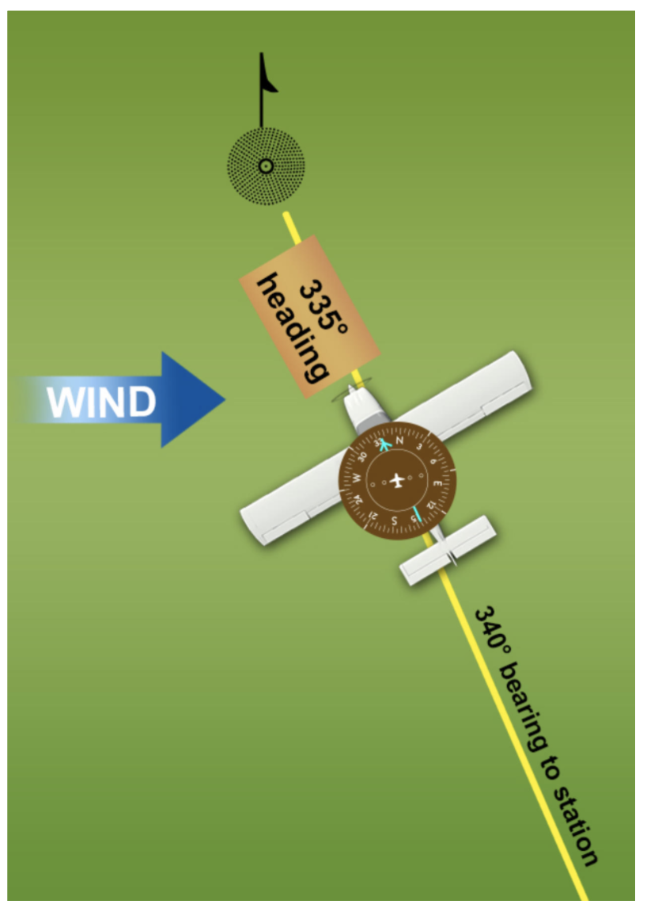

* Relative Bearing (RB): clockise angle between the nose of the airplane and the radio station being used for navigation
* Magnetic Bearing (MB): magnetic direction to the station, read at the head of the arrow of the RMI

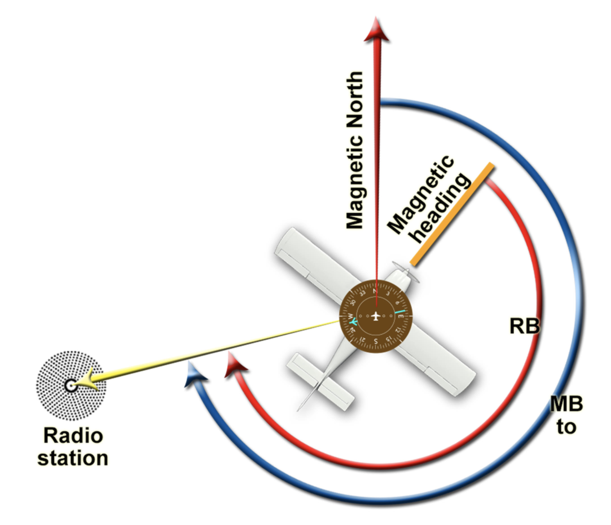

### Using the ADF to Determine Position
* Plotting current position using ADF requires intersection of two lines of position (LOP)
* Example
  * Use course track line as one line of position
  * Use magnetic bearing from the station as second line of position
  * Intersection of these two lines is position
* Using ADF as a checkpoint
  * Apply variation and compute magnetic direction (MB to) from checkpoint to station
  * When RMI needle is pointed at the computed MB to, you have crossed the line

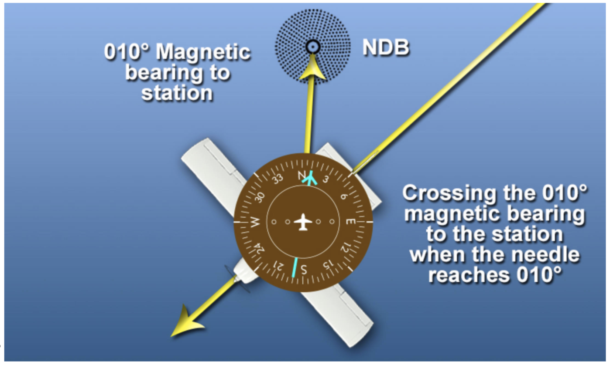

### Using an RMI to Intercept and Track a Bearing
* To intercept a bearing to a station
  * Say you are NE of the NDB and want to intercept the 270° MB to the station
  * Take a heading that will intercept the desired inbound heading, i.e., a 45° angle, so fly a heading of 225°
  * As you approach desired bearing, RMI will move towards 270°
* To intercept a bearing away from a station
  * Take a heading that will intercept the desired outbound heading
  * As you approach the bearing, the tail of the needly will move towards the desired bearing
* Tracking a bearing
  * Must crab into any crosswind to compensate for its effects
  * Adjust aircraft's heading to maintain the desired track
* While tracking needle, if it moves to right, turn to right double the number of degrees the needle moved
* If it moves to left, turn to left double the number of degrees
* Tracking from an NDB
  * Drag tail of needle with you
  * If tail moves to right, turn to left by double and vice versa

## II. VHF Omnidirectional Range (VOR)

### Understanding the VOR
* Transmits different signal in every direction
* Transmits 108 to 117.95 MHz
* Subject to line-of-site reception, similar to VHF communications
  * Higher gives longer range, lower gives shorter range
* One rotating beam and a second signal sent simultaneously in all directions every time the rotating beam passes through north
  * Timed measurement of difference between signal sent in all directions and rotating signal gives position
* VORs are depicted on sectional charts oriented to **magnetic North**
* VORTAC includes DME

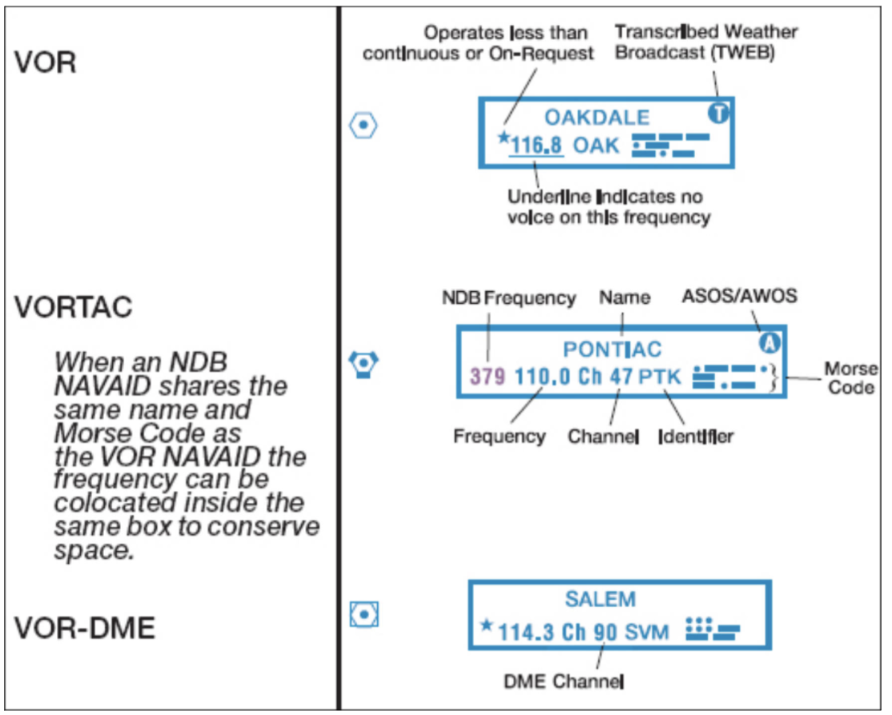

#### VOR radials
* Extend in all directions from VOR

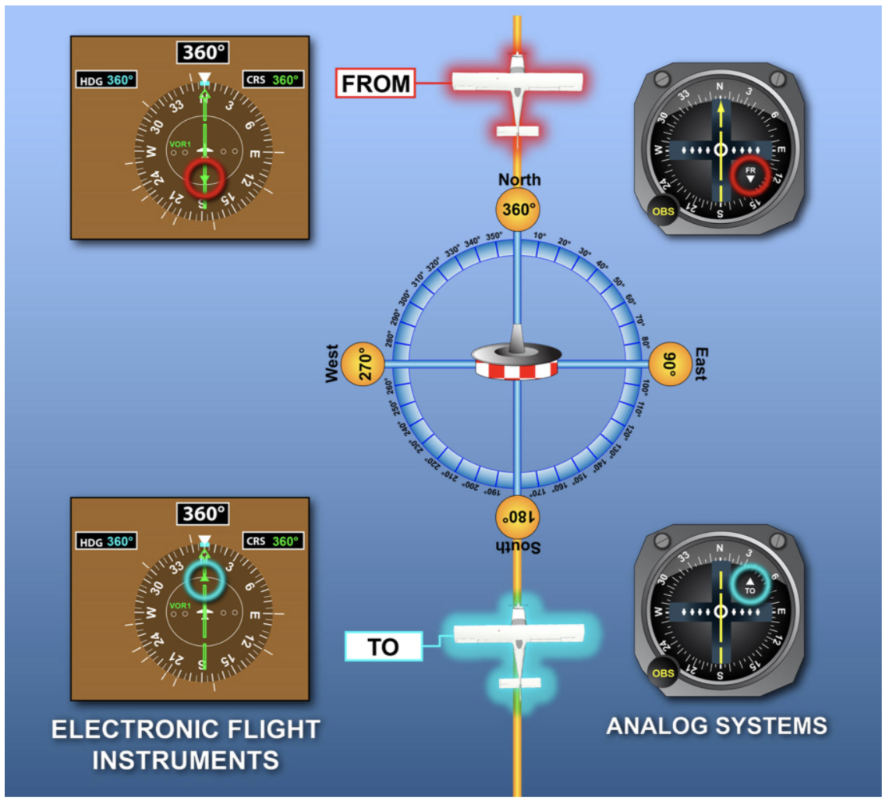

* Three letter identifier guarnateed to be unique within the US
* May transmit in morse code or voice
* `Ch` is TACAN channel
* Underlined frequency indicates that FSS cannot broadcast voice communication on that frequency
* VOR frequency that is not underlined indicates that FSS can broadcast
* A in ball in upper right corner indicates ASOS/AWOS recorded information is available
* FSS communication frequencies are shown above the communication box with `R` if the FSS can only receieve on that frequency and that you must listen on the VOR frequency

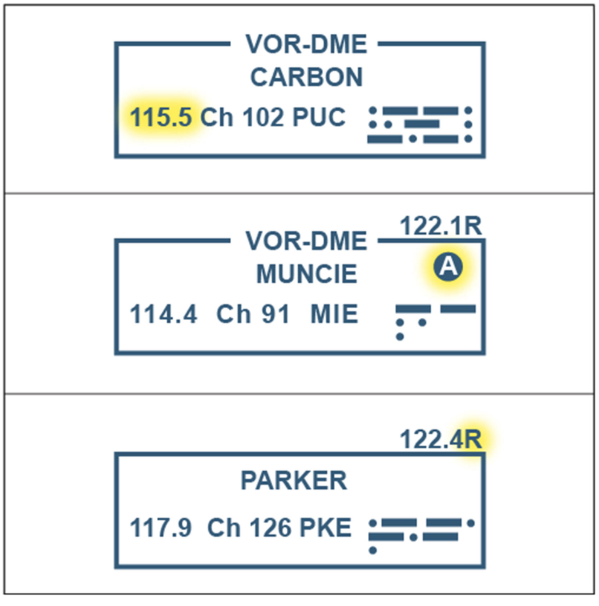

* Indications that the VOR is unserviceable
  * `T E S T` may be broadcast in morse code if maintenance is working on a VOR
  * No identifier broadcast when VOR not in service
  * `FLAG` in the navigation frequency tuning box

### Using VOR Radials
* OBS rotates compass card
* CDI is the needle
* CDI indicates airplane's position (not heading) relative to the course selected with the OBS
* Each dot horizontally represents 2° off the selected radial
* Full scale deflection: on the last horizontal dot
* Pegged needle: more than 10° off course, don't know how much more than 10°
* Heading does not effect CDI deflection
* Concepts of left and right only make sense if airplane is pointed in same direction as OBS setting
  * In this case, when needle deflected left, course is to the left, and vice versa
* CDI calibrated in degree of angle, so 1° off course when near the station is only a slight deviation, whereas 1° off course when far from the station is a significant deviation
* Needle becomes very sensitive close to the station
* Computations
  * 1° off course at 60 miles from station: 1 mile off course
  * 1° off course at 30 miles from station: 1/2 mile off course
  * 1° off course at 15 miles from station: 1/4 mile off course

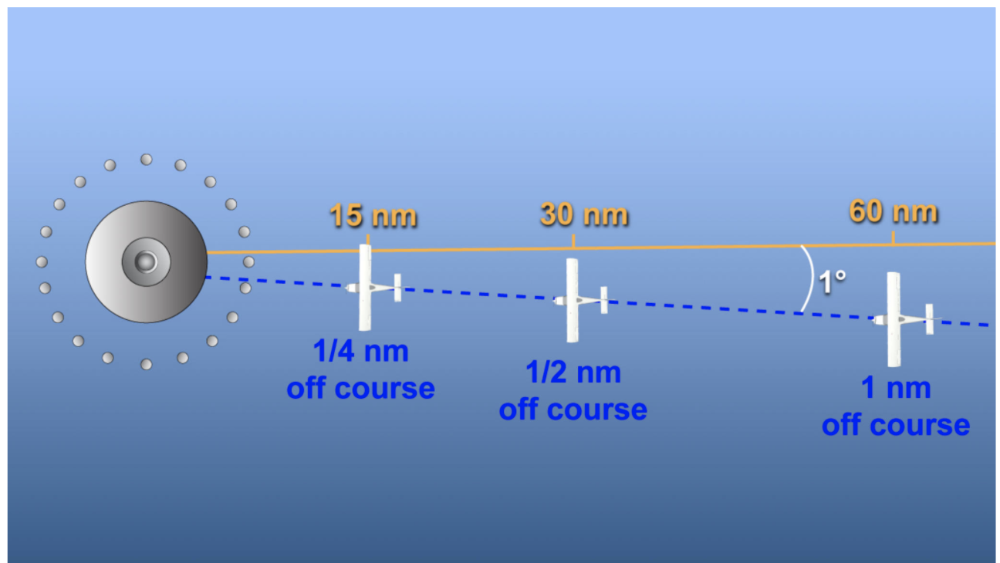

#### TO-FROM Indicator
* Displays TO, FROM, or OFF
* Shows relationship between airplanes position (not heading) relative to the course selected in the OBS
* Concepts of TO, FROM, left, right only make sense when the airplane is pointed in same direction as set in the OBS
* Flying in opposite direction from TO or FROM results in reversed needle movement
* Displays TO if the VOR would be ahead of you if you are heading in the same direction as set in the OBS
* Displays FROM if the VOR would be behind you if you were heading in the same direction as set in the OBS
* Displays OFF if the VOR would be abeam you if you were heading in the same direction as set in the OBS, or directly under you

#### Using the VOR for Navigation
* Determine radial you are on my centering the needle of the OBS selector on a FROM reading
* Fly to the VOR from your position by centering the needle of the OBS selector on a TO reading
  * Always use TO for flying TO a station to prevent reverse needle movement
  * Turn aircraft so that heading matches OBS reading and correct for wind to keep CDI centered
* Fly outbound from the VOR by setting desired outbound radial into the OBS
  * When flying FROM a station always fly the selected course with a FROM indication
* VOR navigation system comprises basic structure of the low-altitude airway route system beneath 18,000 feet MSL
  * VOR Federal airways or Victor airways
  * Airway designations start with `V-`
* High altitude airway route system from 18,000 feet MSL through FL600 are known as jet routes
  * Designations start with `J-`
* Airway is defined by a radial referenced to magnetic north from a VOR station
  * Connects two VOR stations
  * Depicted in blue on sectionals
* Flying from one VOR to another on an airway
  * Radial outbound from the first VOR will be depicted on sectional; this is the radial to be set into the OBS and the approximate heading to fly
  * Radial inbound to the next VOR will not be depicted on sectional charts and will be the reciprocal of the radial shown on the sectional chart
* Change from outbound VOR to inbound VOR
  * Airways with a bend: at point where bend occurs
  * Without a bend: halfway between the two stations
* Remain on course by making corrections as soon as they are needed in same direction as CDI needle deflections
* Triangulation
  * Center needles on two VORs with a FROM indication and plot the intersection
  * On one VOR: station to right, needle to right, you have not passed the VOR; same with left/left
    * Station to right, needle left, you have passed the VOR

### Testing VOR Accuracy
* Accuracy check required for IFR flight within the previous 30 days before the flight
* Not required for VFR but a good idea
* On ground
  * Using a VHF omni test signal/VOR Test Vacility (VOT)
    * Located at designated airports on chart supplement on designated frequencies
    * Radiate a test signal which will have the needle centered only on the 180° TO and 360° FROM radial
    * Allowable tolerance of +/- 4°
  * Using a VOR receiver checkpoint at designated airports shown in the Chart Supplements
    * Specific locations on airport surface
    * Allowable tolerance of +/- 4°
* Airborne
  * Certified airbone checkpoint, listed in Chart Supplement
    * Allowable tolerance of +/- 6° when flying over the checkpoint
  * Dual system VOR check comparing two independent VOR receivers in the aircraft
    * Tuned to same station with both CDIs centered with an allowable spread of 4°
