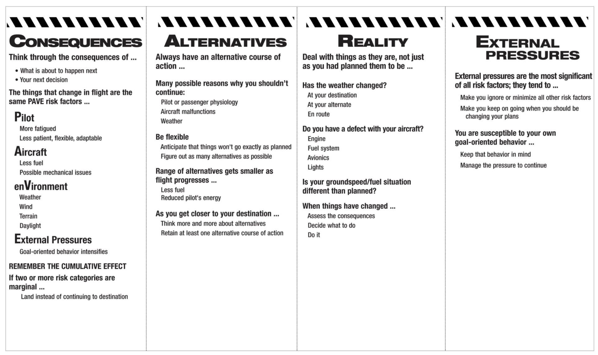
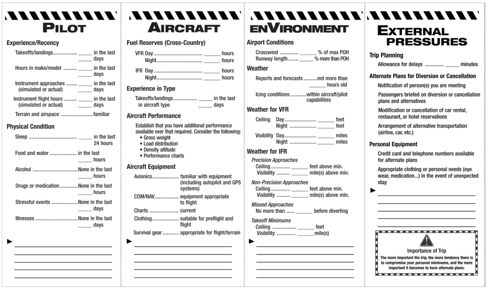

# Flying Longer Cross-Country Routes

## I. The Long Cross-Country Flight

### Before You Go
* Be comfortable with your skills, readiness, airplane, weather, pressures
* Remember PAVE
* Be prepared to divert or stay overnight

### Keeping Track of Your Progress
* CARE: four habits for controlling risk during flight

* Fly the plane
* Prepare for alternates
* Manage desire to press on
