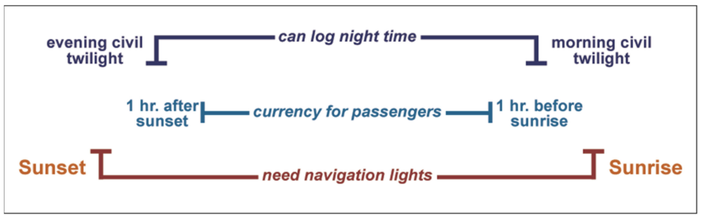

# Your Responsibilities as a Certificated Pilot

## I. Your Responsibilities as a Certificated Pilot

### Staying Current
* To be PIC with passengers or solo, you must complete a flight review with a CFI within the previous 24 calendar months
  * Calendar starts with checkride
* Flight review must include:
  * At least 1 hour of flight training (dual)
  * At least 1 hour of ground training
    * Review of Part 91 rules
  * A logbook endorsement showing completion of the review
* May also fulfill requirement by passing a pilot proficiency check given by an examiner, or complete an FAA-sponsored pilot proficiency program (WINGS)
* To carry passengers, must have three takeoffs and landings within the preceding 90 days in the same category and class of aircraft (and type if applicable)
  * Sole manipulator of flight controls
  * Full stop for tailwheel
  * If out of 90-day currency, may complete three takeoffs and landings solo or with a CFI

#### Night Currency
* A private pilot meeting day currency requirements may carry passengers up to one hour after sunset and beginning one hour before sunrise
* To carry passengers outside of this time, must have three full-stop takeoffs and landings during this period (1 hour after sunset to 1 hour before sunrise) in the same category/class/type of aircraft as sole manipulator of the controls in past 90 days
* Navigation lights required sunset to sunrise
* Night time may be logged from end of evening civil twilight to morning civil twilight
* Currency for carrying passengers is 1 hour after sunset to 1 hour before sunrise

#### FAA Pilot Proficiency Program (WINGS)
* Designed to help pilots construct a curriculum suitable for their unique flight requirements
* Education, review, and proficiency in areas of operation corresponding with the leading causes of accidents
* See the [WINGS website](https://faasafety.gov/wings/pub/learn_more.aspx)
* AC 61-98 also addresses pilot currency

### Broadening Your Horizons
* Follow Private Pilot Certificate with Instrument, Commercial, CFI, and ATP ratings
* May also move up to aircraft requiring a type rating
  * Weight more than 12,500 pounds max gross takeoff weight and/or are turbo-jet-powered

### Transitions to Unfamiliar Airplanes
* Certificate will specify the category and class of aircraft you can fly
  * ASEL: airplane single-engine land
* Can legally fly any airplane for which you are rated not requiring an endorsement you don't have
* Light Sport Aircraft (LSAs) design and build aircraft to meet ASTM (American Society for Testing and Materials) standards
* Other aircraft are built to FAA standards
* Two airplanes meeting the same standards may be noticeably different in cockpit instruments, avionics, controls, handling, performance
* Get trained in the particular make, model, or configuration of an airplane before you fly in it
* New FBOs will want to conduct a checkout and logbook review before you meet their renting requirements
  * Will likely need renter's liability insurance
* Before starting checkout in a new aircraft
  * Review POH or AFM
  * Not stalling and recommended V speeds
  * Review emergency procedures
  * Sit in the cockpit to note location of switches and controls
  * Solo it before taking passengers
  * Ensure you have current charts
* Get a mountain flying checkout before flying in a mountainous area for the first time

## II. Passengers

### Flying Safely and Risk Management
* Pilots are the biggest risk factor in flying
* Only 15% of accidents are the result of a mechanical failure
* Don't keep flying when you shouldn't!
  * Fight the urge to press on
  * Get-home or get-there-itis
* Set yourself up in advance to be able to give up on a goal when necessary
* Use strategies that give you an out to flying
  * Fly to a meeting the day before instead of the day of
  * Take an overnight bag
  * Tell passengers you will call them when you land

### Making Your First Passenger Flight a Success
* Do not hurry or rush it
* Try your best to convince a non-pilot that flying with you will be fun, interesting, and safe
* Don't try to impress them with your skills
  * Don't go straight for steep turns and stalls
  * Do not demonstrate engine out procedures
  * Don't say "watch this!"
* Keep the flight short
* Leave them wanting more
* Bring sick sacks but keep them hidden away
* Briefing
  * Where you are going and what you'll be doing
  * Safety items
    * Operation of doors, seats, seatbelts
    * Location of fire extinguisher
    * No smoking
    * Method of exit
  * Noise changes and pitch attitudes that might startle them
  * When you will need a quiet cockpit
* Explain what you are doing as you go along
  * Keeps them informed
  * Remember: you are not teaching them how to fly
* Have passenger look at horizon if they become nauseous
* Open air vents and loosen collars as necessary
* Head back to airport if a passenger becomes ill
* Always fly the plane first!
